exclude: true   
<style type="text/css">
code.r{ 
  font-size: 16px; 
}
pre {
  font-size: 16px !important;  
}
</style>
```{r setup, include=FALSE}
options(htmltools.dir.version = FALSE)
```

```{r run, eval=FALSE, include=FALSE}
# xaringan::inf_mr("CCMS_Applied_Math_March_2022/index.rmd")
```


---
layout: false
class: split-two middle 
 
.column[
  .split-three[ 
  .row.bg-main1[.content.vmiddle[.font_medium[  
  .alert[Consensus dynamics] on networks (e.g., average consensus).  ]]]     
  .row.bg-main2[.content.vmiddle[.font_medium[
  .alert[Iterative methods] for linear systems (e.g., Kaczmarz methods).  
  ]]] 
  .row.bg-main3[.content.vmiddle[.font_medium[ 
A .alert[bridge] between consensus dynamics on networks and numerical linear algebra. 
  ]]]
]] 

.column[.center[.stretch[
.row[ 
.split-two[
.column[.lil-stretch[<br>
   
  ]]
.column[.lil-stretch[<br>
   
]]]]
.row[ 
.split-two[
.column[.lil-stretch[<br><br><br><br><br><br>
  .alert[Benjamin Jarman] <br> UCLA 
  ]]
.column[.lil-stretch[<br><br><br><br><br><br>
  .alert[Chen Yap] <br> Planet Labs Inc. 
]]]]

<br><br><br><br><br><br><br><br>

**JH**, Benjamin Jarman, and Chen Yap (2022). Paving the Way for Consensus: Convergence of Block Gossip Algorithms. *Submitted*.

.row[ 
.column[.lil-stretch[<br>
   
  ]]
]]
.row[ 
.column[.lil-stretch[
  .alert[Hector Tierno] <br> HMC 
  ]
]]]

]]]
---

layout: true
class: split-two middle 
 
.column[
  .split-three[ 
  .row.bg-main1[.content.vmiddle[.font_medium[  
.alert[Consensus dynamics] on networks (e.g., average consensus).
  ]]]     
  .row.bg-main2[.content.vmiddle[.font_medium[
.alert[Iterative methods] for linear systems (e.g., Kaczmarz methods).   
  ]]] 
  .row.bg-main3[.content.vmiddle[.font_medium[ 
A .alert[bridge] between consensus dynamics on networks and numerical linear algebra.  
  ]]]
]] 

.column[.center[.stretch[
  {{content}} 
]]]
---
class: hide-row2-col1 hide-row3-col1 hide-row4-col1 hide-row5-col1

<br> <br> <br> <br>
  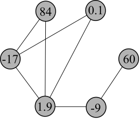
<br>


---
class: hide-row3-col1 hide-row4-col1   hide-row5-col1 
<br> <br> <br> <br> <br>
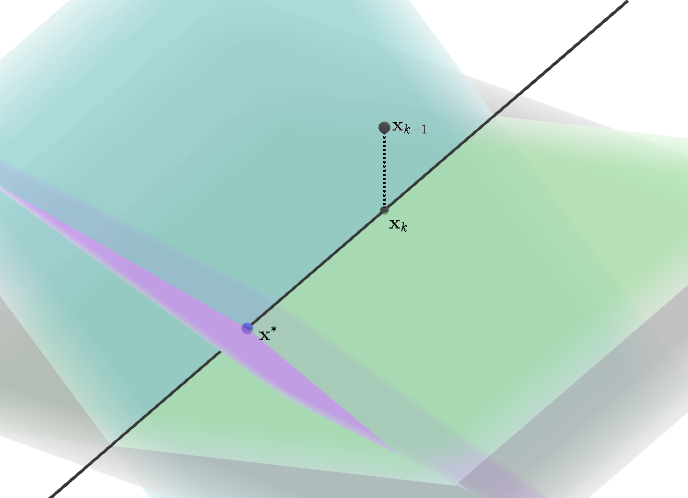
<br> 

---
class: hide-row4-col1 hide-row5-col1 
<br> <br> <br> 
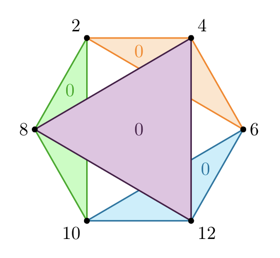 

---

class: fade-row2-col1 fade-row3-col1 fade-row4-col1 fade-row5-col1

<br> <br> <br> <br>
  
<br>

  
 
---

class: split-two
layout: false

.column.bg-main1[
.content[ 
  ## Consensus Dynamics 
 
  <br> 
  Let $\mathcal{G} = (\mathcal{N},\mathcal{E})$ be a graph with nodes $\mathcal{N}$ and edges $\mathcal{E}$.  
  
  <br> 
  <span style="color:gray">Let $c_k(i)$ be a real scalar assigned to node $i$ at time $k$.</span>

<br>
  <span style="color:gray">Consensus dynamical systems are ones in which nodes values $c_k(i)$  evolve
over time, i.e., they change their internal states according to some local interaction-rule, which
is applied in every time step.</span>
]

]

.column[
  .vmiddle[
  </img>
  ] 
]

---

class: split-two
layout: false

.column.bg-main1[
.content[ 
  ## Consensus Dynamics 
 
  <br> 
  Let $\mathcal{G} = (\mathcal{N},\mathcal{E})$ be a graph with nodes $\mathcal{N}$ and edges $\mathcal{E}$.  
  
  <br> 
  Let $c_k(i)$ be a real scalar assigned to node $i$ at time $k$.

<br>
  <span style="color:gray">Consensus dynamical systems are ones in which nodes values $c_k(i)$  evolve
over time, i.e., they change their internal states according to some local interaction-rule, which
is applied in every time step.</span>
]

]

.column[
  .vmiddle[
  </img>
  ] 
]

---

class: split-two
layout: false

.column.bg-main1[
.content[ 
  ## Consensus Dynamics 
 
  <br> 
  Let $\mathcal{G} = (\mathcal{N},\mathcal{E})$ be a graph with nodes $\mathcal{N}$ and edges $\mathcal{E}$.  
  
  <br> 
  Let $c_k(i)$ be a real scalar assigned to node $i$ at time $k$.

<br>
  Consensus dynamical systems are ones in which nodes values $c_k(i)$  evolve
over time, i.e., they change their internal states according to some local interaction-rule, which
is applied in every time step.
]

]

.column[
  .vmiddle[
  </img>
  ] 
]

---

class: split-two
layout: false

.column.bg-main2[
.content[ 
  ## Consensus Dynamics: Applications 
  
  - opinion dynamics
  
  
  

]

]

.column[
  .vmiddle[
  </img>
  ] 
]

---

class: split-two
layout: false

.column.bg-main2[
.content[ 
  ## Consensus Dynamics: Applications 
  
  - opinion dynamics
  
  
  - voting and ranking models
  
 
  

]

]

.column[
  .vmiddle[
  </img>
  ] 
]

---

class: split-two
layout: false

.column.bg-main2[
.content[ 
  ## Consensus Dynamics: Applications 
  
  - opinion dynamics
  
  
  - voting and ranking models
  
 
  - interacting particle systems
  
  
  

]

]

.column[
  .vmiddle[
  </img>
  ] 
]

---

class: split-two
layout: false

.column.bg-main2[
.content[ 
  ## Consensus Dynamics: Applications 
  
  - opinion dynamics
  
  
  - voting and ranking models
  
 
  - interacting particle systems
  
  
  - combinatorial matrix theory
  
  
  

]

]

.column[
  .vmiddle[
  </img>
  ] 
]

---

class: split-two
layout: false

.column.bg-main2[
.content[ 
  ## Consensus Dynamics: Applications 
  
  - opinion dynamics
  
  
  - voting and ranking models
  
 
  - interacting particle systems
  
  
  - combinatorial matrix theory
  
  
  - systems biology
  
  
  

]

]

.column[
  .vmiddle[
  </img>
  ] 
]

---

class: split-two
layout: false

.column.bg-main2[
.content[ 
  ## Consensus Dynamics: Applications 
  
  - opinion dynamics
  
  
  - voting and ranking models
  
 
  - interacting particle systems
  
  
  - combinatorial matrix theory
  
  
  - systems biology
  
  
  - Markov chains
  
  
  

]

]

.column[
  .vmiddle[
  </img>
  ] 
]

---

class: split-two
layout: false

.column.bg-main2[
.content[ 
  ## Consensus Dynamics: Applications 
  
  - opinion dynamics
  
  
  - voting and ranking models
  
 
  - interacting particle systems
  
  
  - combinatorial matrix theory
  
  
  - systems biology
  
  
  - Markov chains
  
  
  - distributed computing
  
  
  

]

]

.column[
  .vmiddle[
  </img>
  ] 
]

---

class: split-two
layout: false

.column.bg-main2[
.content[ 
  ## Consensus Dynamics: Applications 
  
  - opinion dynamics
  
  
  - voting and ranking models
  
 
  - interacting particle systems
  
  
  - combinatorial matrix theory
  
  
  - systems biology
  
  
  - Markov chains
  
  
  - distributed computing
  
  
  &nbsp;&nbsp;&nbsp;&nbsp;&nbsp;&nbsp;&nbsp;&nbsp;&nbsp;&nbsp;&nbsp;&nbsp;&nbsp;&nbsp;&nbsp;&nbsp;&nbsp;&nbsp;&nbsp;⋮

]

]

.column[
  .vmiddle[
  </img>
  ] 
]

---

class: split-two
layout: false

.column.bg-main4[
.content[ 
  ## Consensus Dynamics: Model Types
  
  <br>
  - discrete state majority models
  

  
  
  .footnote[Becchetti, L., Clementi, A., & Natale, E. (2020). Consensus dynamics: An overview. ACM SIGACT News, 51(1), 58-104.]
  
  
]


]

.column[
  .vmiddle[
  </img>
  ] 
]

---

class: split-two
layout: false

.column.bg-main4[
.content[ 
  ## Consensus Dynamics: Model Types
  
  <br>
  - discrete state majority models
  
  
  - discrete state voting models
  


  
  
  .footnote[Becchetti, L., Clementi, A., & Natale, E. (2020). Consensus dynamics: An overview. ACM SIGACT News, 51(1), 58-104.]
  
  
]


]

.column[
  .vmiddle[
  </img>
  ] 
]

---

class: split-two
layout: false

.column.bg-main4[
.content[ 
  ## Consensus Dynamics: Model Types
  
  <br>
  - discrete state majority models
  
  
  - discrete state voting models
  
  
  - discrete state median models
  

  
  
  .footnote[Becchetti, L., Clementi, A., & Natale, E. (2020). Consensus dynamics: An overview. ACM SIGACT News, 51(1), 58-104.]
  
  
]


]

.column[
  .vmiddle[
  </img>
  ] 
]

---

class: split-two
layout: false

.column.bg-main4[
.content[ 
  ## Consensus Dynamics: Model Types
  
  <br>
  - discrete state majority models
  
  
  - discrete state voting models
  
  
  - discrete state median models
  
  
  - .alert[averaging models]
  
  
  .footnote[Becchetti, L., Clementi, A., & Natale, E. (2020). Consensus dynamics: An overview. ACM SIGACT News, 51(1), 58-104.]
  
  
]


]

.column[
  .vmiddle[
  </img>
  ] 
]

---

class: split-two
layout: false

.column.bg-main1[
.content[ 
  ### Example: Average Consensus 
 
  <br> 
  Let $\mathcal{G} = (\mathcal{N},\mathcal{E})$ be an undirected connected graph with nodes $\mathcal{N}$ and edges $\mathcal{E}$.  
  
  <br> 
  <span style="color:gray">Let $c_k(i)$ be a real scalar assigned to node $i$ at time $k$.</span>

<br>
  <span style="color:gray">The average consensus problem is to compute (iteratively) the average value $c^* := \sum_{i \in \mathcal{N}} c_0(i)/|\mathcal{N}|$ at every node, allowing only local communication on the graph.</span>
]

]

.column[
  .vmiddle[
  </img>
  ] 
]

---


class: split-two
layout: false

.column.bg-main1[
.content[ 
  ### Example: Average Consensus
 
  <br> 
  Let $\mathcal{G} = (\mathcal{N},\mathcal{E})$ be an undirected connected graph with nodes $\mathcal{N}$ and edges $\mathcal{E}$.  
  
  <br> 
  Let $c_k(i)$ be a real scalar assigned to node $i$ at time $k$.

<br>
  <span style="color:gray">The average consensus problem is to compute (iteratively) the average value $c^* := \sum_{i \in \mathcal{N}} c_0(i)/|\mathcal{N}|$ at every node, allowing only local communication on the graph.</span>
]

]

.column[
  .vmiddle[
  </img>
  ] 
]

---

class: split-two
layout: false

.column.bg-main1[
.content[ 
  ### Example: Average Consensus 
 
  <br> 
  Let $\mathcal{G} = (\mathcal{N},\mathcal{E})$ be an undirected connected graph with nodes $\mathcal{N}$ and edges $\mathcal{E}$.  
  
  <br> 
  Let $c_k(i)$ be a real scalar assigned to node $i$ at time $k$.

<br>
  The .alert[average consensus problem] is to compute (iteratively) the average value $c^*: = \sum_{i \in \mathcal{N}} c_0(i)/|\mathcal{N}|$ at every node, allowing only local communication on the graph. 
]

]

.column[
  .vmiddle[
  </img>
  ] 
]

---

class: split-two
layout: false

.column.bg-main1[
  
  ### Average Consensus Applications

  

]

.column.bg-main4[.vmiddle[
  <br>
]]


---

class: split-two
layout: false

.column.bg-main1[
  
  ### Average Consensus Applications

<br> <br> <br>

  - .alert[**load balancing in parallel computing**]
  

]

.column.bg-main4[.vmiddle[
  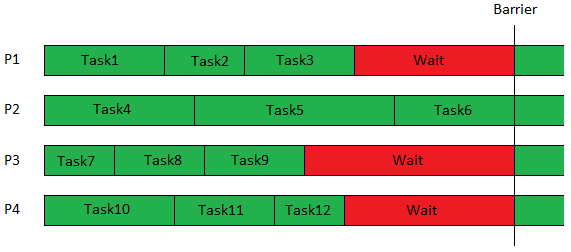</img> 
]]

---

class: split-two
layout: false

.column.bg-main1[
  
  ### Average Consensus Applications

<br> <br> <br>

  - .alert[**load balancing in parallel computing**]
  - .alert[**network clock synchronization**]
  

]

.column.bg-main4[.vmiddle[
  </img> 
]]

---

class: split-two
layout: false

.column.bg-main1[
  
  ### Average Consensus Applications

<br> <br> <br>

  - .alert[**load balancing in parallel computing**]
  <br>
  - .alert[**network clock synchronization**]
  <br>
  - .alert[**coordination of mobile autonomous agents**]

]

.column.bg-main4[.vmiddle[
  </img>  
]]

---

class: split-two
layout: false

.column.bg-main1[
  
  ### Average Consensus Applications

<br> <br> <br>

  - .alert[**load balancing in parallel computing**]
  <br>
  - .alert[**network clock synchronization**]
  <br>
  - .alert[**coordination of mobile autonomous agents**]
  <br>
  - .alert[**distributed data fusion**]

]

.column.bg-main4[.vmiddle[
  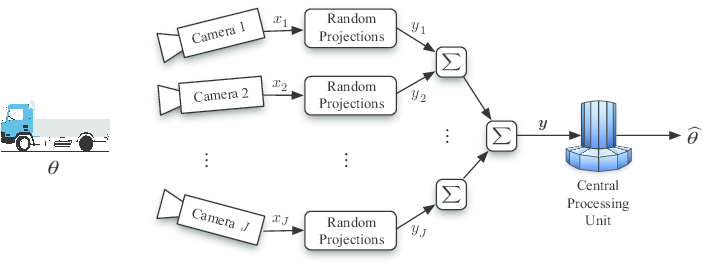</img>  
]]

---
class: split-two
layout: false

.column.bg-main1[
  
  ### Average Consensus Applications

<br> <br> <br>

  - .alert[**load balancing in parallel computing**]
  <br>
  - .alert[**network clock synchronization**]
  <br>
  - .alert[**coordination of mobile autonomous agents**]
  <br>
  - .alert[**distributed data fusion**]
  <br>
  - .alert[**PageRank**]

]

.column.bg-main4[.vmiddle[
  </img>  
]]

---
class: split-two
layout: false

.column.bg-main1[
  
  ### Average Consensus Applications

<br> <br> <br>

  - .alert[**load balancing in parallel computing**]
  <br>
  - .alert[**network clock synchronization**]
  <br>
  - .alert[**coordination of mobile autonomous agents**]
  <br>
  - .alert[**distributed data fusion**]
  <br>
  - .alert[**PageRank**]
  <br>
  - .alert[**decentralized optimization**]

]

.column.bg-main4[.vmiddle[
  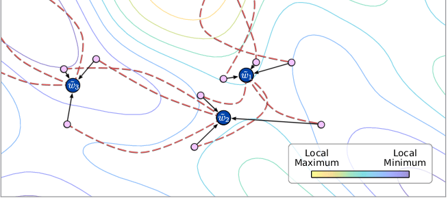</img>  
]]

---


layout: false
class: split-two

.column.bg-main1[
  ## Block Gossip Method

  Given graph $\mathcal{G}$, initial values $\mathbf{c}_0$, and edge subsets $T = \{\tau_1, \cdots, \tau_d\}$, for $k = 1, 2, \cdots$:
   - <span style="color:gray">Choose edge subset $\tau$ uniformly at random from $T$.</span>
<br> 
   - <span style="color:gray">Form $\mathcal{G}_\tau$, the edge-induced subgraph of $\mathcal{G}$ defined by edges in $\tau$.</span>
   - <span style="color:gray">Nodes in each connected component of $\mathcal{G}_\tau$ average their values and nodes outside of $\mathcal{G}_\tau$ do not update; this produces new secret values $\mathbf{c}_k$.</span>
   

.footnote[Related to the .alert[unbounded Deffuant–Weisbuch model]. <br>Deffuant, G., Neau, D., Amblard, F., & Weisbuch, G. (2001). Mixing beliefs among interacting agents. Advances in Complex Systems, (3), 11. ]
  
  

  
]
.column[.content.vmiddle[.stretch[
  .center[]
  <br><br>
  .center[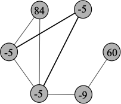]
]]]


---


layout: false
class: split-two

.column.bg-main1[
  ## Block Gossip Method

  Given graph $\mathcal{G}$, initial values $\mathbf{c}_0$, and edge subsets $T = \{\tau_1, \cdots, \tau_d\}$, for $k = 1, 2, \cdots$:
   - Choose edge subset $\tau$ uniformly at random from $T$.
<br> 
   - <span style="color:gray">Form $\mathcal{G}_\tau$, the edge-induced subgraph of $\mathcal{G}$ defined by edges in $\tau$.</span>
   - <span style="color:gray">Nodes in each connected component of $\mathcal{G}_\tau$ average their values and nodes outside of $\mathcal{G}_\tau$ do not update; this produces new secret values $\mathbf{c}_k$.</span>

  
  .footnote[Related to the .alert[unbounded Deffuant–Weisbuch model]. <br>Deffuant, G., Neau, D., Amblard, F., & Weisbuch, G. (2001). Mixing beliefs among interacting agents. Advances in Complex Systems, (3), 11. ]

  
]
.column[.content.vmiddle[.stretch[
  .center[]
  <br><br>
  .center[]
]]]


---


layout: false
class: split-two

.column.bg-main1[
  ## Block Gossip Method

  Given graph $\mathcal{G}$, initial values $\mathbf{c}_0$, and edge subsets $T = \{\tau_1, \cdots, \tau_d\}$, for $k = 1, 2, \cdots$:
   - Choose edge subset $\tau$ uniformly at random from $T$.
<br> 
   - Form $\mathcal{G}_\tau$, the edge-induced subgraph of $\mathcal{G}$ defined by edges in $\tau$.
   - <span style="color:gray">Nodes in each connected component of $\mathcal{G}_\tau$ average their values and nodes outside of $\mathcal{G}_\tau$ do not update; this produces new secret values $\mathbf{c}_k$.</span>

 
  .footnote[Related to the .alert[unbounded Deffuant–Weisbuch model]. <br>Deffuant, G., Neau, D., Amblard, F., & Weisbuch, G. (2001). Mixing beliefs among interacting agents. Advances in Complex Systems, (3), 11. ]

  
]
.column[.content.vmiddle[.stretch[
  .center[]
  <br><br>
  .center[]
]]]


---


layout: false
class: split-two

.column.bg-main1[
  ## Block Gossip Method

  Given graph $\mathcal{G}$, initial values $\mathbf{c}_0$, and edge subsets $T = \{\tau_1, \cdots, \tau_d\}$, for $k = 1, 2, \cdots$:
   - Choose edge subset $\tau$ uniformly at random from $T$.
<br> 
   - Form $\mathcal{G}_\tau$, the edge-induced subgraph of $\mathcal{G}$ defined by edges in $\tau$.
   - Nodes in each connected component of $\mathcal{G}_\tau$ average their values and nodes outside of $\mathcal{G}_\tau$ do not update; this produces new secret values $\mathbf{c}_k$.

  
  .footnote[Related to the .alert[unbounded Deffuant–Weisbuch model]. <br>Deffuant, G., Neau, D., Amblard, F., & Weisbuch, G. (2001). Mixing beliefs among interacting agents. Advances in Complex Systems, (3), 11. ]

  
]
.column[.content.vmiddle[.stretch[
  .center[]
  <br><br>
  .center[]
]]]


---


layout: false
class: split-two

.column.bg-main1[
  ## Block Gossip Method

  Given graph $\mathcal{G}$, initial values $\mathbf{c}_0$, and edge subsets $T = \{\tau_1, \cdots, \tau_d\}$, for $k = 1, 2, \cdots$:
   - Choose edge subset $\tau$ uniformly at random from $T$.
<br> 
   - Form $\mathcal{G}_\tau$, the edge-induced subgraph of $\mathcal{G}$ defined by edges in $\tau$.
   - Nodes in each connected component of $\mathcal{G}_\tau$ average their values and nodes outside of $\mathcal{G}_\tau$ do not update; this produces new secret values $\mathbf{c}_k$.

  
  .footnote[Related to the .alert[unbounded Deffuant–Weisbuch model]. <br>Deffuant, G., Neau, D., Amblard, F., & Weisbuch, G. (2001). Mixing beliefs among interacting agents. Advances in Complex Systems, (3), 11. ]

  
]
.column[.content.vmiddle[.stretch[
  .center[]
  <br><br>
  .center[]
]]]


---


layout: false
class: split-two

.column.bg-main1[
  ## Block Gossip Methods

   - .alert[path gossiping]: F. Benezit, A. G. Dimakis, P. Thiran, and M. Vetterli. Order-optimal consensus through randomized path averaging. IEEE T. Inform. Theory, 56(10):5150–5167, 2010.
   - <span style="color:gray">clique gossiping: Y. Liu, B. Li, B. O. Anderson, and G. Shi. Clique gossiping. IEEE/ACM Transactions on Networking, 27(06):2418–2431, nov 2019.</span>
   - <span style="color:gray">edge-independent set gossiping: S. P. Boyd, A. Ghosh, B. Prabhakar, and D. Shah. Randomized gossip algorithms. IEEE T. Inform. Theory, 52:2508–2530, 2006.</span>


  
]
.column[.content.vmiddle[.stretch[
  .center[]
  <br><br>
  .center[]
]]]


---


layout: false
class: split-two

.column.bg-main1[
  ## Block Gossip Methods

   - .alert[path gossiping]: F. Benezit, A. G. Dimakis, P. Thiran, and M. Vetterli. Order-optimal consensus through randomized path averaging. IEEE T. Inform. Theory, 56(10):5150–5167, 2010.
   - .alert[clique gossiping]: Y. Liu, B. Li, B. O. Anderson, and G. Shi. Clique gossiping. IEEE/ACM Transactions on Networking, 27(06):2418–2431, nov 2019.
   - <span style="color:gray">edge-independent set gossiping: S. P. Boyd, A. Ghosh, B. Prabhakar, and D. Shah. Randomized gossip algorithms. IEEE T. Inform. Theory, 52:2508–2530, 2006.</span>


  
]
.column[.content.vmiddle[.stretch[
  .center[]
  <br><br>
  .center[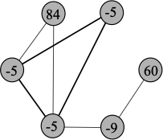]
]]]


---


layout: false
class: split-two

.column.bg-main1[
  ## Block Gossip Methods

   - .alert[path gossiping]: F. Benezit, A. G. Dimakis, P. Thiran, and M. Vetterli. Order-optimal consensus through randomized path averaging. IEEE T. Inform. Theory, 56(10):5150–5167, 2010.
   - .alert[clique gossiping]: Y. Liu, B. Li, B. O. Anderson, and G. Shi. Clique gossiping. IEEE/ACM Transactions on Networking, 27(06):2418–2431, nov 2019.
   - .alert[edge-independent set gossiping]: S. P. Boyd, A. Ghosh, B. Prabhakar, and D. Shah. Randomized gossip algorithms. IEEE T. Inform. Theory, 52:2508–2530, 2006.


  
]
.column[.content.vmiddle[.stretch[
  .center[]
  <br><br>
  .center[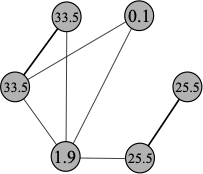]
]]]


---


layout: true
class: split-two middle 
 
.column[
  .split-three[ 
  .row.bg-main1[.content.vmiddle[.font_medium[  
.alert[Consensus dynamics] on networks (e.g., average consensus).
  ]]]     
  .row.bg-main2[.content.vmiddle[.font_medium[
.alert[Iterative methods] for linear systems (e.g., Kaczmarz methods).   
  ]]] 
  .row.bg-main3[.content.vmiddle[.font_medium[ 
A .alert[bridge] between consensus dynamics on networks and numerical linear algebra.  
  ]]]
]] 

.column[.center[.stretch[
  {{content}} 
]]]
---


class: fade-row2-col1 fade-row3-col1 fade-row4-col1 fade-row5-col1

<br> <br> <br> <br>
  
<br>

  
 
---


class: fade-row1-col1 fade-row3-col1 fade-row4-col1 fade-row5-col1

<br> <br> <br> <br> <br>
  
<br>

  
---

class: split-two
layout: false

.column.bg-main2[

## Iterative Methods for Linear Systems

Many classical numerical linear algebraic iterative methods for solving linear systems operate with row or column subset information, and/or entry-wise on iterates.


]

.column[
  <br> <br> <br> <br> <br>
  
]

 
---

class: split-two
layout: false

.column.bg-main2[

## Iterative Methods for Linear Systems

Many classical numerical linear algebraic iterative methods for solving linear systems operate with row or column subset information, and/or entry-wise on iterates.

- Kaczmarz methods


]

.column[
  <br> <br> <br> <br> <br>
  
]

 
---

class: split-two
layout: false

.column.bg-main2[

## Iterative Methods for Linear Systems

Many classical numerical linear algebraic iterative methods for solving linear systems operate with row or column subset information, and/or entry-wise on iterates.

- Kaczmarz methods


- Jacobi methods


]

.column[
  <br> <br> <br> <br> <br>
  
]

 
---

class: split-two
layout: false

.column.bg-main2[

## Iterative Methods for Linear Systems

Many classical numerical linear algebraic iterative methods for solving linear systems operate with row or column subset information, and/or entry-wise on iterates.

- Kaczmarz methods


- Jacobi methods


- Gauss-Seidel methods


]

.column[
  <br> <br> <br> <br> <br>
  
]

 
---

class: split-two
layout: false

.column.bg-main2[

## Iterative Methods for Linear Systems

Many classical numerical linear algebraic iterative methods for solving linear systems operate with row or column subset information, and/or entry-wise on iterates.

- Kaczmarz methods


- Jacobi methods


- Gauss-Seidel methods


- coordinate descent methods

]

.column[
  <br> <br> <br> <br> <br>
  
]

 
---

class: split-two
layout: false

.column.bg-main2[

### Example: Block Kaczmarz Method

<br> 
Given linear system measurement matrix $A$ and measurement vector $\mathbf{b}$, initial iterate $\mathbf{x}_0$, and sets of row indices $T = \{\tau_1, \cdots, \tau_d\}$, for $k = 1, 2, \cdots$:
<br> <br>
   - <span style="color:gray">Choose row block $\tau$ uniformly at random from $T$.</span>
<br> 
   - <span style="color:gray"> $\mathbf{x}_k = \mathbf{x}_{k-1} + A_\tau^\dagger(\mathbf{b}_\tau - A_\tau \mathbf{x}_{k-1})$ </span>
   
   
   .footnote[Needell, D., & Tropp, J. A. (2014). Paved with good intentions: analysis of a randomized block Kaczmarz method. Linear Algebra and its Applications, 441, 199-221.]

]

.column[
  <br> <br> <br> <br> <br>
  
]


---

class: split-two
layout: false

.column.bg-main2[

### Example: Block Kaczmarz Method

<br> 
Given linear system measurement matrix $A$ and measurement vector $\mathbf{b}$, initial iterate $\mathbf{x}_0$, and sets of row indices $T = \{\tau_1, \cdots, \tau_d\}$, for $k = 1, 2, \cdots$:
<br> <br>
   - Choose row block $\tau$ uniformly at random from $T$.
<br> 
   - <span style="color:gray"> $\mathbf{x}_k = \mathbf{x}_{k-1} + A_\tau^\dagger(\mathbf{b}_\tau - A_\tau \mathbf{x}_{k-1})$ </span>
   
   
   .footnote[Needell, D., & Tropp, J. A. (2014). Paved with good intentions: analysis of a randomized block Kaczmarz method. Linear Algebra and its Applications, 441, 199-221.]

]

.column[
  <br> <br> <br> <br> <br>
  
]


---

class: split-two
layout: false

.column.bg-main2[

### Example: Block Kaczmarz Method

<br> 
Given linear system measurement matrix $A$ and measurement vector $\mathbf{b}$, initial iterate $\mathbf{x}_0$, and sets of row indices $T = \{\tau_1, \cdots, \tau_d\}$, for $k = 1, 2, \cdots$:
<br> <br>
   - Choose row block $\tau$ uniformly at random from $T$.
<br> 
   - $\mathbf{x}_k = \mathbf{x}_{k-1} + A_\tau^\dagger(\mathbf{b}_\tau - A_\tau \mathbf{x}_{k-1})$
   
   
   .footnote[Needell, D., & Tropp, J. A. (2014). Paved with good intentions: analysis of a randomized block Kaczmarz method. Linear Algebra and its Applications, 441, 199-221.]

]

.column[
  <br> <br> <br> <br> <br>
  
]


---

class: bg-main4
  

## How to choose the subset of rows, $T$?

<br>
**Definition:** A $(d, \alpha, \beta)$ .alert[**row paving**] of a matrix $\mathbf{A}$ is a partition $T = \{\tau_1,\tau_2, \cdots, \tau_d\}$ of the row indices that satisfies $$\alpha \le \lambda_{\min}(\mathbf{A}_\tau \mathbf{A}_\tau^\top) \text{ and } \lambda_{\max}(\mathbf{A}_\tau \mathbf{A}_\tau^\top) \le \beta \text{ for each } \tau \in T.^{\;1}$$

.footnote[ $^1$ As defined in: <br> D. Needell and J. Tropp (2014). Paved with good intentions: Analysis of a randomized block Kaczmarz method. *Linear Algebra and Applications* 441, 199-221.
]


---

class: bg-main4
  

## How to choose the subset of rows, $T$?

<br>
**Definition:** A $(d, \alpha, \beta, r, R)$ .alert[**row covering**] of a matrix $\mathbf{A}$ is a collection of subsets $T = \{\tau_1,\tau_2, \cdots, \tau_d\}$ of the row indices, $\tau_i \subset [m]$ for all $i = 1, \cdots, d$, that covers the row indices, for each $i \in [m]$ we have $i \in \tau_l$ for some $l = 1, \cdots, d$, and that satisfies $$\alpha \le \lambda_{\min +}(\mathbf{A}_\tau \mathbf{A}_\tau^\top) \text{ and } \lambda_{\max}(\mathbf{A}_\tau \mathbf{A}_\tau^\top) \le \beta \text{ for each } \tau \in T,$$ where $r$ and $R$ are the minimum and maximum, respectively, number of blocks in which a single row appears, i.e., $r = \min_{i \in [m]} |\{\tau_l \in T: i \in \tau_l\}|$ and $R = \max_{i \in [m]} |\{\tau_l \in T: i \in \tau_l\}|$.


---

layout: true
class: split-two middle 
 
.column[
  .split-three[ 
  .row.bg-main1[.content.vmiddle[.font_medium[  
.alert[Consensus dynamics] on networks (e.g., average consensus).
  ]]]     
  .row.bg-main2[.content.vmiddle[.font_medium[
.alert[Iterative methods] for linear systems (e.g., Kaczmarz methods).   
  ]]] 
  .row.bg-main3[.content.vmiddle[.font_medium[ 
A .alert[bridge] between consensus dynamics on networks and numerical linear algebra.  
  ]]]
]] 

.column[.center[.stretch[
  {{content}} 
]]]

---

class: fade-row1-col1 fade-row3-col1 fade-row4-col1 fade-row5-col1

<br> <br> <br> <br> <br> <br>
  
<br>

  
 
---

class: fade-row1-col1 fade-row2-col1 fade-row4-col1 fade-row5-col1

<br> <br> <br> <br>
  
<br>

  
 
---


class: split-two
layout: false

.column.bg-main1[
  ### The .alert[Bridge]
  <br> <br> <br>
  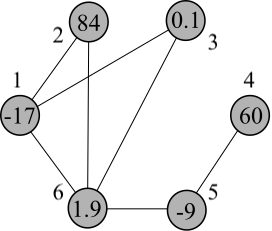
]

.column[
  <br> 
  - formulate averaging consensus as a .alert[homogenous linear system] (e.g., Laplacian system, incidence system)
  

  
  
  .footnote[Loizou, N., & Richtárik, P. (2021). Revisiting randomized gossip algorithms: General framework, convergence rates and novel block and accelerated protocols. IEEE Transactions on Information Theory, 67(12), 8300-8324.]

]

---


class: split-two
layout: false

.column.bg-main1[
  ### The .alert[Bridge]
  <br> <br> <br>
  
]

.column[
  <br> 
  - formulate averaging consensus as a .alert[homogenous linear system] (e.g., Laplacian system, incidence system)
  
  
  - describe the iterative local update as an .alert[iteration of a NLA method]
  

  
  
  .footnote[Loizou, N., & Richtárik, P. (2021). Revisiting randomized gossip algorithms: General framework, convergence rates and novel block and accelerated protocols. IEEE Transactions on Information Theory, 67(12), 8300-8324.]

]

---


class: split-two
layout: false

.column.bg-main1[
  ### The .alert[Bridge]
  <br> <br> <br>
  
]

.column[
  <br> 
  - formulate averaging consensus as a .alert[homogenous linear system] (e.g., Laplacian system, incidence system)
  
  
  - describe the iterative local update as an .alert[iteration of a NLA method]
  
  
  - .alert[apply theory from NLA] and algebraic graph theory to consensus dynamics model (e.g., convergence rate, limiting state, etc.)
  
  
  .footnote[Loizou, N., & Richtárik, P. (2021). Revisiting randomized gossip algorithms: General framework, convergence rates and novel block and accelerated protocols. IEEE Transactions on Information Theory, 67(12), 8300-8324.]

]

---


class: split-two
layout: false

.column.bg-main1[
  ### The graph...
  <br> <br> <br>
  
]

.column[
  
  .center[<br> <br>

]
]

---

class: split-two
layout: false

.column.bg-main1[
  ### The graph...
  <br> <br> <br>
  
]

.column[
  ### ...the incidence matrix 
  .center[<br> <br>
$$\mathbf{Q} = \left[\begin{matrix}
    <!-- \mathbf{1} & \mathbf{-1} & 0 & 0 & 0 & 0  \\  -->
    <!--  \mathbf{1} & 0 & \mathbf{-1} & 0 & 0 & 0 \\ -->
    <!--  \mathbf{1} & 0 & 0 & 0 & 0 & \mathbf{-1} \\ -->
    <!--  0 & \mathbf{1} & 0 & 0 & 0 & \mathbf{-1} \\ -->
    <!--  0 & 0 & \mathbf{1} & 0 & 0 & \mathbf{-1} \\  -->
    <!--  0 & 0 & 0 & \mathbf{1} & \mathbf{-1} & 0 \\  -->
    <!--  0 & 0 & 0 & 0 & \mathbf{1} & \mathbf{-1} \\  -->
    \end{matrix}\right] 
    $$
]
]

---

class: split-two
layout: false

.column.bg-main1[
  ### The .alert[bridge application]...
  <br> <br> <br> <br>
  The block gossip method with blocks $T$ produces the same iterates as the block Kaczmarz method performed with $\mathbf{A} = \mathbf{Q}$, $\mathbf{b} = \mathbf{0}$, and $\mathbf{x}_0 = \mathbf{c}_0$ with row blocks corresponding to the same edge sets as $T$.
]

.column[
  ### ...the incidence matrix 
  .center[<br> <br>
$$\mathbf{Q} = \left[\begin{matrix}
    <!-- \mathbf{1} & \mathbf{-1} & 0 & 0 & 0 & 0  \\  -->
    <!--  \mathbf{1} & 0 & \mathbf{-1} & 0 & 0 & 0 \\ -->
    <!--  \mathbf{1} & 0 & 0 & 0 & 0 & \mathbf{-1} \\ -->
    <!--  0 & \mathbf{1} & 0 & 0 & 0 & \mathbf{-1} \\ -->
    <!--  0 & 0 & \mathbf{1} & 0 & 0 & \mathbf{-1} \\  -->
    <!--  0 & 0 & 0 & \mathbf{1} & \mathbf{-1} & 0 \\  -->
    <!--  0 & 0 & 0 & 0 & \mathbf{1} & \mathbf{-1} \\  -->
    \end{matrix}\right] 
    $$
]
]

---

class: split-two bg-main4
layout: false

### Application to Average Consensus and Block Gossip

.column[
<br><br><br><br><br><br>
The Block Gossip method is a special case of the Block Kaczmarz method for a .alert[linear algebraic formulation of the average consensus problem].


]
.column[
<br><br><br><br><br><br>

 
]


---


class: split-two bg-main1
layout: false

## Block Kaczmarz Convergence

**Theorem:** Consider the least-squares problem $\min \|\mathbf{A}\mathbf{x} - \mathbf{b}\|_2^2$ where $\mathbf{A} \in \mathbb{R}^{m \times n}$ is not necessarily full-rank and $\mathbf{b} \in \mathbb{R}^m$. <span style="color:gray"> Let $T = \{\tau_1, \cdots, \tau_d\}$ be a $(d, \alpha, \beta, r, R)$ covering (not necessarily a paving) of the rows of $\mathbf{A}$. Let $\mathbf{x}_j$ denote the $j$th iterate produced by Block RK on the system defined by $\mathbf{A}$ and $\mathbf{b}$ with initial iterate $\mathbf{x}_0$, let $\mathbf{x}^\ast := \text{argmin}_{\mathbf{x}} \|\mathbf{A}\mathbf{x} - \mathbf{b}\|_2^2,$ and let $\mathbf{e} := \mathbf{A}\mathbf{x}^\ast - \mathbf{b}$.
Then we have $$\mathbb{E}\left(\|\mathbf{x}_{j} - \mathbf{x}^\ast\|_2^2\right) \leq \left(1 - \frac{r\sigma_{\min +}^2(\mathbf{A})}{\beta d}\right)^{j} \|\mathbf{x}_0 - \mathbf{x}^\ast\|_2^2 + \frac{\beta R}{\alpha r \sigma_{\min +}^2(\mathbf{A})} \|\mathbf{e}\|_2^2,$$
where $\sigma_{\min +}(\mathbf{A})$ is the smallest nonzero singular value of $\mathbf{A}$. </span> 

---

class: split-two bg-main1
layout: false

## Block Kaczmarz Convergence

**Theorem:** Consider the least-squares problem $\min \|\mathbf{A}\mathbf{x} - \mathbf{b}\|_2^2$ where $\mathbf{A} \in \mathbb{R}^{m \times n}$ is not necessarily full-rank and $\mathbf{b} \in \mathbb{R}^m$. Let $T = \{\tau_1, \cdots, \tau_d\}$ be a $(d, \alpha, \beta, r, R)$ covering (not necessarily a paving) of the rows of $\mathbf{A}$. <span style="color:gray"> Let $\mathbf{x}_j$ denote the $j$th iterate produced by Block RK on the system defined by $\mathbf{A}$ and $\mathbf{b}$ with initial iterate $\mathbf{x}_0$, let $\mathbf{x}^\ast := \text{argmin}_{\mathbf{x}} \|\mathbf{A}\mathbf{x} - \mathbf{b}\|_2^2,$ and let $\mathbf{e} := \mathbf{A}\mathbf{x}^\ast - \mathbf{b}$.
Then we have $$\mathbb{E}\left(\|\mathbf{x}_{j} - \mathbf{x}^\ast\|_2^2\right) \leq \left(1 - \frac{r\sigma_{\min +}^2(\mathbf{A})}{\beta d}\right)^{j} \|\mathbf{x}_0 - \mathbf{x}^\ast\|_2^2 + \frac{\beta R}{\alpha r \sigma_{\min +}^2(\mathbf{A})} \|\mathbf{e}\|_2^2,$$
where $\sigma_{\min +}(\mathbf{A})$ is the smallest nonzero singular value of $\mathbf{A}$. </span> 

---

class: split-two bg-main1
layout: false

## Block Kaczmarz Convergence

**Theorem:** Consider the least-squares problem $\min \|\mathbf{A}\mathbf{x} - \mathbf{b}\|_2^2$ where $\mathbf{A} \in \mathbb{R}^{m \times n}$ is not necessarily full-rank and $\mathbf{b} \in \mathbb{R}^m$.  Let $T = \{\tau_1, \cdots, \tau_d\}$ be a $(d, \alpha, \beta, r, R)$ covering (not necessarily a paving) of the rows of $\mathbf{A}$. Let $\mathbf{x}_j$ denote the $j$th iterate produced by Block RK on the system defined by $\mathbf{A}$ and $\mathbf{b}$ with initial iterate $\mathbf{x}_0$, let $\mathbf{x}^\ast := \text{argmin}_{\mathbf{x}} \|\mathbf{A}\mathbf{x} - \mathbf{b}\|_2^2,$ and let $\mathbf{e} := \mathbf{A}\mathbf{x}^\ast - \mathbf{b}$.
<span style="color:gray">Then we have $$\mathbb{E}\left(\|\mathbf{x}_{j} - \mathbf{x}^\ast\|_2^2\right) \leq \left(1 - \frac{r\sigma_{\min +}^2(\mathbf{A})}{\beta d}\right)^{j} \|\mathbf{x}_0 - \mathbf{x}^\ast\|_2^2 + \frac{\beta R}{\alpha r \sigma_{\min +}^2(\mathbf{A})} \|\mathbf{e}\|_2^2,$$
where $\sigma_{\min +}(\mathbf{A})$ is the smallest nonzero singular value of $\mathbf{A}$. </span> 

---

class: split-two bg-main1
layout: false

## Block Kaczmarz Convergence

**Theorem:** Consider the least-squares problem $\min \|\mathbf{A}\mathbf{x} - \mathbf{b}\|_2^2$ where $\mathbf{A} \in \mathbb{R}^{m \times n}$ is not necessarily full-rank and $\mathbf{b} \in \mathbb{R}^m$. Let $T = \{\tau_1, \cdots, \tau_d\}$ be a $(d, \alpha, \beta, r, R)$ covering (not necessarily a paving) of the rows of $\mathbf{A}$. Let $\mathbf{x}_j$ denote the $j$th iterate produced by Block RK on the system defined by $\mathbf{A}$ and $\mathbf{b}$ with initial iterate $\mathbf{x}_0$, let $\mathbf{x}^\ast := \text{argmin}_{\mathbf{x}} \|\mathbf{A}\mathbf{x} - \mathbf{b}\|_2^2,$ and let $\mathbf{e} := \mathbf{A}\mathbf{x}^\ast - \mathbf{b}$.
Then we have $$\mathbb{E}\left(\|\mathbf{x}_{j} - \mathbf{x}^\ast\|_2^2\right) \leq \left(1 - \frac{r\sigma_{\min +}^2(\mathbf{A})}{\beta d}\right)^{j} \|\mathbf{x}_0 - \mathbf{x}^\ast\|_2^2 + \frac{\beta R}{\alpha r \sigma_{\min +}^2(\mathbf{A})} \|\mathbf{e}\|_2^2,$$
where $\sigma_{\min +}(\mathbf{A})$ is the smallest nonzero singular value of $\mathbf{A}$.

---

class: split-two bg-main2
layout: false

## Block Kaczmarz Convergence

<br>
Generalizes the block Kaczmarz convergence result of [Needell, Tropp '14] in several ways:


---

class: split-two bg-main2
layout: false

## Block Kaczmarz Convergence

<br>
Generalizes the block Kaczmarz convergence result of [Needell, Tropp '14] in several ways:

- Generalizes to the case when the least-squares problem is .alert[rank-deficient].

---

class: split-two bg-main2
layout: false

## Block Kaczmarz Convergence

<br>
Generalizes the block Kaczmarz convergence result of [Needell, Tropp '14] in several ways:

- Generalizes to the case when the least-squares problem is .alert[rank-deficient].
- Relaxes the requirement that the row blocks be sampled from a .alert[matrix paving].

---

class: split-two bg-main2
layout: false

## Block Kaczmarz Convergence

<br>
Generalizes the block Kaczmarz convergence result of [Needell, Tropp '14] in several ways:

- Generalizes to the case when the least-squares problem is .alert[rank-deficient].
- Relaxes the requirement that the row blocks be sampled from a .alert[matrix paving].
- Demonstrates that the convergence horizon depends upon the .alert[minimum *nonzero* singular value] of the blocks $\mathbf{A}_\tau$ rather the absolute minimum singular value (often 0).

---

class: split-two bg-main2
layout: false

## Block Kaczmarz Convergence

<br>
Generalizes the block Kaczmarz convergence result of [Needell, Tropp '14] in several ways:

- Generalizes to the case when the least-squares problem is .alert[rank-deficient].
- Relaxes the requirement that the row blocks be sampled from a .alert[matrix paving].
- Demonstrates that the convergence horizon depends upon the .alert[minimum *nonzero* singular value] of the blocks $\mathbf{A}_\tau$ rather the absolute minimum singular value (often 0).

These generalizations are important for application to average consensus and block gossip methods, but are likely of interest in other applications.

---

class: split-two bg-main4
layout: false

### Application to Average Consensus and Block Gossip

.column[
<br><br><br><br><br><br>
The Block Gossip method is a special case of the Block Kaczmarz method for a .alert[linear algebraic formulation of the average consensus problem].

<br><br><br>
The Block Kaczmarz convergence result yields as a corollary a .alert[convergence result for the block gossip method].

]
.column[
<br><br><br><br><br><br>

 
]


---

class: split-two bg-main2
layout: false

### Block Gossip Convergence 

<br><br>
**Corollary:** Suppose graph $\mathcal{G} = (\mathcal{V},\mathcal{E})$ is connected, $\mathbf{Q} \in \mathbb{R}^{|\mathcal{E}| \times |\mathcal{V}|}$ is the incidence matrix for $\mathcal{G}$, and $T = \{\tau_1, \cdots,\tau_d\}$ is a $(d,\alpha,\beta,r,R)$ row covering for $\mathbf{Q}$ with $M = \max_{i \in [d]}|\tau_i|$.  <span style="color:lightgray"> Then the block gossip method with blocks determined by $T$ converges at least linearly in expectation with the guarantee $$\mathbb{E}\|\mathbf{c}_k - \mathbf{c}^*\|_2^2 \le \left(1 - \frac{r\alpha(\mathcal{G})}{\beta d}\right)^k \|\mathbf{c}_0 - \mathbf{c}^*\|_2^2,$$ where $\alpha(\mathcal{G})$ is the algebraic connectivity of graph $\mathcal{G}$. Here $\mathbf{c}^*$ is the constant vector with all entries equal to the average of the entries of $\mathbf{c}_0$.</span>

---

class: split-two bg-main2
layout: false

### Block Gossip Convergence 

<br><br>
**Corollary:** Suppose graph $\mathcal{G} = (\mathcal{V},\mathcal{E})$ is connected, $\mathbf{Q} \in \mathbb{R}^{|\mathcal{E}| \times |\mathcal{V}|}$ is the incidence matrix for $\mathcal{G}$, and $T = \{\tau_1, \cdots,\tau_d\}$ is a $(d,\alpha,\beta,r,R)$ row covering for $\mathbf{Q}$ with $M = \max_{i \in [d]}|\tau_i|$.  Then the block gossip method with blocks determined by $T$ converges at least linearly in expectation with the guarantee $$\mathbb{E}\|\mathbf{c}_k - \mathbf{c}^*\|_2^2 \le \left(1 - \frac{r\alpha(\mathcal{G})}{\beta d}\right)^k \|\mathbf{c}_0 - \mathbf{c}^*\|_2^2,$$ where $\alpha(\mathcal{G})$ is the algebraic connectivity of graph $\mathcal{G}$. Here $\mathbf{c}^*$ is the constant vector with all entries equal to the average of the entries of $\mathbf{c}_0$.

---

class: split-two bg-main4
layout: false

### Block Gossip Convergence 

<br>
$$\mathbb{E}\|\mathbf{c}_k - \mathbf{c}^*\|_2^2 \le \left(1 - \frac{r\alpha(\mathcal{G})}{\beta d}\right)^k \|\mathbf{c}_0 - \mathbf{c}^*\|_2^2$$
<br>
- <span style="color:lightgray">If $T$ consists of independent edge sets, the rate constant can be bounded by $\left(1 - \frac{r\alpha(\mathcal{G})}{2d}\right).$</span>
- <span style="color:lightgray">If $T$ consists of clique or path subgraphs, the rate constant can be bounded by $\left(1 - \frac{r\alpha(G)}{(2 - 2\cos\frac{M\pi}{M+1})d}\right) \le \left(1 - \frac{r\alpha(\mathcal{G})}{4d}\right).$</span>
- <span style="color:lightgray">If $T$ consists of arbitrary connected subgraphs, the rate constant can be bounded by $\left(1 - \frac{r\alpha(\mathcal{G})}{Md}\right).$</span>

---

class: split-two bg-main4
layout: false

### Block Gossip Convergence 

<br>
$$\mathbb{E}\|\mathbf{c}_k - \mathbf{c}^*\|_2^2 \le \left(1 - \frac{r\alpha(\mathcal{G})}{\beta d}\right)^k \|\mathbf{c}_0 - \mathbf{c}^*\|_2^2$$
<br>
- If $T$ consists of independent edge sets, the rate constant can be bounded by $\left(1 - \frac{r\alpha(\mathcal{G})}{2d}\right).$
- <span style="color:lightgray">If $T$ consists of clique or path subgraphs, the rate constant can be bounded by $\left(1 - \frac{r\alpha(G)}{(2 - 2\cos\frac{M\pi}{M+1})d}\right) \le \left(1 - \frac{r\alpha(\mathcal{G})}{4d}\right).$</span>
- <span style="color:lightgray">If $T$ consists of arbitrary connected subgraphs, the rate constant can be bounded by $\left(1 - \frac{r\alpha(\mathcal{G})}{Md}\right).$</span>

---

class: split-two bg-main4
layout: false

### Block Gossip Convergence 

<br>
$$\mathbb{E}\|\mathbf{c}_k - \mathbf{c}^*\|_2^2 \le \left(1 - \frac{r\alpha(\mathcal{G})}{\beta d}\right)^k \|\mathbf{c}_0 - \mathbf{c}^*\|_2^2$$
<br>
- If $T$ consists of independent edge sets, the rate constant can be bounded by $\left(1 - \frac{r\alpha(\mathcal{G})}{2d}\right).$
- If $T$ consists of clique or path subgraphs, the rate constant can be bounded by $\left(1 - \frac{r\alpha(G)}{(2 - 2\cos\frac{M\pi}{M+1})d}\right) \le \left(1 - \frac{r\alpha(\mathcal{G})}{4d}\right).$
- <span style="color:lightgray">If $T$ consists of arbitrary connected subgraphs, the rate constant can be bounded by $\left(1 - \frac{r\alpha(\mathcal{G})}{Md}\right).$</span>

---

class: split-two bg-main4
layout: false

### Block Gossip Convergence 

<br>
$$\mathbb{E}\|\mathbf{c}_k - \mathbf{c}^*\|_2^2 \le \left(1 - \frac{r\alpha(\mathcal{G})}{\beta d}\right)^k \|\mathbf{c}_0 - \mathbf{c}^*\|_2^2$$
<br>
- If $T$ consists of independent edge sets, the rate constant can be bounded by $\left(1 - \frac{r\alpha(\mathcal{G})}{2d}\right).$
- If $T$ consists of clique or path subgraphs, the rate constant can be bounded by $\left(1 - \frac{r\alpha(G)}{(2 - 2\cos\frac{M\pi}{M+1})d}\right) \le \left(1 - \frac{r\alpha(\mathcal{G})}{4d}\right).$
- If $T$ consists of arbitrary connected subgraphs, the rate constant can be bounded by $\left(1 - \frac{r\alpha(\mathcal{G})}{Md}\right).$

---

layout: true
class: split-two middle 
 
.column[
  .split-three[ 
  .row.bg-main1[.content.vmiddle[.font_medium[  
.alert[Consensus dynamics] on networks (e.g., average consensus).
  ]]]     
  .row.bg-main2[.content.vmiddle[.font_medium[
.alert[Iterative methods] for linear systems (e.g., Kaczmarz methods).   
  ]]] 
  .row.bg-main3[.content.vmiddle[.font_medium[ 
A .alert[bridge] between consensus dynamics on networks and numerical linear algebra.  
  ]]]
]] 

.column[.center[.stretch[
  {{content}} 
]]]

---

class: fade-row1-col1 fade-row2-col1 fade-row4-col1 fade-row5-col1

<br> <br> <br> <br>
  
<br>

  
 
---

class: fade-row4-col1 fade-row5-col1

<br> <br> <br> <br>
  
<br>

  
 
---

class: split-two
layout: false

.column.bg-main1[
### Building a Robust Bridge


There is a natural bridge between many problems regarding consensus dynamics on networks and classical iterative methods from numerical linear algebra.


]


.column[.vmiddle[.center[


]]
]

---

class: split-two
layout: false

.column.bg-main1[
### Building a Robust Bridge


There is a natural bridge between many problems regarding consensus dynamics on networks and classical iterative methods from numerical linear algebra.

- distributed consensus


]


.column[.vmiddle[.center[


]]
]

---

class: split-two
layout: false

.column.bg-main1[
### Building a Robust Bridge


There is a natural bridge between many problems regarding consensus dynamics on networks and classical iterative methods from numerical linear algebra.

- distributed consensus
- opinion dynamics


]


.column[.vmiddle[.center[


]]
]

---

class: split-two
layout: false

.column.bg-main1[
### Building a Robust Bridge


There is a natural bridge between many problems regarding consensus dynamics on networks and classical iterative methods from numerical linear algebra.

- distributed consensus
- opinion dynamics
- ranking models


]


.column[.vmiddle[.center[


]]
]

---

class: split-two
layout: false

.column.bg-main1[
### Building a Robust Bridge


There is a natural bridge between many problems regarding consensus dynamics on networks and classical iterative methods from numerical linear algebra.

- distributed consensus
- opinion dynamics
- ranking models
- Laplacian-system based solvers


]


.column[.vmiddle[.center[


]]
]

---

class: split-two
layout: false

.column.bg-main1[
### Building a Robust Bridge


There is a natural bridge between many problems regarding consensus dynamics on networks and classical iterative methods from numerical linear algebra.

- distributed consensus
- opinion dynamics
- ranking models
- Laplacian-system based solvers

To tackle more complex models (e.g., bounded confidence, imperfect communication, etc.) we can look to the ever-growing body of NLA literature on variants of iterative methods.


]


.column[.vmiddle[.center[


]]
]

---

class: split-two
layout: false

.column.bg-main1[
### Current Work

Show that the unbounded .alert[Hegselmann-Krause (HK) model] can be analyzed under the .alert[Jacobi and Gauss-Seidel method] framework.


<br>
   
<br> .alert[Hector Tierno] <br> HMC

.footnote[Hegselmann, R., & Krause, U. (2002). Opinion dynamics and bounded confidence models, analysis, and simulation. Journal of artificial societies and social simulation, 5(3).]

]


.column[

.vmiddle[.center[


]]
]

---

class: split-two
layout: false

.column.bg-main1[
### Current Work

Show that the unbounded .alert[Hegselmann-Krause (HK) model] can be analyzed under the .alert[Jacobi and Gauss-Seidel method] framework.


<br>
   
<br> .alert[Hector Tierno] <br> HMC

.footnote[Hegselmann, R., & Krause, U. (2002). Opinion dynamics and bounded confidence models, analysis, and simulation. Journal of artificial societies and social simulation, 5(3).]

]


.column[

.vmiddle[.center[

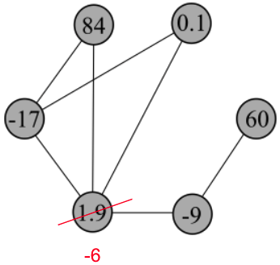
]]
]

---

class: split-two
layout: false

.column.bg-main1[
### Future Work

Analyze .alert[bounded] models through the framework of residual-constrained iterative methods.  


]


.column[

.vmiddle[.center[


]]
]

---

class: split-two
layout: false

.column.bg-main1[
### Future Work

Analyze .alert[bounded] models through the framework of residual-constrained iterative methods.  

Understand limit of consensus models via NLA and algebraic graph theory literature.


.footnote[Meng, X. F., Van Gorder, R. A., & Porter, M. A. (2018). Opinion formation and distribution in a bounded-confidence model on various networks. Physical Review E, 97(2), 022312.]

]


.column[

.vmiddle[.center[


]]
]

---

class: split-two
layout: false

.column.bg-main1[
### Future Work

Analyze .alert[bounded] models through the framework of residual-constrained iterative methods.  

Understand limit of consensus models via NLA and algebraic graph theory literature.

Extend work to models on .alert[hypergraphs].

.footnote[Hickok, A., Kureh, Y., Brooks, H. Z., Feng, M., & Porter, M. A. (2022). A bounded-confidence model of opinion dynamics on hypergraphs. SIAM Journal on Applied Dynamical Systems, 21(1), 1-32.<br><br>Meng, X. F., Van Gorder, R. A., & Porter, M. A. (2018). Opinion formation and distribution in a bounded-confidence model on various networks. Physical Review E, 97(2), 022312.]

]


.column[

.vmiddle[.center[


]]
]

---

class: split-two
layout: false

.column.bg-main1[

## Summary

<br>
The .alert[average consensus problem] may be formulated as a least-squares problem. 


]

.column[.center[.stretch[
.row[ 
.split-two[
.column[.lil-stretch[<br>
   
  ]]
.column[.lil-stretch[<br>
   
]]]]
.row[ 
.split-two[
.column[.lil-stretch[<br><br><br><br><br><br>
  .alert[Benjamin Jarman] <br> UCLA 
  ]]
.column[.lil-stretch[<br><br><br><br><br><br>
  .alert[Chen Yap] <br> Planet Labs Inc. 
]]]]

<br><br><br><br><br><br><br><br>

**JH**, Benjamin Jarman, and Chen Yap (2022). Paving the Way for Consensus: Convergence of Block Gossip Algorithms. *Submitted*.

.row[ 
.column[.lil-stretch[<br>
   
  ]]
]]
.row[ 
.column[.lil-stretch[
  .alert[Hector Tierno] <br> HMC 
  ]
]]]

]]]

---

class: split-two
layout: false

.column.bg-main1[

## Summary

<br>
The .alert[average consensus problem] may be formulated as a least-squares problem. 

Popular .alert[gossip methods] may be viewed as special cases of Kaczmarz methods.


]

.column[.center[.stretch[
.row[ 
.split-two[
.column[.lil-stretch[<br>
   
  ]]
.column[.lil-stretch[<br>
   
]]]]
.row[ 
.split-two[
.column[.lil-stretch[<br><br><br><br><br><br>
  .alert[Benjamin Jarman] <br> UCLA 
  ]]
.column[.lil-stretch[<br><br><br><br><br><br>
  .alert[Chen Yap] <br> Planet Labs Inc. 
]]]]

<br><br><br><br><br><br><br><br>

**JH**, Benjamin Jarman, and Chen Yap (2022). Paving the Way for Consensus: Convergence of Block Gossip Algorithms. *Submitted*.

.row[ 
.column[.lil-stretch[<br>
   
  ]]
]]
.row[ 
.column[.lil-stretch[
  .alert[Hector Tierno] <br> HMC 
  ]
]]]

]]]

---

class: split-two
layout: false

.column.bg-main1[

## Summary

<br>
The .alert[average consensus problem] may be formulated as a least-squares problem. 

Popular .alert[gossip methods] may be viewed as special cases of Kaczmarz methods.

Convergence results for Kaczmarz methods provide as corollaries .alert[convergence results for the gossip methods].


]

.column[.center[.stretch[
.row[ 
.split-two[
.column[.lil-stretch[<br>
   
  ]]
.column[.lil-stretch[<br>
   
]]]]
.row[ 
.split-two[
.column[.lil-stretch[<br><br><br><br><br><br>
  .alert[Benjamin Jarman] <br> UCLA 
  ]]
.column[.lil-stretch[<br><br><br><br><br><br>
  .alert[Chen Yap] <br> Planet Labs Inc. 
]]]]

<br><br><br><br><br><br><br><br>

**JH**, Benjamin Jarman, and Chen Yap (2022). Paving the Way for Consensus: Convergence of Block Gossip Algorithms. *Submitted*.

.row[ 
.column[.lil-stretch[<br>
   
  ]]
]]
.row[ 
.column[.lil-stretch[
  .alert[Hector Tierno] <br> HMC 
  ]
]]]

]]]

---

class: split-two
layout: false

.column.bg-main1[

## Summary

<br>
The .alert[average consensus problem] may be formulated as a least-squares problem. 

Popular .alert[gossip methods] may be viewed as special cases of Kaczmarz methods.

Convergence results for Kaczmarz methods provide as corollaries .alert[convergence results for the gossip methods].

This technique may be exploited for .alert[other models of consensus dynamics on networks].


]

.column[.center[.stretch[
.row[ 
.split-two[
.column[.lil-stretch[<br>
   
  ]]
.column[.lil-stretch[<br>
   
]]]]
.row[ 
.split-two[
.column[.lil-stretch[<br><br><br><br><br><br>
  .alert[Benjamin Jarman] <br> UCLA 
  ]]
.column[.lil-stretch[<br><br><br><br><br><br>
  .alert[Chen Yap] <br> Planet Labs Inc. 
]]]]

<br><br><br><br><br><br><br><br>

**JH**, Benjamin Jarman, and Chen Yap (2022). Paving the Way for Consensus: Convergence of Block Gossip Algorithms. *Submitted*.

.row[ 
.column[.lil-stretch[<br>
   
  ]]
]]
.row[ 
.column[.lil-stretch[
  .alert[Hector Tierno] <br> HMC 
  ]
]]]

]]]

---
class: middle bg-main1 
layout: false
# Thanks everyone! 

## Questions?


