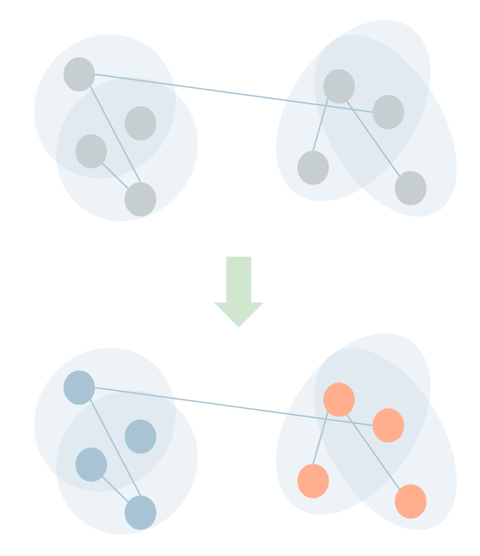
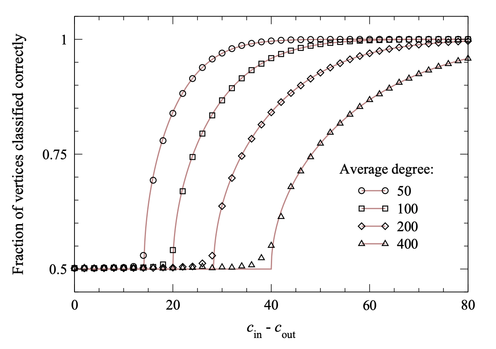
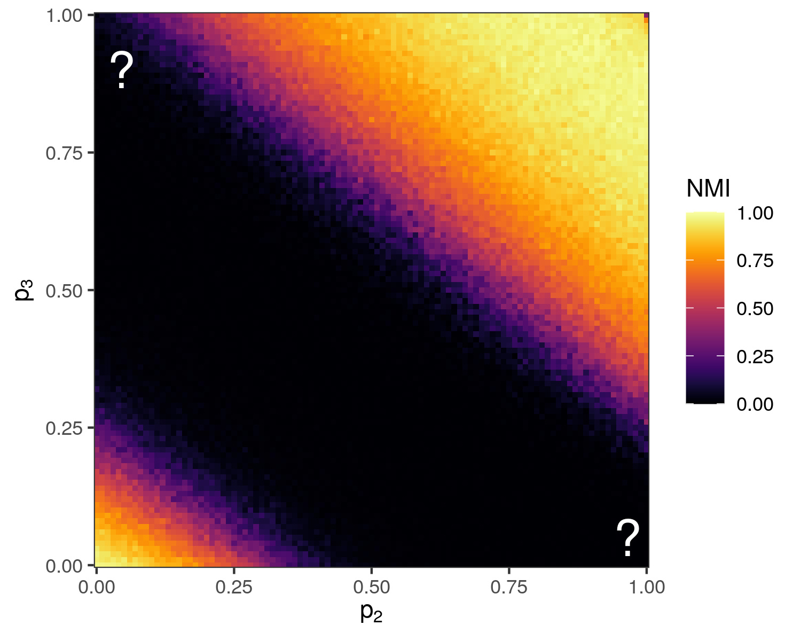
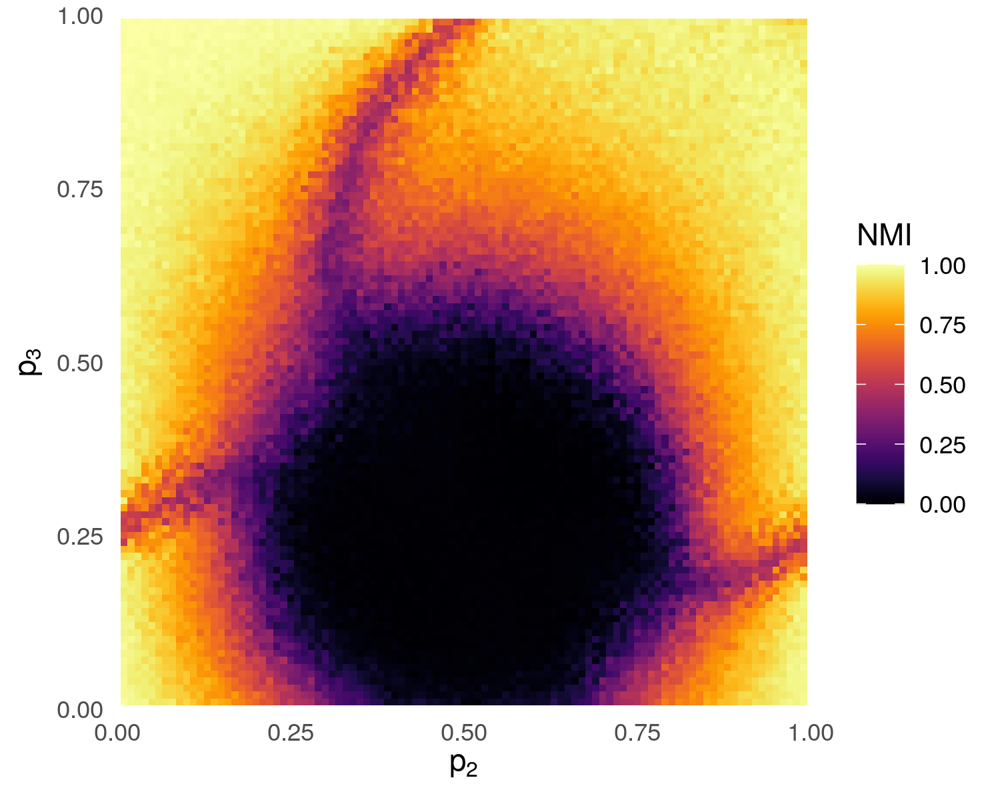
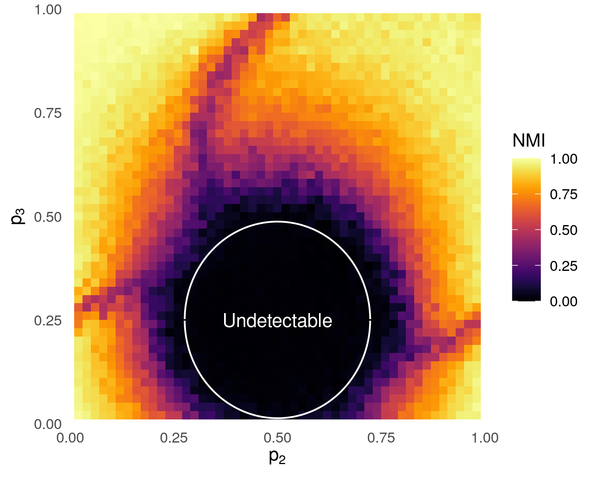

exclude: true
<style type="text/css">
code.r{ 
  font-size: 16px; 
}
pre {
  font-size: 16px !important;
}
</style>
```{r setup, include=FALSE}
options(htmltools.dir.version = FALSE)
```

---

class: split-two
layout: true

.column.bg-main1[

## Community Detection in Hypergraphs 

<br> 
**Core Problem**: Label nodes on the basis of observed (hyper)edges. 

We often picture .alert[assortative], densely-connected communities.  

What happens when edges of .alert2[different sizes] play .alert2[different roles]?  

*E.g. Large gatherings play different social/connective roles than small meetings.*                

]

.column[.content.vmiddle[.stretch[
  {{content}}           
]]]

---

class: 



---

class: 
 


---

class: bg-main5 middle
layout: false

# ***When is community detection in hypergraphs possible?*** 


---
layout: true
class: split-two with-border middle 

.column[
  .split-three[ 
  .row.bg-main1[.content.vmiddle[.font_medium[  
.alert[**Detectability thresholds**] for communities in graphs. 
  ]]]     
  .row.bg-main2[.content.vmiddle[.font_medium[
.alert[**Experimental results**] in random hypergraphs.
  ]]] 
  .row.bg-main5[.content.vmiddle[.font_medium[
Steps toward hypergraph theory via .alert[**nonbacktracking operators**]. 
  ]]]
]]

.column[
{{content}}]
 
---
class: hide-row2-col1 hide-row3-col1 hide-row4-col1 hide-row5-col1

<br><br><br>
  
  
<div class="footnote">
  Nadakuditi, R. R., & Newman, M. E. (2012). Graph spectra and the detectability of community structure in networks. <i>Physical Review Letters</i>, 108(18), 188701.  
</div>


---
class: hide-row3-col1 hide-row4-col1 hide-row5-col1
<br> <br> <br>

<br> 
<div class="footnote">
  <b>PSC</b>, N. Veldt, A. R. Benson, (2021). Generative hypergraph clustering: from blockmodels to modularity, <i>Science Advances (forthcoming)</i>
</div> 

---
class: hide-row4-col1 hide-row5-col1 
<br> <br> <br> 


---

class: fade-row2-col1 fade-row3-col1 fade-row4-col1 fade-row5-col1
<br><br><br>
  
  
<div class="footnote">
  Nadakuditi, R. R., & Newman, M. E. (2012). Graph spectra and the detectability of community structure in networks. <i>Physical Review Letters</i>, 108(18), 188701.  
</div>

---

class: split-two
layout: false

.column.bg-main1[

## Detectability in Graphs

<br>

In a random graph (SBM) with two, equally-sized communities, let:

- $\color{#63d297}{c_i}$: average number of .alert2[within-cluster] neighbors per node.
- $\color{#ff5252}{c_o}$: the average number of .alert[between-cluster] neighbors per node. 

**Detectability threshold (informal)**: In the large-graph limit, it is possible to detect communities iff  

$$(\color{#63d297}{c_i} - \color{#ff5252}{c_o})^2 > \frac{1}{2}\sqrt{\color{#63d297}{c_i} + \color{#ff5252}{c_o}}\;.$$ 

]

.column[

## *A Brief History*

<br>

.font_smaller[

**Conjectured** using belief-propagation by Decelle, A., Krzakala, F., Moore, C., & Zdeborová, L. (2011),  <i>PRE</i>. 

**Re-conjectured** via nonbacktracking operators in Krzakala, F., Moore, C., Mossel, E., Neeman, J., Sly, A., Zdeborová, L., & Zhang, P. (2013), *PNAS*.

**Negative direction proved** via a coupling to broadcasting on trees: Mossel, E., Neeman, J., & Sly, A. (2015). *Probability Theory and Related Fields*.

**Positive direction proved** via weighted nonbacktracking paths by by Mossel, E., Neeman, J., & Sly, A. (2018), *Combinatorica*.

**Helpful review**: Abbe, E. (2017), *JMLR*.
]
]

---

class: split-two
layout: false

.column.bg-main1[

## Detectability in Graphs

<br> 

In a random graph (SBM) with two, equally-sized communities, let:

- $\color{#63d297}{c_i}$: average number of .alert2[within-cluster] neighbors per node.
- $\color{#ff5252}{c_o}$: the average number of .alert[between-cluster] neighbors per node. 

**Detectability threshold (informal)**: In the large-graph limit, it is possible to detect communities iff  

$$(\color{#63d297}{c_i} - \color{#ff5252}{c_o})^2 > \frac{1}{2}\sqrt{\color{#63d297}{c_i} + \color{#ff5252}{c_o}}\;.$$ 

]

.column[
<br><br><br>
  
.font_smaller[A spectral method is shown, but the threshold applies to **any algorithm.**]
  
<div class="footnote">
  Nadakuditi, R. R., & Newman, M. E. (2012). Graph spectra and the detectability of community structure in networks. <i>Physical Review Letters</i>, 108(18), 188701.  
</div>
]


---
layout: true
class: split-two with-border middle 

.column[
  .split-three[ 
  .row.bg-main1[.content.vmiddle[.font_medium[
.alert[**Detectability thresholds**] for communities in graphs. 
  ]]]     
  .row.bg-main2[.content.vmiddle[.font_medium[
.alert[**Experimental results**] in random hypergraphs. 
  ]]]
  .row.bg-main5[.content.vmiddle[.font_medium[
Steps toward hypergraph theory via .alert[**nonbacktracking operators**]. 
  ]]]
]]

.column[
{{content}}]
 


---

class: fade-row1-col1 fade-row3-col1 fade-row4-col1

<br> <br> <br> 

<br> 
<div class="footnote">
  <b>PSC</b>, N. Veldt, A. R. Benson, (2021). Generative hypergraph clustering: from blockmodels to modularity, <i>Science Advances (forthcoming)</i>
</div>


---
class: split-50 bg-main1 
layout: false 

.row[ 
.split-three[
.column[<br><br>
   
  ]
.column[<br><br>
   
]
.column[<br><br>
   
] 

]
]
.row[ 
.split-three[
.column[<br>
  .font_large[.alert[<nobr>Nate Veldt</nobr>]]
  <nobr>Applied Mathematics</nobr> <br> Cornell University
  @n_veldt
]
.column[<br>
  .font_large[.alert[<nobr>Austin Benson</nobr>]]
   Computer Science <br> Cornell University
   @austinbenson
]
.column[<br>
  .font_large[.alert[<nobr>Phil Chodrow</nobr>]]
  <nobr>Mathematics</nobr> <br> UCLA
  <br> @PhilChodrow
]
]
]
    
---

class: split-two
layout: false


 
.column.bg-main1[
## Modularity Objective 

<br> 
$$Q = \sum_k\color{#ff5252}{\beta_k}\left[ \mathbf{cut}_k(\mathbf{z}) - \color{#63d297}{\gamma_k}\sum_{\ell} \mathbf{vol}(\ell)^k\right]$$

- $\mathbf{z}$: cluster labels. 
- $\mathbf{cut}(\mathbf{z})$: number of $k$-edges split by $\mathbf{z}$. 
- $\mathbf{vol}(\ell)$: Sum of degrees in cluster $\ell$. 
- $\color{#ff5252}{\beta_k}$: importance of edges of size $k$. 
- $\color{#63d297}{\gamma_k}$: resolution parameter for edges of size $k$.   

Approximates maximum-likelihood in a certain blockmodel. 
]

.column[
## Louvain Algorithm

<br>

1. All nodes start in their own clusters. 
2. Greedily agglomerate nodes to maximize $Q$. 
3. Greedily agglomerate **clusters** of nodes to further maximize $Q$. 

Re-estimate $\beta_k$ and $\gamma_k$. 

Repeat...

<div class="footnote">
  <b>PSC</b>, N. Veldt, A. R. Benson, (2021). Generative hypergraph clustering: from blockmodels to modularity, <i>Science Advances (forthcoming)</i>
</div>

]


---

layout: false

## Experimental Setup

 

.footnote[**PSC**, N. Veldt, A. R. Benson, (2021). Generative hypergraph clustering: from blockmodels to modularity. *Science Advances (forthcoming)*] 
 


---

layout: false
class:  

## Detectability limits: graphs vs. hypergraphs

 

.footnote[**PSC**, N. Veldt, A. R. Benson, (2021). Generative hypergraph clustering: from blockmodels to modularity. *Science Advances (forthcoming)*] 

---

class: split-two


.column.bg-main1[
## Can we do better? <br> 

<br> <br> 
Unclear! Extant theory on hypergraphs only treats .alert[*uniform*] hypergraphs (all edges same size).

Most hypergraph data sets are non-uniform...

We seek .alert2[detectability theory] for .alert[non-uniform hypergraphs].


]

.column[

### (*Papers on Uniform Hypergraphs*)

.font_smaller[

<br> <br> <br>

Lin, C. Y., Chien, I. E., & Wang, I. H. (2017).  *IEEE International Symposium on Information Theory*.

Ghoshdastidar, D., & Dukkipati, A. (2017). *Annals of Statistics*.

Angelini, M. C., Caltagirone, F., Krzakala, F., & Zdeborová, L. (2015), *Allerton Conference*.

]]


---
layout: true
class: split-two with-border middle 

.column[
  .split-three[ 
  .row.bg-main1[.content.vmiddle[.font_medium[
.alert[**Detectability thresholds**] for communities in graphs. 
  ]]]     
  .row.bg-main2[.content.vmiddle[.font_medium[
.alert[**Experimental results**] in random hypergraphs. 
  ]]]
  .row.bg-main5[.content.vmiddle[.font_medium[
Steps toward hypergraph theory via .alert[**nonbacktracking operators**]. 
  ]]]
]]

.column[
{{content}}]
 

---

class: fade-row1-col1 fade-row2-col1 fade-row4-col1

<br> <br> <br> 


---
class: split-50 bg-main1 
layout: false 
 
.row[ 
.split-three[
.column[<br><br>
   
  ]
.column[<br><br>
   
]
.column[<br><br>
     
] 

]
]
.row[ 
.split-three[
.column[<br>
  .font_large[.alert[<nobr>Jamie Haddock</nobr>]]
  <nobr>Mathematics</nobr> <br> Harvey Mudd College      
  @jamie_hadd
]
.column[<br>
  .font_large[.alert[<nobr>Nicole Eikmeier</nobr>]]
   Computer Science <br> Grinnell College      
   @NicoleEikmeier 
]
.column[<br>
  .font_large[.alert[<nobr>Phil Chodrow</nobr>]]
  <nobr>Mathematics</nobr> <br> UCLA
  <br> @PhilChodrow <br>
]
]
]

---

class: split-two
layout: false


.column.bg-main1[
## Hypergraph Nonbacktracking

Write $(e_1, p_1) \sim (e_2, p_2)$ if: 

- $p_1 \in e_1$ and $p_2 \in e_2$
- $p_1 \in e_2 \setminus p_2$
- $e_1 \neq e_2$

The .alert2[hypergraph nonbacktracking operator] $\color{#63d297}{\mathbf{B}}$ is the linear operator 

.font_smaller[ 
$$\mathbf{B}[(e_1, p_1), (e_2, p_2)] = \begin{cases} 1 &\quad (e_1, p_1) \sim (e_2, p_2) \\ 
0 &\quad \text{otherwise.}\end{cases}$$
]]

.column[
<br> <br> <br> 
.stretch[]
]

---

class: split-two
layout: false


.column.bg-main1[
## Hypergraph Nonbacktracking


First formulated by Storm, C. K. (2006). *The Electronic Journal of Combinatorics*.

"Rediscovered" by Angelini, M. C., Caltagirone, F., Krzakala, F., & Zdeborová, L. (2015), *Allerton Conference*.


 .alert2[Well-defined on non-uniform hypergraphs!]

 .alert[Second eigenvector] is correlated with communities in detectable regime. 
 
]

.column[
<br> <br> <br> 

]


---

class: split-two
layout: false


.column.bg-main1[
## Hypergraph Nonbacktracking


First formulated by Storm, C. K. (2006). *The Electronic Journal of Combinatorics*.

"Rediscovered" by Angelini, M. C., Caltagirone, F., Krzakala, F., & Zdeborová, L. (2015), *Allerton Conference*.


 .alert2[Well-defined on non-uniform hypergraphs!]

 .alert[Second eigenvector] is correlated with communities in detectable regime. 
 
]

.column[.content.vmiddle[.stretch[
   
]] 
.footnote[**PSC**, J. Haddock, N. Eikmeier, *ongoing work.*]]
]

---

class: split-two
layout: false


.column.bg-main1[
## Hypergraph Nonbacktracking

<br><br> 
 .alert[Second eigenvector] correlated with communities in detectable regime. 
 
Surprisingly, can't reach the ? corners in experiments, even though we know this to be .alert2[experimentally possible.]


]

.column[.content.vmiddle[.stretch[

]]
.footnote[**PSC**, J. Haddock, N. Eikmeier, *ongoing work.*]]
]


---
layout: true
class: split-two  

.column.bg-main1[
## Reaching the Corners

We use a modified nonbacktracking operator to adapt to .alert2[qualitatively distinct roles] for edges of multiple sizes.

The community-correlated eigenvector can either the first or second eigenvector of the modified operator. 

Under some approximations, we can .alert[analytically derive] the undetectable region: 

$$(2p_2 - 1)^2 c_2  + 2\left(\frac{4p_3 - 1}{3}\right)^2c_3 \leq 1$$


]

.column[.content.center.vmiddle[.stretch[
  {{content}}
  
]].footnote[**PSC**, J. Haddock, N. Eikmeier, *ongoing work.*]]
---

---
 


---

class: split-two
layout: false

.column.bg-main1[

# Future Directions

**Performance**

- Fast computation of spectrum via .alert[Ihara-Bass determinants]. 

**Generalizations**

- Arbitrary .alert2[numbers] and .alert2[sizes] of communities.


**Theory**

- Bounds on spectral clustering $\stackrel{?}{\implies}$ bounds on .alert[*any* algorithm]?

]

.column[.content.vmiddle[.stretch[
 
]]]


---
layout: false
class: split-two  


.column.bg-main1[

# **Thanks!!**

.row[ 
.split-two[
.column[.lil-stretch[<br><br><br><br> 
   
  ]]
.column[.lil-stretch[<br><br><br><br>
   
]]]]
.row[ 
.split-two[
.column[.lil-stretch[<br><br><br><br><br><br><br><br><br><br>
  .alert[Jamie Haddock] <br> Harvey Mudd
  ]]
.column[.lil-stretch[<br><br><br><br><br><br><br><br><br><br>
  .alert[Nicole Eikmeier] <br> Grinnell
]]]]

<br><br><br><br><br><br><br><br><br>


- Leonie Neuhäuser 
- Christopher Blöcker
- Jürgen Hackl
- Y'all!! 


]

]


.column[
<br> <br> <br> <br> <br> <br> <br> 
# **Questions?** 
<!--  -->
]

