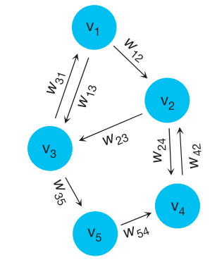
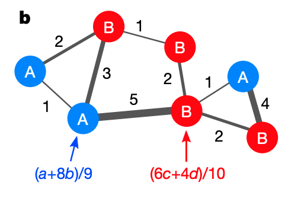
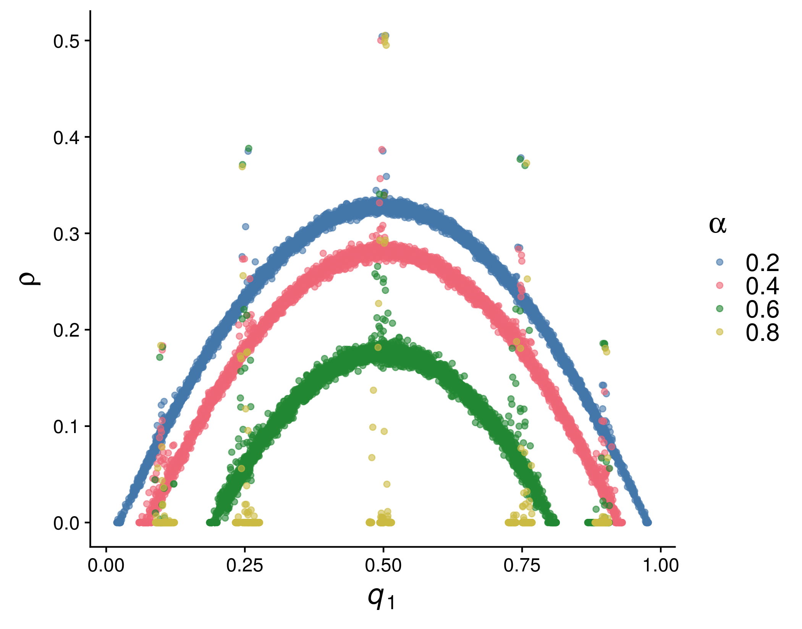
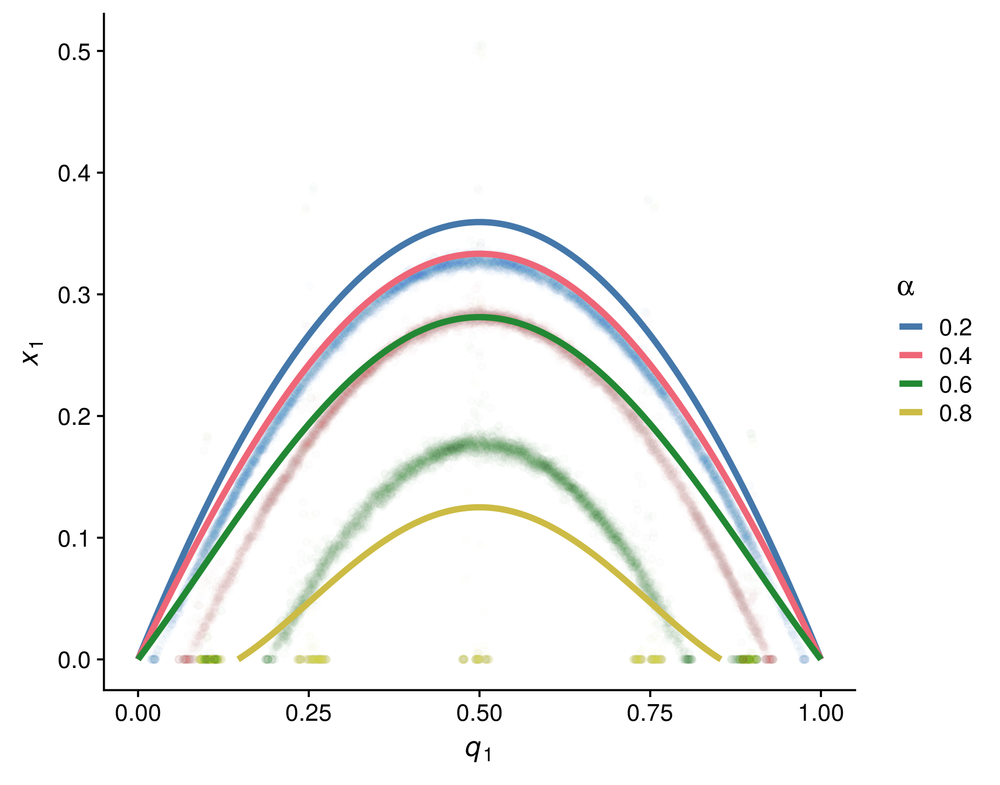
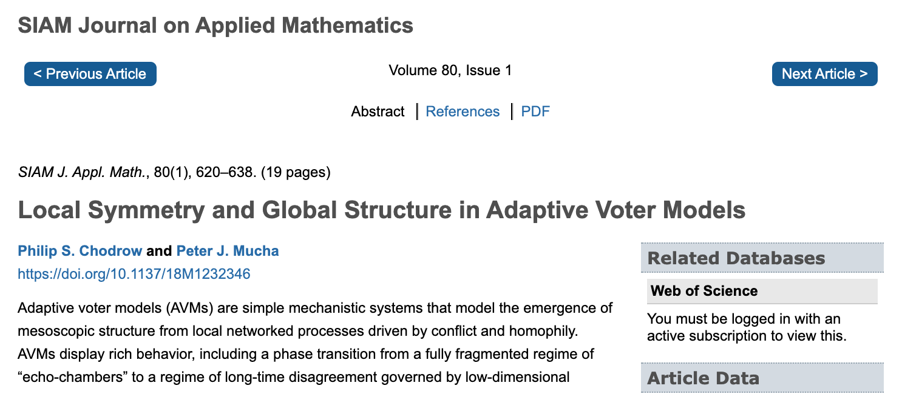

class: left, middle, inverse

```{r setup, include=FALSE}
options(htmltools.dir.version = FALSE)
```


# Coevolutionary Graphs
## Models, Dynamics, and Approximations


.pull-left[
###  Phil Chodrow, MIT 
### *Peter Mucha, UNC*
March 22nd, 2020
]

.pull-right[
.centered[
<br>
<br>
	 
]
]

---

class: left, top

# Agenda

1). Quick review of some evolutionary graph theory models (for contrast).

2). **Co**evolutionary models and competing timescales. 

3). Extended example: approximations for the adaptive voter model.

--

4). *(The hidden agenda): I want you to work on coevolutionary models.*

---

class: left, top

## Review: **Evolutionary Dynamics on Graphs**

.pull-left[.smaller[1. Choose an individual $i$ proportional to their current fitness $\phi_i$. 
1. Sample $j \in \mathcal{N}(i)$ proportional to $w_{ij}$. Then, $\phi_j\gets \phi_i$.
1. .alert[**Isothermal Theorem**]: This process has the same long-term selection dynamics as the complete graph $K_n$ iff $T_i = \sum_j{w_{ji}}$ is constant on $V$. 
]
]

.pull-right[
  
]

.footnote[
Leiberman et al., *Nature* (2005)
]

---


## Review: **Evolutionary Games on Graphs**

.pull-left[
.smaller[	
1. Agents play a chosen strategy  in a two-player game along each weighted edge.
1. An agent is selected for death, replaced proportional to fitness of neighbors. 
1. .alert[**Result**]: It is possible to classify whether selection favors the emergence of cooperative behavior based purely on graph topology. 
]
]


.pull-right[
  
]

.footnote[
Allen et al., *Science* (2017)
]

---

class: center, middle, inverse

# 

.bigger[**Dynamics unfolding *on* networks are often tractable.**]

---

background-color: #000000
background-image: url(img/jerks.jpg)
background-size: contain

---

background-color: #000000
background-image: url(img/neighbors.jpg)
background-size: contain

---

background-color: #000000
background-image: url(img/sick.jpg)
background-size: contain

---

class: left, top
background-image: url("img/adaptive_networks.png")
background-size: contain

# Coevolutionary Graphs

.footnote[
Image from Malik and Shi, ["Adaptive Networks in Action"](https://dsweb.siam.org/The-Magazine/Article/adaptive-networks-in-action-opinion-formation-epidemics-and-the-evolution-of-cooperation), *SIAM DS Web*
]

---

class: left, top

# Some Life Advice

"If your friends are jerks, make new friends."

.smaller[.smaller[.smaller[Generic absorbing transition in coevolution dynamics (Vazquez et al.,  *PRL*, 2008)]]] 


"If your friends outcompete you, make new friends."

.smaller[.smaller[.smaller[Evolutionary prisoner’s dilemma games coevolving on adaptive networks (Lee et al., *Journal of Complex Networks*, 2017).]]]


"If your friends make you sick, make new friends."

.smaller[.smaller[.smaller[Social clustering in epidemic spread on coevolving networks (Malik et al., *PRE*, 2019).]]]

---

class: center, middle, inverse

# Mathematically...

---

background-color: #000000
background-image: url(img/borked.jpg)
background-size: contain

---

class: top, left

# Everything is Borked

1) Whole process is usually Markovian, but neither node- nor edge-upates are in isolation $\rightarrow$ no closed form anything. 

--

2) Edge updates tend to create long-range correlations between node states. $\rightarrow$ mean-field theories will usually perform poorly. 

--

3) What questions should we even be asking of these models?? 

---

class: left, top

# Example: Voter Model (AVM)

Nodes have binary states $\in \{0,1\}$. 
At each time step $t$: 

Pick an edge $e = (u,v)$ where $u$ and $v$ disagree. 

- With probability $\alpha$, .alert[**rewire**]: delete $(u,v)$ and form $(u,w)$, where $w$ agrees with $u$ ("rewire-to-same") or $w$ is uniformly random ("rewire-to-random"). 
- With probability $1-\alpha$, .alert[**vote**]: $v$ adopts $u$'s opinion. 


**Alternative View**: Neutral drift in a population where wild-types prefer to avoid mutants. 

**Alternative Alternative View**: SI model with reactive social distancing. 

---

class: left, middle

# Let's do an experiment! 
From Malik and Shi, ["Adaptive Networks in Action"](https://dsweb.siam.org/The-Magazine/Article/adaptive-networks-in-action-opinion-formation-epidemics-and-the-evolution-of-cooperation), *SIAM DS Web*

---

class: left, top
background-image: url("img/AVM_animation.gif")
background-size: contain

---

# Model Timescales

With only rewiring ( $\alpha = 1$ ), disagreement resolved in time $\sim O(n \log n)$ on sparse graphs. .alert[**Fast dynamics, segregated consensus**].  

With only voting ( $\alpha = 0$ ), disagreement resolved in time $\sim O(n^2)$.  .alert[**Slow dynamics, hegemonic consensus**]. 

These two regimes are separated by a .alert[phase transition] in $\alpha$. 
If mean degree is 4, then $\alpha \approx 0.73$ (rewire-to-random). 

---

background-image: url(img/phase_transition_basic.png)
background-size: contain

---

background-image: url(img/network_sample_detailed.png)
background-size: contain

# Near the Phase Transition

---

class: left, middle, inverse

.bigger[Disparate .alert[**timescales**] between node and edge dynamics drive phase transitions in long-term behavior.]

---

class: left, top

# The Arch

.pull-left[
	
]
.pull-right[

.alert[**Quasistable manifold**] governing relationship between fraction of ones $q_1$ and fraction of discordant edges $\rho$. 
]

---

# The Arch: Analysis Questions

.pull-left[
	
]

.pull-right[
- .alert[**Phase Transition**]: Can we estimate the value of $\alpha$ at which the arch emerges?
- .alert[**Quasistable Density**]: Can we estimate the complete shape of the arch? 
]

---

# Methods

---

# Methods: Exact Solutions

.left-column[

### .tiny[Exact]

]

.right-column[


]

---

# Methods: Exact Solutions

.left-column[

### .tiny[Exact]

]

.right-column[
**LOL no.** 


]

---

# Methods: Pair Approximation

.left-column[

### .tiny[Exact]

### .tiny[PA]

]

.right-column[
.smaller[
A continuous-time mean field theory directly relating the fraction of ones $q_1$ to edge densities $x_{00}$, $x_{01}$, and $x_{11}$. Approximates triplets of nodes as sets of pairs (moment closure):
The approximate update in the fraction of disagreeing edges $x_{01}$ is 
]

.tiny[
$$\frac{dx_{01}}{dt} = \underbrace{x_{01}}_{\text{removed}} -  \overbrace{(1-\alpha) x_{01}}^\text{created by rewiring} + \underbrace{(1-\alpha)\left[\frac{x_{10}x_{00}}{q_0} + \frac{x_{11}x_{10}}{q_1} - \frac{x_{10}x_{01}}{q_0} - \frac{x_{01}x_{10}}{q_1} \right]}_{\text{created/destroyed by voting}}$$
]

.smaller[
Solve to obtain an approximation for the arch....that doesn't match the data very well. =(
]
]

---

# Methods: Pair Approximation

.left-column[

### .tiny[Exact]

### .tiny[PA]

]

.right-column[

]


---

# Methods: Approximate Master Equations

.left-column[

### .tiny[Exact]

### .tiny[PA]

### .tiny[AMEs]
]

.right-column[
A continuous-time .alert[**compartmental**] approach: track node densities with $j$ agreeing neighbors and $k$ disagreeing neighbors, for each combination of $k$ and $j$.


.footnote[.tiny[Durrett et al.,*PNAS*, 2012]]
]

---

# Methods: Approximate Master Equations

.left-column[

### .tiny[Exact]

### .tiny[PA]

### .tiny[AMEs]
]

.right-column[
This works ok, but is not interpretable and scales poorly with mean degree. 
For mean degree 4, there are ~200 equations like the below. 


.footnote[.tiny[Durrett et al.,*PNAS*, 2012]]
]

---

# Methods: Bespoke

.left-column[

### .tiny[Exact]

### .tiny[PA]

### .tiny[AMEs]

### .tiny[.smaller[Bespoke]]
]


.right-column[

Literally anything else. 

1). PDE approximations -- Silk et al., *New Journal of Physics* (2014)


2). Linearization near the emergence of the arch -- Bohme + Gross, *PRE* (2011)


3). .alert[**Discrete-time Markovian approximations**] -- Chodrow + Mucha, *SIAM J. Applied Math* (2020)
]

---
background-image: url('img/siam_journal.png')
background-size: contain

---

# Discrete-Time Markovian Approximations

$$\underbrace{\mathbf{m}(t+1) - \mathbf{m}
(t)}_{\text{change in edge counts}} = \underbrace{\alpha\mathbb{E}[\mathbf{R}(\mathbf{x})]}_{\text{rewiring}} +\underbrace{(1-\alpha)\mathbb{E}[\mathbf{V}(\mathcal{G}(t))]}_{\text{voting}}$$

.pull-left[
Second term is non-Markovian $\rightarrow$ no closed form. 

We can approximate it by tracking each discordant edge (under some modeling assumptions). 

Ugly bookkeeping, but easy computation.
]
.pull-right[


Joint work with Peter Mucha, UNC
]

---
background-image: url('img/table.png')
background-size: contain

.footnote[(Impacts and rates for different kinds of voting events)]

---
background-image: url('img/arch_approx.png')
background-size: contain

---

# Takeaways

Competing timescales of node and edge dynamics drive rich behavior even in simple systems. 

--

It helps to treat these systems as truly discrete, rather than resort to continuous-time approximations. 

--

This is a .alert[**great area**] for applied mathematicians, with lots of potential in evolutionary dynamics and theoretical ecology. 

--

**The best work here is yet to come!**

---

background-color: #000000
background-image: url(img/boldly.jpg)
background-size: contain

---

class: left, top, inverse

# Thanks! 

.large-left-column[

.smaller[


[philchodrow.com](https://www.philchodrow.com) 

@philchodrow

MIT $\rightarrow$ UCLA]
]



