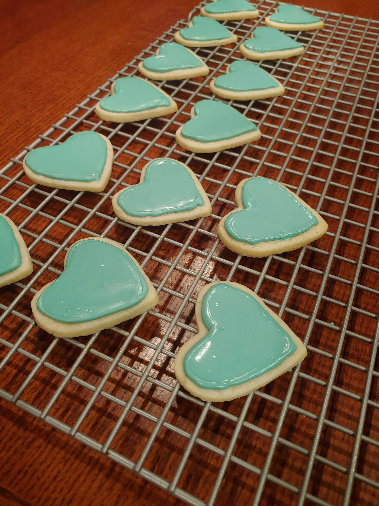
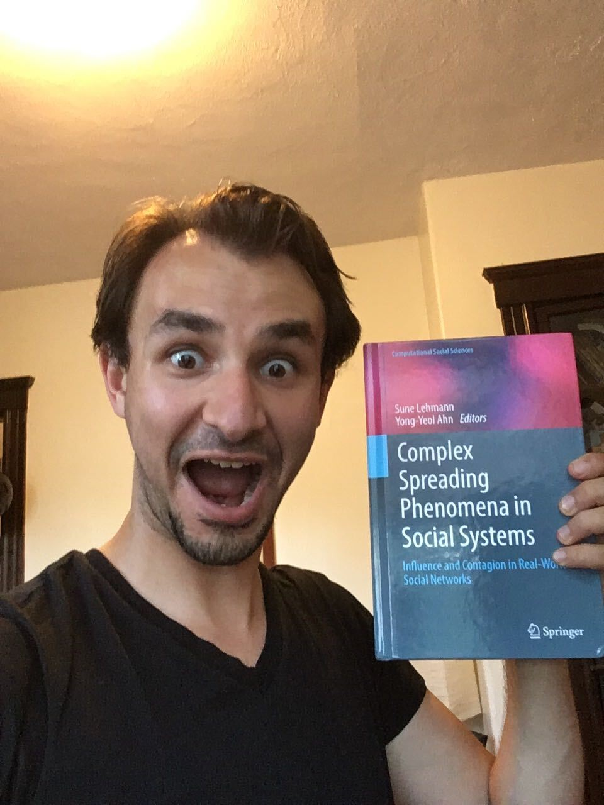

exclude: true
<style type="text/css">
code.r{
  font-size: 16px; 
}
pre {
  font-size: 16px !important;
}
</style>
```{r setup, include=FALSE}
options(htmltools.dir.version = FALSE)
```


---
class: split-50 bg-main1

.row[
.split-four[
.column[.image-caption-right[
  <br>
  ## .alert[<nobr>Mari Kawakatsu</nobr>]
  .font_medium[Applied and Computational Mathematics <br> Princeton University ]
  ]   
]
.column[.image-bottom[
   
]]
.column[  
.image-bottom[
  
]  
] 
.column[.image-caption-left[
  <br>
  ## .alert[<nobr>Phil Chodrow</nobr>]
  .font_large[Mathematics <br> UCLA]
  ] 
]
]
]

.row[
.split-four[
.column[.image-caption-right[
  ## .alert[<nobr>Nicole Eikmeier</nobr>]
  .font_large[<nobr>Computer Science</nobr> <br> Grinnell]      
  ]   
]
.column[
   
]
.column[    
  
] 
.column[.image-caption-left[
  ## .alert[<nobr>Dan Larremore</nobr>]
  .font_large[<nobr>Computer Science</nobr> <br> CU Boulder ]
  ] 
]
]
]

---
layout: true
class: split-two with-border middle

.column[
  .split-four[
  .row.bg-main1[.content.font2[
Quick overview of .alert[**networks**] and why we care about them.
  ]]
  .row.bg-main2[.content.font2[
.alert[**Ranking**] in networks. <br> (Here be linear algebra.)
  ]]
  .row.bg-main3[.content.font2[
From ranks to self-sustaining  <br>.alert[**feedback loops**]. 
  ]]
  .row.bg-main5[.content.font2[
.alert[**Having fun**] while doing science. 
  ]]
]]

.column[.content.center.vmiddle[
{{content}}
]]

---
class: hide-row2-col1 hide-row3-col1 hide-row4-col1

***Image credit:*** *Wikipedia*
---
class: hide-row3-col1 hide-row4-col1

$$\left[\mathbf{D}^i + \mathbf{D}^o - (\mathbf{A} + \mathbf{A}^T) +\alpha \mathbf{I}\right]\mathbf{s} = \left[\mathbf{D}^i- \mathbf{D}^o \right]\mathbb{1}$$
---
class: hide-row4-col1

---
class:




---
class: fade-row2-col1 fade-row3-col1 fade-row4-col1
   
***Image credit:*** *Wikipedia*    

---
layout: false
class: split-two
  
.column.bg-main1[<br> <br>
.content.font3[.color-main1[Directed] Networks] 
.blockquote.font_large[A ***.alert2[network]*** (or ***.alert2[graph]***) consists of:
- A set $\mathcal{N}$ of entities, called *.alert2[nodes]*.
- A set of $\mathcal{E}$ of connections between pairs of nodes, called *.alert2[edges]*.]

.font_large[Social groups, complex infrastructure, and natural ecosystems are among the .alert[many] systems we can model with networks.]
]

.column[
.content.center.vmiddle[
   
***Image credit:*** *Wikipedia*
]
]

---
layout: true
class: split-two

.column[
  .split-four[
  .row.bg-main1[.content.font3[
.alert[Directed] Networks
  ]]
  .row.bg-main1[.content.font_large[
  .alert2[Competitions] (chess, basketball...)  <br> 
  .color-main1[tab] Nodes are competitors/teams. <br>
  .color-main1[tab] $A \rightarrow B$ $\implies$ $B$ beats $A$. 
  ]]
  .row.bg-main1[.content.font_large[ 
  .alert2[Internet] (Google, Facebook) <br>
  .color-main1[tab] Nodes are webpages. <br>
  .color-main1[tab] $A\rightarrow B$ $\implies$ $A$ links to $B$. 
  ]] 
  .row.bg-main1[.content.font_large[
  .alert2[Endorsements] (politics, Twitter) <br> 
  .color-main1[tab] Nodes are people. <br>
  .color-main1[tab] $A\rightarrow B$ $\implies$ $A$ thinks $B$ is good.   
  ]]
]]

.column[.content.center.hmiddle[<br>
<br>
***Image credit:*** *Wikipedia*
{{content}}
]]

---
class: hide-row2-col1 hide-row3-col1 hide-row4-col1 

---
class: hide-row3-col1 hide-row4-col1
 

---
class:hide-row4-col1


---

class:
<br> 
***Image credit***: [PJ Lamberson](http://social-dynamics.org/twitter-network-data/)

---
layout: true
class: split-two with-border middle

.column[
  .split-four[
  .row.bg-main1[.content.font2[
Quick overview of .alert[networks] and why we care about them.
  ]]
  .row.bg-main2[.content.font2[
.alert[Ranking] in networks. <br> (Here be linear algebra.)
  ]]
  .row.bg-main3[.content.font2[
From ranks to self-sustaining  <br>.alert[feedback loops]. 
  ]]
  .row.bg-main5[.content.font2[
.alert[**Having fun**] while doing science. 
  ]]
]]

.column[.content.center.vmiddle[
{{content}}
]]

---
class: fade-row1-col1 fade-row3-col1 fade-row4-col1

$$\left[\mathbf{D}^i + \mathbf{D}^o - (\mathbf{A} + \mathbf{A}^T) +\alpha \mathbf{I}\right]\mathbf{s} = \left[\mathbf{D}^i- \mathbf{D}^o \right]\mathbb{1}$$

---
class: middle
layout: false

.split-two[
.column.bg-main1[
<br><br>
# The Network Ranking Problem

.blockquote.font_large[Given a network, assign a scalar .alert2[**rank**] or .alert2[**score**] to each node in $\mathcal{N}$ based on its links between pairs.   
]


.content.font_large[
1. Who is the **best** chessplayer? 
  - [Magnus Carlsen](https://twitter.com/MagnusCarlsen?ref_src=twsrc%5Egoogle%7Ctwcamp%5Eserp%7Ctwgr%5Eauthor)
2. Which website is **most central** to the internet?
  - [philchodrow.com](www.philchodrow.com)
3. What is the **most important** account on Twitter?
  - [No Context Star Trek](https://twitter.com/NoContextTrek)]
]
.column[
.content.center.vmiddle[
<br> 
***Image credit:*** *Wikipedia* 
]
]
]

---
class: middle
layout: false

.split-two[ 
.column.bg-main5[
<br> <br> 
# The Adjacency Matrix <br> <br> 
.content.center[.font_large[ 
  $$\mathbf{A} = \left[\begin{matrix}
    <!-- 0 & \mathbf{1} & 0 & 0 & 0 & 0 \\  -->
    <!-- 0 & 0 & \mathbf{1} & 0 & 0 & 0 \\ -->
    <!-- 0 & 0 & 0 & 0 & \mathbf{1} & 0 \\ -->
    <!-- 0 & \mathbf{1} & 0 & 0 & 0 & 0 \\ -->
    <!-- 0 & 0 & 0 & \mathbf{1} & 0 & \mathbf{1} \\  -->
    <!-- 0 & 0 & 0 & 0 & 0 & 0  -->
    \end{matrix}\right] 
    $$
    
  Turns **network** problems into **linear algebra** problems. 
  ]
  ]
]
.column[
.content.center.vmiddle[
<br> 
***Image credit:*** *Wikipedia*
]
]
]


