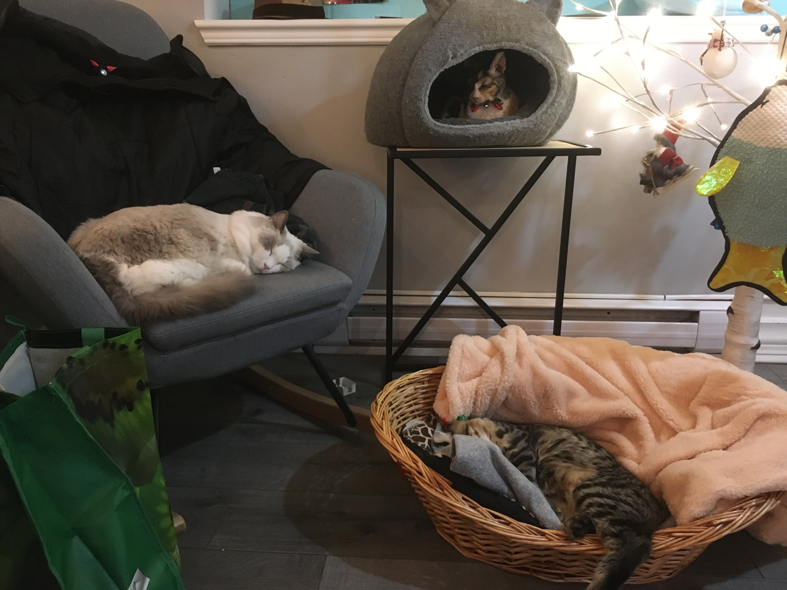
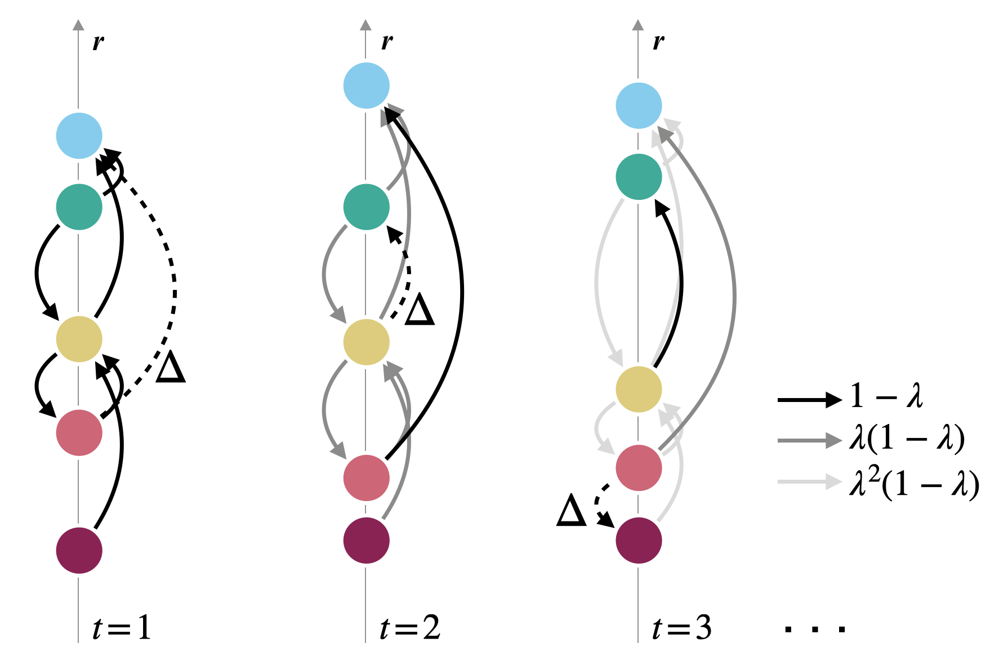
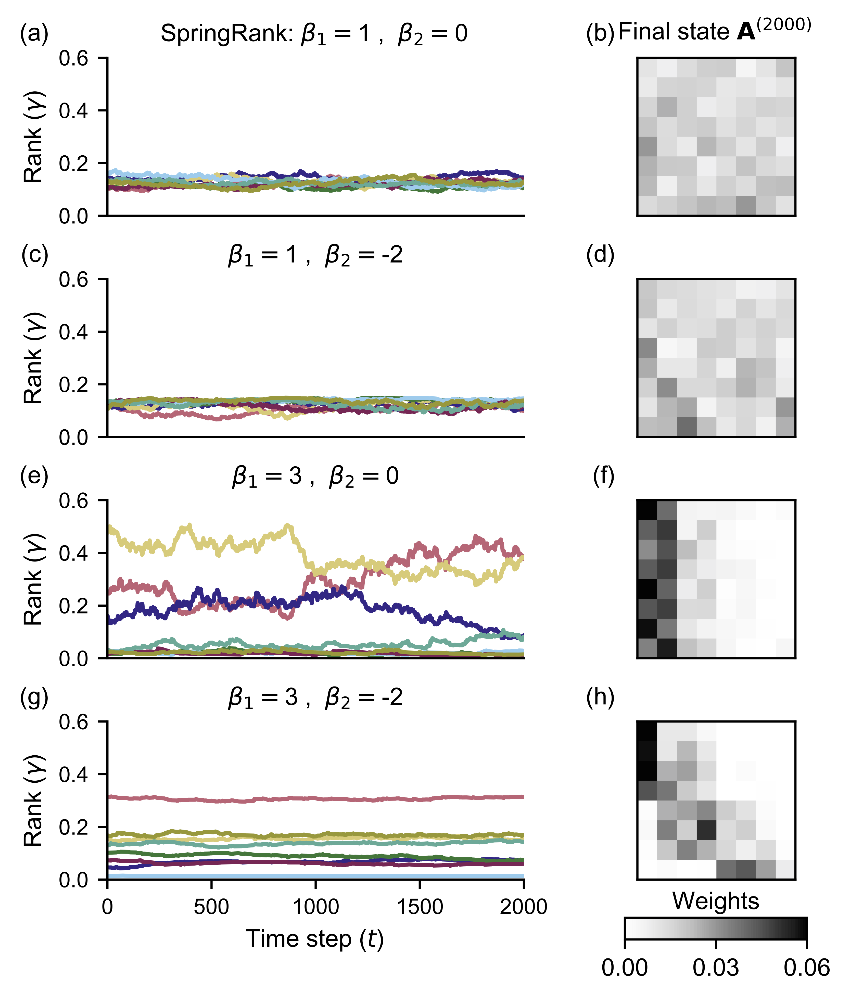
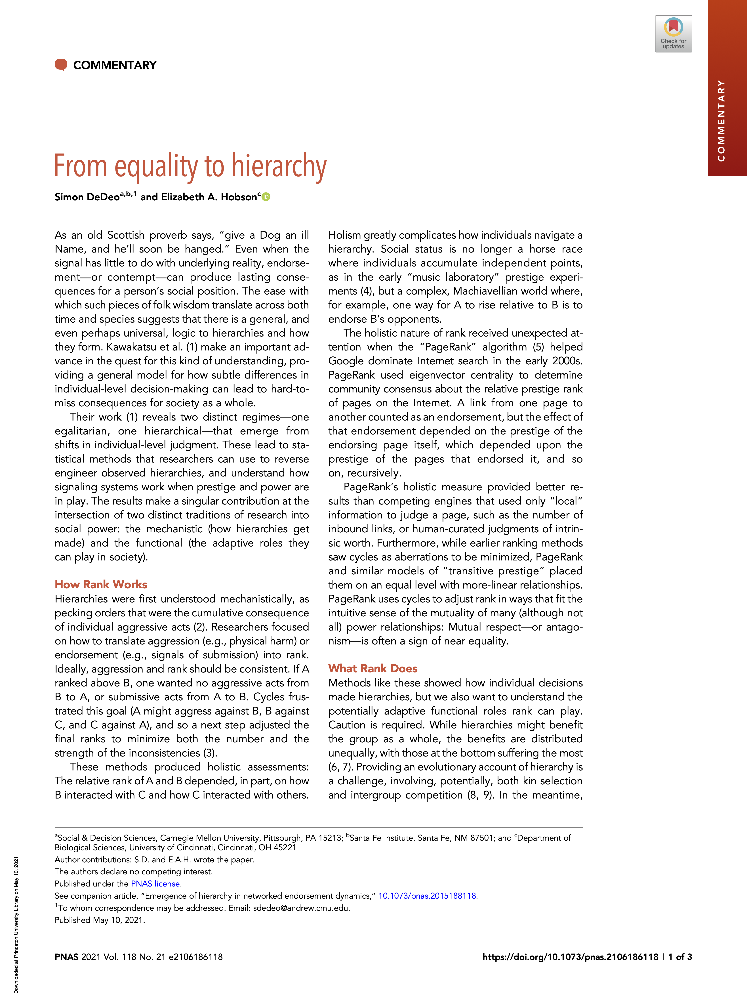
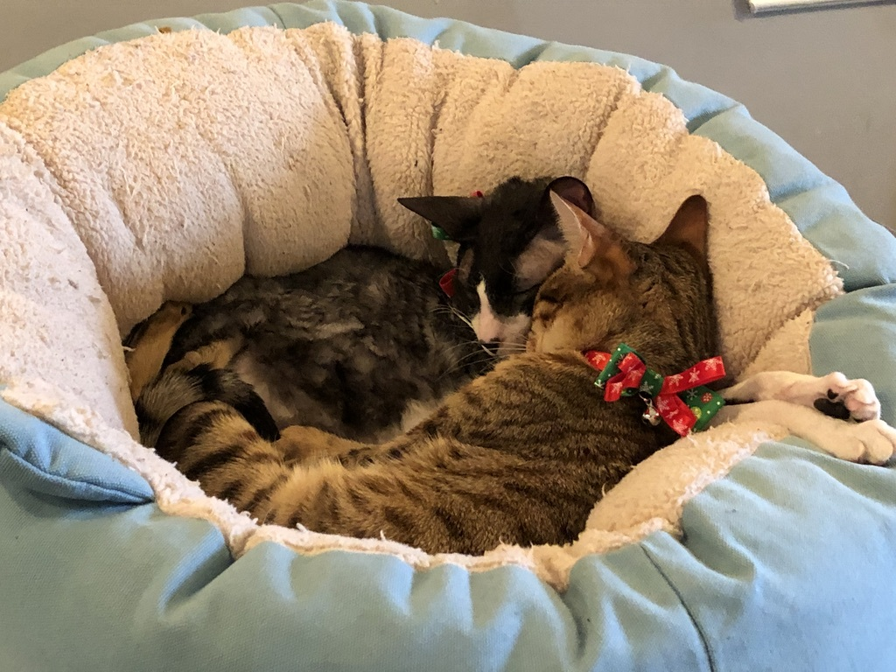
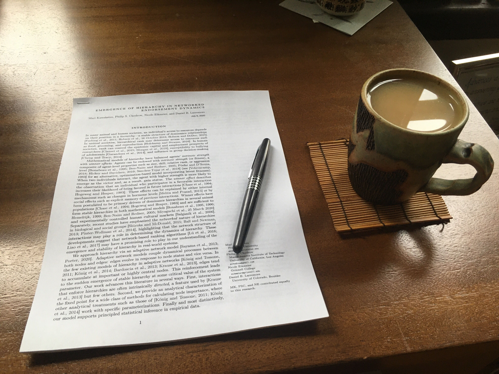

exclude: true
<style type="text/css">
code.r{ 
  font-size: 16px; 
}
pre {
  font-size: 16px !important;
}
</style>
```{r setup, include=FALSE}
options(htmltools.dir.version = FALSE)
```


---

class: split-two 


.column.bg-main1[.content[
.font3[Hi! I'm Phil.]

.font_medium[.font_large[Things I .alert[like]:]]

.font_large[
- Mathematics of complex systems
  - Network science
  - Nonlinear dynamics
  - Probability and statistics
  - Linear algebra
- Tea
- *Star Trek: Deep Space 9*
- Effective pedagogy 
- Martial arts (tai chi, aikido)
]

.font_medium[.font_large[Things I .alert2[teach]:]]

.font_large[
- Python programming
- Data science
- Mathematical network science
- Aikido
]
]

]]

.column[.content.center[
]

.font_medium[*Artist's rendering of me from back when haircuts were a thing.*] <br>
*Image via [Picrew.me](https://picrew.me/image_maker/634561)*

]
]


---

class: bg-main1 
background-image: url("../img-shared/geo-intro.png")
background-size: contain
 

---

class: center middle
background-image: url(img/vegetables.jpeg)
background-size: cover

.content.vmiddle[
.color-main4[
.font_large[.font_large[.font_large[.font_large[.font_large[.font_large[.font_large[.font_large[ ?]]]]]]]]
]] 


---

# My Journey

 
---
layout: true
class: split-two with-border middle

.column[
  .split-four[
  .row.bg-main1[.content.font2[
Quick overview of .alert[**networks**] and why we care about them.
  ]]
  .row.bg-main3[.content.font2[
.alert[**Ranking**] in networks.
  ]]
  .row.bg-main4[.content.font2[
From ranks to self-sustaining  <br>.alert[**feedback loops**]. 
  ]]
  .row.bg-main5[.content.font2[
.alert[**Having fun**] while doing science. 
  ]]
]]

.column[.content.center.vmiddle[
{{content}}
]]

---
class: hide-row2-col1 hide-row4-col1 hide-row3-col1

***Image credit:*** *Wikipedia*

---
class: hide-row3-col1 hide-row4-col1

$$\left[\mathbf{D}^i + \mathbf{D}^o - (\mathbf{A} + \mathbf{A}^T) +\alpha \mathbf{I}\right]\mathbf{s} = \left[\mathbf{D}^i- \mathbf{D}^o \right]\mathbb{1}$$

---
class: hide-row4-col1


---
class: 


 


---
layout: true
class: split-two with-border middle

.column[
  .split-four[
  .row.bg-main1[.content.font2[
Quick overview of .alert[**networks**] and why we care about them.
  ]]
  .row.bg-main3[.content.font2[
.alert[**Ranking**] in networks.
  ]]
  .row.bg-main4[.content.font2[
From ranks to self-sustaining  <br>.alert[**feedback loops**]. 
  ]]
  .row.bg-main5[.content.font2[
.alert[**Having fun**] while doing science. 
  ]]
]]

.column[.content.center.vmiddle[
{{content}}
]]

---

class: fade-row2-col1 fade-row3-col1 fade-row4-col1 fade-row5-col1

   
***Image credit:*** *Wikipedia*

---
layout: false
class: split-two
  
.column.bg-main1[<br> <br>
.content.font3[.color-main1[Directed] Networks] 
.blockquote.font_large[A ***.alert2[network]*** (or ***.alert2[graph]***) consists of:
- A set $\mathcal{N}$ of entities, called *.alert2[nodes]*.
- A set of $\mathcal{E}$ of connections between pairs of nodes, called *.alert2[edges]*.]

.font_large[Social groups, complex infrastructure, and natural ecosystems are among the .alert[many] systems we can model with networks.]
]

.column[
.content.center.vmiddle[
   
***Image credit:*** *Wikipedia*
]
]

---
layout: true
class: split-two

.column[
  .split-four[
  .row.bg-main1[.content.font3[
.alert[Directed] Networks
  ]]
  .row.bg-main1[.content.font_large[
  .alert2[Competitions] (chess, basketball...)  <br> 
  .color-main1[tab] Nodes are competitors/teams. <br>
  .color-main1[tab] $A \rightarrow B$ $\implies$ $B$ beats $A$. 
  ]]
  .row.bg-main1[.content.font_large[ 
  .alert2[Internet] (Google, Facebook) <br>
  .color-main1[tab] Nodes are webpages. <br>
  .color-main1[tab] $A\rightarrow B$ $\implies$ $A$ links to $B$. 
  ]] 
  .row.bg-main1[.content.font_large[
  .alert2[Endorsements] (politics, Twitter) <br> 
  .color-main1[tab] Nodes are people. <br>
  .color-main1[tab] $A\rightarrow B$ $\implies$ $A$ thinks $B$ is good.   
  ]]
]]

.column[.content.center.hmiddle[<br>
<br>
***Image credit:*** *Wikipedia*
{{content}}
]]

---
class: hide-row2-col1 hide-row3-col1 hide-row4-col1 

---
class: hide-row3-col1 hide-row4-col1
 

---
class:hide-row4-col1


---

class:
<br> 
***Image credit***: [PJ Lamberson](http://social-dynamics.org/twitter-network-data/)

---
layout: true
class: split-two with-border middle

.column[
  .split-four[
  .row.bg-main1[.content.font2[
Quick overview of .alert[**networks**] and why we care about them.
  ]]
  .row.bg-main3[.content.font2[
.alert[**Ranking**] in networks.
  ]]
  .row.bg-main4[.content.font2[
From ranks to self-sustaining  <br>.alert[**feedback loops**]. 
  ]]
  .row.bg-main5[.content.font2[
.alert[**Having fun**] while doing science. 
  ]]
]]

.column[.content.center.vmiddle[
{{content}}
]]

---
class: fade-row1-col1 fade-row3-col1 fade-row4-col1 fade-row5-col1

$$\left[\mathbf{D}^i + \mathbf{D}^o - (\mathbf{A} + \mathbf{A}^T) +\alpha \mathbf{I}\right]\mathbf{s} = \left[\mathbf{D}^i- \mathbf{D}^o \right]\mathbb{1}$$

---
class: middle
layout: false

.split-two[
.column.bg-main1[
<br><br>
# The Network Ranking Problem

.blockquote.font_large[Given a network, assign a .alert2[**rank**] or .alert2[**score**] vector $\mathbf{r} \in \mathbb{R}^n$ based on the network structure. $r_i$ is the rank of node $i \in \mathcal{N}$.    
]


.content.font_large[
1. Who is the **best** chessplayer? 
  - [Magnus Carlsen](https://twitter.com/MagnusCarlsen?ref_src=twsrc%5Egoogle%7Ctwcamp%5Eserp%7Ctwgr%5Eauthor)
2. Which website is **most central** to the internet?
  - [philchodrow.com](www.philchodrow.com)
3. What is the **most important** account on Twitter?
  - [No Context Star Trek](https://twitter.com/NoContextTrek)]
]
.column[
.content.center.vmiddle[
<br> 
***Image credit:*** *Wikipedia* 
]
]
]

---
class: 
layout: false

.split-two[ 
.column[
<br>
# The Adjacency Matrix


.content.center[.font_medium[
<br> 
***Image credit:*** *Wikipedia*

  $$\mathbf{A} = \left[\begin{matrix}
    <!-- 0 & \mathbf{1} & 0 & 0 & 0 & 0 \\  -->
    <!-- 0 & 0 & \mathbf{1} & 0 & 0 & 0 \\ -->
    <!-- 0 & 0 & 0 & 0 & \mathbf{1} & 0 \\ -->
    <!-- 0 & \mathbf{1} & 0 & 0 & 0 & 0 \\ -->
    <!-- 0 & 0 & 0 & \mathbf{1} & 0 & \mathbf{1} \\  -->
    <!-- 0 & 0 & 0 & 0 & 0 & 0  -->
    \end{matrix}\right] 
    $$
  ]
  ]
]
.column.bg-main1[
]
]

---
class: 
layout: false

.split-two[ 
.column[
<br>
# The Adjacency Matrix


.content.center[.font_medium[
<br> 
***Image credit:*** *Wikipedia*

  $$\mathbf{A} = \left[\begin{matrix}
    <!-- 0 & \mathbf{1} & 0 & 0 & 0 & 0 \\  -->
    <!-- 0 & 0 & \mathbf{1} & 0 & 0 & 0 \\ -->
    <!-- 0 & 0 & 0 & 0 & \mathbf{1} & 0 \\ -->
    <!-- 0 & \mathbf{1} & 0 & 0 & 0 & 0 \\ -->
    <!-- 0 & 0 & 0 & \mathbf{1} & 0 & \mathbf{1} \\  -->
    <!-- 0 & 0 & 0 & 0 & 0 & 0  -->
    \end{matrix}\right] 
    $$
  ]
  ]
]
.column.bg-main1[
.content.center.vmiddle[
 
]
]
]


---
layout: true
class: split-two

.column.bg-main1[
<br> <br> 
# Computing .alert[Ranks] <br> <br> 
.content.center[.font_large[ 
  $$\mathbf{A} = \left[\begin{matrix}
    <!-- 0 & \mathbf{1} & 0 & 0 & 0 & 0 \\  -->
    <!-- 0 & 0 & \mathbf{1} & 0 & 0 & 0 \\ -->
    <!-- 0 & 0 & 0 & 0 & \mathbf{1} & 0 \\ -->
    <!-- 0 & \mathbf{1} & 0 & 0 & 0 & 0 \\ -->
    <!-- 0 & 0 & 0 & \mathbf{1} & 0 & \mathbf{1} \\  -->
    <!-- 0 & 0 & 0 & 0 & 0 & 0  -->
    \end{matrix}\right] 
    $$
    Lots of ways to compute a rank vector $\mathbf{r} \in \mathbb{R}^n$...
  ]
  ]
]

.column[<br>
  .split-three[
  .row.bg-main4[.content.font_large[
  .alert2[Degree] (Number of positive interactions) 
  .color-main4[tab] $$\mathbf{r} = \mathbf{d} = \mathbf{1}^T\mathbf{A}$$ <br>
  ]]
  .row.bg-main4[.content.font_large[ 
  .alert2[PageRank] (Google) **r** is leading eigenvector of 
  $$\mathbf{P} = \alpha_p\mathbf{D}^{-1}\mathbf{A} + \frac{1}{n}(1-\alpha_p)\mathbf{E}$$
  ]] 
  .row.bg-main4[.content.font_large[
  .alert2[SpringRank] (DeBacco et al. 2018) Solve linear system 
  .font_medium[.font_small[$$\left[\mathbf{D}^i + \mathbf{D}^o - (\mathbf{A} + \mathbf{A}^T) + \alpha_s\mathbf{I}\right]  \mathbf{r} = \left[\mathbf{D}^i - \mathbf{D}^o\right]\mathbf{1}$$]
  ]]]
]]


---
class: hide-row1-col2 hide-row2-col2 hide-row3-col2 

---
class: hide-row2-col2 hide-row3-col2


---
class:hide-row3-col2 

---
class: 

---
layout: false
class: bg-main1

# .alert2[Example]: PageRank in the *Hamilton* mention network

.content.center[
<br> 

.font2[Leading eigenvector of 
$\mathbf{P} = \alpha_p\mathbf{D}^{-1}\mathbf{A} + \frac{1}{n}(1-\alpha_p)\mathbf{E}$.]
]


---

layout: true
class: split-two with-border middle

.column[
  .split-four[
  .row.bg-main1[.content.font2[
Quick overview of .alert[**networks**] and why we care about them.
  ]]
  .row.bg-main3[.content.font2[
.alert[**Ranking**] in networks.
  ]]
  .row.bg-main4[.content.font2[
From ranks to self-sustaining  <br>.alert[**feedback loops**]. 
  ]]
  .row.bg-main5[.content.font2[
.alert[**Having fun**] while doing science. 
  ]]
]]

.column[.content.center.vmiddle[
{{content}}
]]

---
class: fade-row1-col1 fade-row2-col1 fade-row4-col1 fade-row5-col1


 

---
class: split-50 bg-main1 
layout: false 

.row[ 
.split-four[
.column[.image-caption-right[
  <br> 
  ## .alert[<nobr>Mari Kawakatsu</nobr>]
  .font_medium[Applied and Computational Mathematics <br> Princeton University ]
  ]    
]
.column[.image-bottom[
   
]]
.column[  
.image-bottom[
  
]  
] 
.column[.image-caption-left[
  <br>
  ## .alert[<nobr>Phil Chodrow</nobr>]
  .font_large[Mathematics <br> UCLA]
  ] 
]
]
]

.row[
.split-four[
.column[.image-caption-right[
  ## .alert[<nobr>Nicole Eikmeier</nobr>]
  .font_large[<nobr>Computer Science</nobr> <br> Grinnell]      
  ]   
]
.column[
    
]
.column[    
  
] 
.column[.image-caption-left[
  ## .alert[<nobr>Dan Larremore</nobr>]
  .font_large[<nobr>Computer Science</nobr> <br> CU Boulder ]
  ] 
]
]
]

---

class: split-two bg-main1

# Working Environment (.alert2[Very Important]) 

.content.font2[Complex Networks Winter Workshop 2019 (\#CNWW)]

.column[.content.center[<br><br><br><br><br><br><br><br>
   
  
  .content.font_medium[Le Monastère des Augustines, Québec City]
]]
.column[.content.center[<br><br><br><br><br><br><br><br>
   
  
  .content.font_medium[Cafe Felin Ma Langue Aux Chats (yes, it's a .alert[cat cafe]])
]]


---

class: split-two bg-main1
layout: false

.column[
<br> 
.font_large[.font_large[.font_large[
.content.center[Ranks .alert2[⟳] Decisions]]]
]
.blockquote[
.content.font_large[.content.font_large[
  What happens when network ranks .alert2[inform] decision-making within a    system?]
]]
]


.column.bg-main4[.content.center[<br><br><br><br>
   
  ]
  .content.font_large[.alert[Example]: 
  College ranks are based on selectivity. 
  
  High ranks <br>  $\implies$ more applications <br> $\implies$     higher selectivity <br> $\implies$ even higher ranks....
]]


---

class: split-two bg-main1

.column[.content[
<br> 
.font_large[.content.center[.font_large[.font_large[The Model]]] <br>

Matrix $\mathbf{A} = \mathbf{A}^{(t)}$ of *endorsements*: $a_{ij}^{(t)}$ is the weighted number of times $i$ endorses $j$ by time $t$. 

1. Compute rank vector $\mathbf{r} = \sigma(\mathbf{A})$ (degree, PageRank, SpringRank...)
2. Node $i$ computes a *utility* of endorsing $j$:  $$u_{ij} = \color{#63d297}{\beta_1} r_j + \color{#ff5252}{\beta_2} (r_j - r_i)^2\;.$$ 

$\color{#63d297}{\beta_1}$ : Preference for *prestige*. <br>
$\color{#ff5252}{\beta_2}$ : Preference for *proximity*. 
]]]

.column.bg-main4[.content.vmiddle[
 
]]

---

class: split-two bg-main1

.column[.content[
<br> 
.font_large[.content.center[.font_large[.font_large[The Model]]] <br>


3\.  $m$ nodes make endorsements. Node $i$ selects node $j$ to endorse with probability $$p_{ij} =    \frac{e^{u_{ij}}}{\sum_k e^{u_{ik}}}\;.$$

4\. Matrix $\mathbf{A}$ updated with .alert2[new endorsements]: 

$$\mathbf{A}^{(t+1)} = \color{#ff5252}{\lambda} \mathbf{A}^{(t)} + (1-\color{#ff5252}{\lambda}) \color{#63d297}{\mathbf{\Delta}^{(t)}}$$

$\lambda$ is a .alert[memory parameter]: $\lambda \approx 1 \rightarrow$ system evolves slowly. 

]]]

.column.bg-main4[.content.vmiddle[
 
]]

---

class: split-two bg-main1

.column[.content[
<br> 
.font_large[.font_large[.font_large[
.center[Ranks .alert2[⟳] Decisions]
]]

.blockquote[Agents develop prestige by receiving endorsements.
]

.blockquote[Agents make endorsements based on prestige. 
]
]]]

.column.bg-main4[.content.vmiddle[
 
]]

---

class: split-two bg-main1

.column[<br><br>.content.font_large[.font_large[What happens?]]<br><br><br>
.font_large[

$\color{#63d297}{\beta_1}$ : Preference for .alert2[*prestige*]. <br>

- $\beta_1$ small: fluctuating egalitarianism.
- $\beta_1$ large: emergence of time-varying hierarchies. 

$\color{#ff5252}{\beta_2}$ : Preference for *.alert[proximity]*. 

- $\beta_2 < 0$: stabilization of hierarchical ranks. 

<br>
Can we say anything *mathematical* about these observations?
]
]
.column.bg-main4[.content.vmiddle[
 
]]

---

class: split-two bg-main1

.column[<br><br>.content.font_large[.font_large[Theorem [KCEL 2021]]]<br><br>
.font_large[

Consider the deterministic function 
$$\mathbf{f}(\mathbf{r}, \mathbf{A}) = \lim_{\lambda \rightarrow 1} \frac{\mathbb{E}[\mathbf{r}|\mathbf{A}] - \mathbf{r}}{1 - \lambda}\;.$$

This function has an egalitarian fixed point such that $\mathbf{r} = r \mathbb{e}$. This point is linearly stable iff $\beta_1 < \beta_1^c$: 

$$\beta_1^c = \begin{cases}
  2\sqrt{\frac{n}{m}} &\quad \text{Root-Degree} \\ 
  1/\alpha_p &\quad \text{PageRank} \\ 
  2 + \alpha_s\frac{n}{m} &\quad \text{SpringRank}.
\end{cases}$$

]]
.column.bg-main4[.content.vmiddle[
 
]]


---

class: split-two bg-main1
layout: true

.column[<br><br>.content.font_large[.font_large[Theorem [KCEL 2021]]]<br><br>
.font_large[

Consider the deterministic function 
$$\mathbf{f}(\mathbf{r}, \mathbf{A}) = \lim_{\lambda \rightarrow 1} \frac{\mathbb{E}[\mathbf{r}|\mathbf{A}] - \mathbf{r}}{1 - \lambda}\;.$$

This function has an egalitarian fixed point such that $\mathbf{r} = r \mathbb{e}$. This point is .alert[linearly stable] iff $\beta_1 < \beta_1^c$: 

$$\beta_1^c = \begin{cases}
  2\sqrt{\frac{n}{m}} &\quad \text{Root-Degree} \\ 
  1/\alpha_p &\quad \text{PageRank} \\ 
  2 + \alpha_s\frac{n}{m} &\quad \text{SpringRank}.
\end{cases}$$
]]


.column.bg-main4[.content.font_medium[
  {{content}}
]]

---
class: 

<br>
Heuristically, a fixed point $\mathbf{x}_0$ of some dynamics is **stable** if, when you perturb the the system to some nearby point, it eventually comes back to $\mathbf{x}_0$. 

 
Image credit: [Desmond Winterborne](https://www.sciencedirect.com/topics/engineering/stable-equilibrium)

---
class: 

<br>
Here, stability of the egalitarian fixed point of $\mathbf{f}$ is governed by the **Jacobian matrix** of partial derivatives: 

$$\mathbf{J} = \left[\begin{matrix}\frac{\partial f_1}{\partial r_1} & \frac{\partial f_1}{\partial r_2} & \cdots  & \frac{\partial f_1}{\partial r_n}  \\ 
\frac{\partial f_2}{\partial r_1} & \frac{\partial f_2}{\partial r_2} & \cdots  & \frac{\partial f_2}{\partial r_n} \\ 
\vdots & \vdots & \ddots & \vdots \\ 
\frac{\partial f_n}{\partial r_1} & \frac{\partial f_n}{\partial r_2} & \cdots  & \frac{\partial f_n}{\partial r_n}
\end{matrix}\right]$$


Fixed point is **linearly stable** if $\mathbf{J}$ only has eigenvalues with negative real part. 

Fixed point is **unstable** of $\mathbf{J}$ has any eigenvalues with positive real part. 

So, we need...

---

class: 

<br> <br> <br> <br> <br> 
 


---

class: 
layout: false

background-image: url("img/bifurcations_with_curves.png")
background-size: contain


---


class: split-two
layout: false

.column.bg-main1[<br>
# Ok, but what about **data**?

.content.font_large[

Model assigns a *likelihood* to the observed data. 

$$\mathcal{L}(\lambda, \beta) = \sum_{t = 0}\sum_{i, j \in \mathcal{N}}\color{#ff5252}{k_{ij}^{(t)}} \log \color{#63d297}{\gamma_{ij}^{(t)}}$$

- $\color{#ff5252}{k_{ij}^{(t)}}$: \# of observed endorsements $i\rightarrow j$ in time $t$ (from data).
- $\color{#63d297}{\gamma_{ij}^{(t)}}$: Probability that $i$ chooses $j$ as recipient of endorsement at time $t$ (depends on $\lambda$, $\beta$, and data from previous timesteps). 

**Method of maximum likelihood**: find parameters $\hat{\lambda}$ and $\hat{\beta}$ to maximize $\mathcal{L}$. 
]
]

.column.bg-main4[.content.vmiddle[.font_large[<br> 
**Math PhD Exchange**¹: University *A* "endorses" *B* by hiring a PhD trained at *B*, over 50 years. <br><br>  
**Monk Parakeets**²: Parakeet *A* "endorses" *B* by losing a fight to *B*, over 4 observation periods.  <br><br><br> 
**Newcomb Fraternity**³: Fraternity brother *A* "endorses" *B* by stating that they like *B* on a survey, over a semester (15 weeks).
]

<br> <br> 
¹D. Taylor, S. A. Meyers, A. Clauset, M. A. Porter, P. J. Mucha, Eigenvector-based centrality measures for temporal networks. *Multiscale Model. Simul.* 15, 537–574 (2017). <br> 
North Dakota State University Department of Mathematics, Data from “The Mathematics Genealogy Project.”  ([link](https://www.genealogy.math.ndsu.nodak.edu/index.php.)) <br> 
²E. A. Hobson, S. DeDeo, Social feedback and the emergence of rank in animal society. *PLoS Comput. Biol.* 11, e1004411 (2015) <br> 
³T. Newcomb, *The Acquaintance Process* (Holt, Reinhard, and Winston, New York, NY, 1961).
]]


---

class: split-two

.column.bg-main1[<br>
# Ok, but what about **data**?

.content.font_large[

Model assigns a *likelihood* to the observed data. 

$$\mathcal{L}(\lambda, \beta) = \sum_{t = 0}\sum_{i, j \in \mathcal{N}}\color{#ff5252}{k_{ij}^{(t)}} \log \color{#63d297}{\gamma_{ij}^{(t)}}$$

- $\color{#ff5252}{k_{ij}^{(t)}}$: \# of observed endorsements $i\rightarrow j$ in time $t$ (from data).
- $\color{#63d297}{\gamma_{ij}^{(t)}}$: Probability that $i$ chooses $j$ as recipient of endorsement at time $t$ (depends on $\lambda$, $\beta$, and data from previous timesteps). 

**Method of maximum likelihood**: find parameters $\hat{\lambda}$ and $\hat{\beta}$ to maximize $\mathcal{L}$. 
]
]

.column.bg-main4[.content.vmiddle[
 
]]

---

class: split-two bg-main1

.column[<br><br>.content.font_large[.font_large[Are we in the hierarchical regime?]]<br><br>
.font_large[

**Theorem from before**: Egalitarianism is stable iff $\beta_1 < \beta_1^c$, where 

$$\beta_1^c = \begin{cases}
  2\sqrt{\frac{n}{m}} &\quad \text{Root-Degree} \\ 
  1/\alpha_p &\quad \text{PageRank} \\ 
  2 + \alpha_s\frac{n}{m} &\quad \text{SpringRank}.
\end{cases}$$
<br> <br> 
Math PhD exchange: .alert2[**bistable**] $-$ both egalitarianism and hierarchy are possible. 

Parakeets + Newcomb Frat: .alert[**supercritical**]. 

]
]
.column.bg-main4[.content.vmiddle[
 
]]

---

class: split-two bg-main1

.column[<br><br>.content.font_large[.font_large[It matters how we conceptualize rank! ]]<br><br>
.font_large[

**Placement share, Root-Degree, and PageRank**: MIT dominates, esp. recently. 


**SpringRank**: Favors Harvard, Stanford, Princeton, and Berkeley (based on prestigious placements of their graduates).

Different estimates of fluidity in ranks.  
]
]
.column.bg-main4[.content.vmiddle[
 
]]

---

class: split-two bg-main1

.column[.font_large[.font_large[.font_large[
.center[Ranks .alert2[⟳] Decisions]
]] 

We wrote a simple .alert[math model] of hierarchies emerging from feedback loops.

Feedback loops can generate stable hierarchies, even when are .alert[no meaningful differences] between agents.

Some systems are .alert[near criticality]: small interventions could help to promote equality and equity. 


.alert[Interdisciplinary math is fun]! Commentary by biology friends Simon DeDeo and Elizabeth Hobson ➔

]
]
.column.bg-main4[.content.vmiddle[
 
]]

---
layout: true
class: split-two with-border middle


.column[
  .split-four[
  .row.bg-main1[.content.font2[
Quick overview of .alert[**networks**] and why we care about them.
  ]]
  .row.bg-main3[.content.font2[
.alert[**Ranking**] in networks.
  ]]
  .row.bg-main4[.content.font2[
From ranks to self-sustaining  <br>.alert[**feedback loops**]. 
  ]]
  .row.bg-main5[.content.font2[
.alert[**Having fun**] while doing science. 
  ]]
]]

.column[.content.center.vmiddle[
{{content}}
]]


---
class: fade-row1-col1 fade-row2-col1 fade-row3-col1 

<!--  -->
<!--  -->
<!--  -->





 

---

layout: false
class: split-two


.column.bg-main1[<br> 
# Two Ways to Start Research

<br> 

.content.font_large[.font_large[.alert[**Idea**] First]]

.content.font_large[.font_large[*"Here's a cool idea! <br>What/who do I need to do in order to achieve this?"*]]

<br> 
.content.font_large[.font_large[.alert2[**People**] First]]

.content.font_large[.font_large[*"Here are some people I like! <br> What cool things can we achieve together?"*]]
]

.column[.content.vmiddle[
.font_large[.font_large[I do both of these, but I have the most fun when I  .alert2[start with people].]]

.font_large[.font_large[
I look for folks who 
- Are **fun to work with**
- Can **teach me stuff**
]]
]
  
]

---

class: split-two

.column.bg-main1[<br> 
# Parting Wisdom
<br> <br> <br> 
.content.font_large[.font_medium[


Question hierarchy. 

Seek cat cafes. 

Focus on what's important:
]]]
]

.column[.content.vmiddle[
]
]
]

---

class: split-two

.column.bg-main1[<br> 
# Parting Wisdom
<br> <br> <br> 
.content.font_large[.font_medium[


Question hierarchy. 

Seek cat cafes. 

Focus on what's important:
]]]
]

.column[.content.vmiddle[

]
]
]

---

class: split-two bg-main1


<br>

.column[
<br> 
# Thanks!! 

 
 

 

.font_large[.alert[Fab team]: Mari, Nicole, Dan]
]

.column.bg-main4[

<br> <br> <br> <bR> <br> <br> <br> <br> <br> 
.font_large[

Complex Networks Winter Workshop 2019

The cats 

Jamie

.alert2[Y'all!] 


.font_large[What questions do you have?]


]

]


