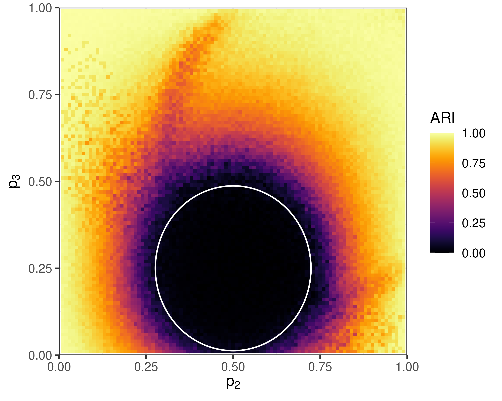
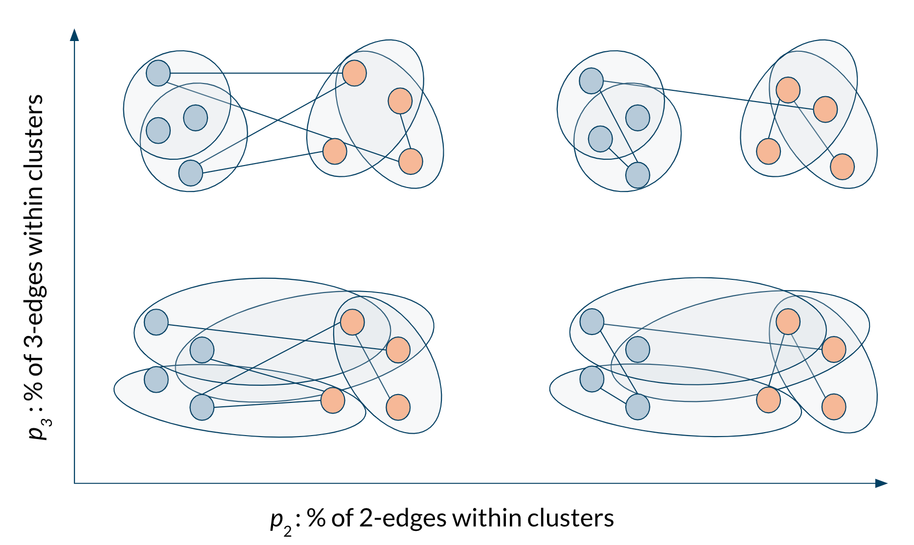
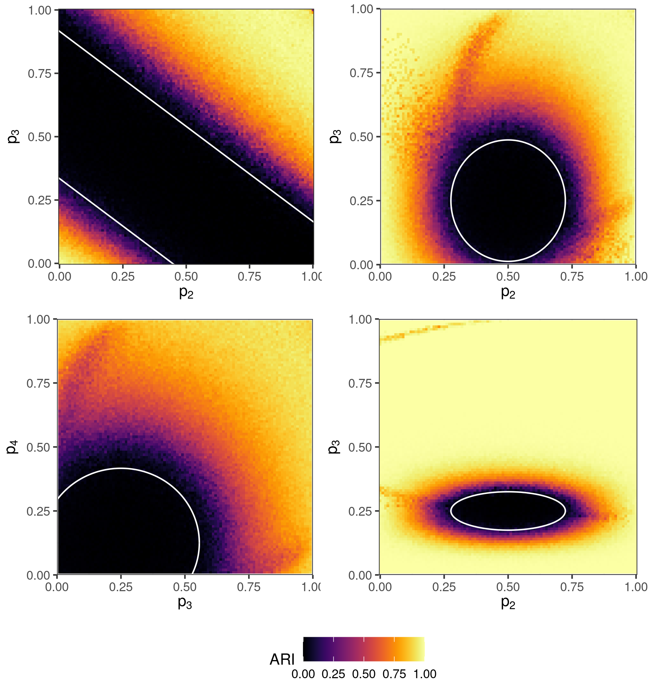

exclude: true   
<style type="text/css">
code.r{ 
  font-size: 16px; 
}
pre {
  font-size: 16px !important;  
}
</style>
```{r setup, include=FALSE}
options(htmltools.dir.version = FALSE)
```

```{r run, eval=FALSE, include=FALSE}
# xaringan::inf_mr("grinnell-2021/index.rmd")
```


---

class: split-two 

.column.bg-main1[.content[

### Hi! I'm Phil Chodrow.

<br>
I look like this $\rightarrow$

Things I .alert[like]:]

- Computation and theory for complex systems
  - Network data analysis
  - Modeling social systems
  - Machine learning
- Tea
- Memes
- *Star Trek: Deep Space 9*  
- Traditional martial arts
]

.column[.content.center[<br><br><br>
]


]


---

class: bg-main1 
background-image: url("../img-shared/geo-intro.png")
background-size: contain
 
# My Journey
 


---

class: split-two
layout: false

.column.bg-main1[
.content[ 
  ## Graphs and Hypergraphs 
 
  <br> 
  A .alert[graph] consists of a set of nodes and a set of edges. Each edge is a set of two nodes. 

<br> <br> <br> <br> <br>
  In .alert[hypergraphs], edges can contain *any number* of nodes.     
]
]

.column[
  .vmiddle[
  </img>
  ] 
]

---

class: split-two
layout: false

.column.bg-main1[
  
## Hypergraph Data

]

.column.bg-main2[.vmiddle[
  <br>
]]

---

class: split-two
layout: false

.column.bg-main1[
  
  ## Hypergraph Data

<br> <br> 

  - .alert[**Interaction**]: nodes are agents, edges are interaction events (socializing in groups, attending events).
  
]

.column.bg-main2[.vmiddle[.stretch[
  </img> 
]]]

---

class: split-two
layout: false

.column.bg-main1[
  
  ## Hypergraph Data

<br> <br> 

  - .alert[**Interaction**]: nodes are agents, edges are interaction events (socializing in groups, attending events).
  - .alert[**Collaboration**]: nodes are collaborators, edges are projects or teams (scholarly papers, legislation, etc). 
  

]

.column.bg-main2[.vmiddle[.stretch[
  </img> 
]]]

---

class: split-two
layout: false

.column.bg-main1[
  
  ## Hypergraph Data

<br> <br> 

  - .alert[**Interaction**]: nodes are agents, edges are interaction events (socializing in groups, attending events).
  - .alert[**Collaboration**]: nodes are collaborators, edges are projects or teams (scholarly papers, legislation, etc). 
  - .alert[**Co-presence**]: nodes are chemical compounds, edges are drugs formed from those compounds.

]

.column.bg-main2[.vmiddle[.stretch[
  </img> 
]]]

---

layout: false
class: split-two

.column.bg-main1[
  ### Hypergraph Clustering

  <br>
  Given some hypergraph data, assign each node to a .alert[**cluster**] (or "community") of "related" nodes. 
  <br> <br>
  "*Related*": often interpreted as "*densely interconnected.*"
<br> <br>
  Applications in social network analysis, drug discovery, image processing, data visualization...

  
  .footnote[
  .alert2[One survey in]: <br> <b>PSC</b>, N. Veldt, A. R. Benson, (2021). Generative hypergraph clustering: from blockmodels to modularity, <i>Science Advances</i>, 7:eabh1303
  ]

  
]
.column[.content.vmiddle[.stretch[
  
]]]


---

layout: true
class: split-two middle 
 
.column[
  .split-three[ 
  .row.bg-main1[.content.vmiddle[.font_medium[Generative clustering with .alert[hypergraph blockmodels]].
  ]]    
  .row.bg-main2[.content.vmiddle[.font_medium[Scalable, greedy heuristics for .alert[large hypergraphs].] 
  ]] 
  .row.bg-main3[.content.vmiddle[.font_medium[.alert[Sparse thresholds] and eigenvector methods.] 
  ]]
]
] 

.column[.center[.stretch[
  {{content}} 
]]]

---
class: hide-row2-col1 hide-row3-col1 hide-row4-col1 hide-row5-col1 

<br>


---
class: hide-row3-col1 hide-row4-col1 hide-row5-col1


  
---
class: hide-row4-col1   hide-row5-col1 

 
 

---

class: fade-row2-col1 fade-row3-col1 fade-row4-col1 fade-row5-col1

  <br>
  

---

layout: false
background-image: url(img/task.png)
background-size: contain

---

layout: false
background-image: url(img/fiction.png)
background-size: contain


---

class: split-two
layout: false

.column[ 
  ### Hypergraph Stochastic Blockmodel
  
]

.column.bg-main1[


.font_smaller[

### &nbsp; <br>  &nbsp;  
1. Give each node $i$ a cluster label $z_i$ and a degree-weight $\theta_i$ (higher weight $\implies$ more hyperedges involving that node).
2. For each tuple $R$ of nodes, sample a random number of edges:
$$a_R \sim \mathrm{Poisson}\left(\Omega(\mathbf{z}_R)\prod_{i \in R}\theta_i\right)$$

Here, $\Omega$ is an *affinity function* that encodes which combinations of groups are likely to form hyperedges. 
]

.footnote[
Bernoulli variant proposed by Ke et al (2019), *arXiv:*:1909.06503
]
]

---

class: split-two
layout: false

.column[ 
  ### Hypergraph Stochastic Blockmodel
  
]

.column.bg-main1[

<br> <br> <br> 
## The Big Message

The generative approach to hypergraph clustering offers both .alert[scalable heuristics] and .alert2[fundamental theoretical insights]. 
]

---

layout: true
class: split-two middle 
 
.column[
  .split-three[ 
  .row.bg-main1[.content.vmiddle[.font_medium[Generative clustering with .alert[hypergraph blockmodels]].
  ]]    
  .row.bg-main2[.content.vmiddle[.font_medium[Scalable, greedy heuristics for .alert[large hypergraphs].] 
  ]] 
  .row.bg-main3[.content.vmiddle[.font_medium[.alert[Sparse thresholds] and eigenvector methods.] 
  ]]
]
] 

.column[.center[.stretch[
  {{content}} 
]]]

---

class: fade-row1-col1 fade-row3-col1 fade-row4-col1 fade-row5-col1

  

---

class: split-two 
layout: false

.column.bg-main1[

<br> <br>
### Motivation 

Suppose we have some hypergraph Big Data® with suspected cluster structure.   

### Question

Can we do .alert[scalable] clustering with statistical foundations?


]

.column[.stretch[ 
     
]]

---
class: split-50 bg-main1 
layout: false 
 
.row[ 
.split-three[
.column[<br><br>
   
  ]
.column[<br><br>
   
]
.column[<br><br>
     
] 

]
]
.row[ 
.split-three[
.column[<br>
  .font_large[.alert-no-bold[<nobr>Nate Veldt</nobr>]]
  <nobr>Computer Science</nobr> <br> Texas A&M      
  .alert2[@n_veldt]
]  
.column[<br>
  .font_large[.alert-no-bold[<nobr>Austin Benson</nobr>]]
   Computer Science <br> Cornell      
   .alert2[@austinbenson]
]
.column[<br>
  .font_large[.alert-no-bold[<nobr>Phil Chodrow</nobr>]]
  <nobr>Mathematics</nobr> <br> UCLA
  <br> .alert2[@PhilChodrow] <br>
]
]
]


---

class: split-two
layout: 

.column.bg-main1[
### The Affinity Function $\Omega$

<br> <br>

This controls how hyperedges form in response to node labels. 

Let's focus on the .alert[All-Or-Nothing] affinity.

This models the idea that edges form most frequently when nodes have the same labels. 


]

.column[

### <br>

<br> <br>

Let $e$ be a hyperedge of size $k$: 

$$\Omega(\mathbf{z}_e) = \begin{cases}
  \omega_{k1} &\quad e \text{ has all same labels} \\ 
  \omega_{k0} &\quad \text{otherwise}\;.  
\end{cases}$$

<br>

$$\Omega(\color{#ff5252}{\bullet} \color{#ff5252}{\bullet} \color{#ff5252}{\bullet}) > \Omega(\color{#ff5252}{\bullet} \color{#ff5252}{\bullet} \color{#FFD046}{\bullet})= \Omega(\color{#ff5252}{\bullet} \color{#FFD046}{\bullet} \color{#6ec0de}{\bullet})\ldots$$ 

]

<!-- ---

class: split-two
layout: false


.column.bg-main1[
  ## Maximum-Likelihood Inference

  <br>

  We only observe $H$. How do we learn the clusters $\mathbf{z}$?

  Let $P(H; \theta, \mathbf{z}, \omega)$ be the probability of realizing a hypergraph $H$ with parameters $(\theta, \mathbf{z}, \omega)$. 

  .alert[Maximum-Likelihood Inference]: 

  $$(\hat{\theta}, \hat{\mathbf{z}}, \hat{\omega}) = \text{argmax}_{\theta, \mathbf{z}, \omega} \log P(H; \theta, \mathbf{z}, \omega).$$ 
]

.column[
  
  <br> <br> <br>

  Some estimates can be approximated quickly:

<br> 
  **Degree Weights**

  $$\hat{\theta}_i \approx\text{degree of node }i \equiv d_i$$

  **Affinity Values** (requires estimate of $\mathbf{z}$)

.font_smaller[
  $$\omega_{k1} \approx \frac{\text{# homogeneous hyperedges }}{\prod_{j} (\text{sum of degrees in cluster } j)}\;.$$
]

.footnote[Approximations exact when all clusters are same size]

] -->


---

## Estimating labels $\mathbf{z}$

With the All-Or-Nothing affinity, we can derive an objective function from a maximum-likelihood problem for our blockmodel: 

$$
Q \triangleq \sum_k \color{#ff5252}{\beta_k} \left[(\text{# homogeneous }k\text{-edges}) - \color{#21728f}{\gamma_k}\sum_j (\text{# of edges in cluster } j)^k\right]
$$

$\color{#ff5252}{\beta_k} \triangleq \log \omega_{k1} - \log \omega_{k0}$. <br>
$\color{#21728f}{\gamma_k} \triangleq \frac{1}{\beta_k}(\omega_{k1} - \omega_{k0})$.

**Maximum-Likelihood Problem**: find cluster labels $\mathbf{z}$ to make $Q$ large. 

 
.footnote[
   
Derivation follows Newman, "Equivalence between modularity optimization and maximum likelihood methods for community detection." *PRE*, 2016
  
Generalizes Kamiński et al., "Clustering via hypergraph modularity." *PLoS ONE*, 2019] 

---

class: split-two

.column.bg-main1[

### Hypergraph Maximum-Likelihood Louvain Algorithm

<br>

1. All nodes start in their own cluster. 
2. Greedily .alert[merge] nodes to maximize $Q$. 
3. Then, greedily merge .alert2[entire clusters] of nodes.  
4. Estimate parameters $\omega$ and $\{\theta_i\}$.
5. Repeat!

Extends Louvain algorithm for graphs.

.footnote[Blondel et al. "Fast unfolding of communities in large networks." *J. Stat. Mech.*, 2008]
]

.column[ 
  
  <br>
  
  
  .footnote[Image from Traag et al., "From Louvain to Leiden: guaranteeing well-connected communities," *Scientific Reports*, 2019]
]

---
background-image: url(img/performance.png)
background-size: contain

#### We can retrieve correlated partitions on synthetic hypergraphs of .alert[1M nodes].

<br> <br> <br> <br> <br> <br> <br> <br> <br> <br> <br> <br> <br> 

Hypergraph Louvain is roughly as fast as baseline graph methods. 

---

### .alert[Empirical data]: school contact hypergraphs. 

<br> 
.center[]

Cluster labels are classes in a primary school and a high school (in France). 


.footnote[
Stehlé et al. (*PLoS ONE*, 2011) and Mastrandrea et al. (*PLoS ONE*, 2015)
]

---


background-image: url(img/contact-clustering.png)
background-size: contain


---

class: split-two

.column.bg-main1[
  
  ## Summing Up

  <br>

  The generative approach informs .alert[scalable algorithms] for clustering hypergraphs. 

  These algorithms .alert[inherit assumptions] from their generative models. 

  These algorithms can .alert[outperform graph-based methods] on social interaction data sets. 

]

.column[.stretch[ 
     
]]

---

layout: true
class: split-two middle 
 
.column[
  .split-three[ 
  .row.bg-main1[.content.vmiddle[.font_medium[Generative clustering with .alert[hypergraph blockmodels]].
  ]]    
  .row.bg-main2[.content.vmiddle[.font_medium[Scalable, greedy heuristics for .alert[large hypergraphs].] 
  ]] 
  .row.bg-main3[.content.vmiddle[.font_medium[.alert[Sparse thresholds] and eigenvector methods.] 
  ]]
]
] 

.column[.center[.stretch[
  {{content}} 
]]]

---

class: fade-row1-col1 fade-row2-col1 fade-row4-col1 fade-row5-col1

 
 

---

layout: false
class: split-two

.column.bg-main1[ 
  ### Sparsity

  <br>
  A hypergraph blockmodel is .alert[*sparse*] if $\Omega$ is tuned so that 

  $$ \Omega(\mathbf{z}_R) = O(n^{1-\left|{R}\right|})\;. $$

  **Consequence**: \# edges attached to a node doesn't grow with the size of the hypergraph. 

  .alert[Intuition]: if the world's population doubled, the number of friends that you personally have might not change too much. 
]

.column[
  ### Fundamental Limits

  <br>
  In graphs, it turns out that there are sparse models for which algorithms can't even .alert[sometimes] find clusters that are even .alert2[correlated] with the correct ones.   

  
  <br>
  What about hypergraphs?

  <br>
  ***Note***: *here we are primarily interested in theoretical limits rather than practical performance.*
]

---
class: split-50 bg-main1 
layout: false 
 
.row[ 
.split-three[
.column[<br><br>
   
]
.column[<br><br>
   
  ]
.column[<br><br>
     
] 

]
]
.row[ 
.split-three[
.column[<br>
  .font_large[.alert-no-bold[<nobr>Nicole Eikmeier</nobr>]]
   Computer Science <br> Grinnell College      
   .alert2[@NicoleEikmeier]
]
.column[<br>
  .font_large[.alert-no-bold[<nobr>Jamie Haddock</nobr>]]
  <nobr>Mathematics</nobr> <br> Harvey Mudd College      
  .alert2[@jamie_hadd]
]  
.column[<br>
  .font_large[.alert-no-bold[<nobr>Phil Chodrow</nobr>]]
  <nobr>Mathematics</nobr> <br> UCLA
  <br> .alert2[@PhilChodrow] <br>
]
]
]

---

class: 

### A Testbed for Sparse Hypergraph Clustering




---

### Greedy Methods


Greedy methods (from last time) fail in large regions of our testbed! Can we do better?

<!-- ---

class: split-two
layout: false

.column.bg-main1[
  ## Belief Propagation...

<br>

  ...is the "cavity method" of statistical physics. 

  ...is an approximate method for learning graphical models. 

  ...is a discrete-time dynamical system.  

  ...is **very** expensive on hypergraphs. 
]

.column[

## &nbsp;


Formally, iterate these updates to convergence: 
<br> 
\begin{align}
\mu_{iR}^{(s)} &\gets \frac{1}{Z_{iR}}\prod_{Q \in \binom{[n]}{|R|}\setminus R} \nu_{Qi}^{(s)} \\ 
\nu_{Ri}^{(s)} &\gets \frac{1}{Z_{Ri}}\sum_{\mathbf{z}:z_i = s}P(a_R| \mathbb{z}_R)\prod_{j \in R\setminus i} \mu_{jR}^{(z_j)}
\end{align}

.font_smaller[  
$\mu_{iR}^{(s)}$ is "node $i$'s confidence that it belongs to cluster $s$ based on other nodes in tuple $R$."

$Z_{iR}$ is a normalization constant. 

$P(a_R|\mathbb{z}_R)$ is our HSBM. 
]
] -->

---

class: split-two

.column.bg-main1[

### The Belief-Propagation Jacobian


.alert[Belief-propagation] is a method for learning probabilistic machine learning models, but it's very expensive computationally. 

<br>

We can approximate BP by computing eigenvectors of a certain matrix, called the .alert2[Jacobian]. 

]
.column[
  

### &nbsp; 


In a sparse HSBM, 

  $$\mathbf{J} = \sum_{k = 1}^{\bar{k}} \mathbf{C}_k \otimes \mathbf{B}_k + O(n^{-1})\;,$$

  - $\mathbf{C}_k$ is a matrix of parameters that depends on the affinity function $\Omega$. 
  - $\mathbf{B}_k$ is a matrix called the *Hashimoto matrix* for edges of size $k$. 
  - $\otimes$ is the matrix Kronecker product. 


.footnote[
  .alert2[Shown for graphs by]: <br> Krzakala et al. (2013)  Spectral redemption in clustering sparse networks, <i>PNAS</i> 110 (52) 20935-20940
]
]

---

background-image: url(img/algorithm-demo.png)
background-size: contain

### Belief-Propagation Spectral Clustering

<br> <br> <br> <br> <br> <br> <br> <br> <br> <br> <br> <br> <br>  Real leading eigenvectors of $\mathbf{J}$ contain cluster information! 

<!-- ---

### Linear algebra for faster computation

$\mathbf{J}$ is a *really* big matrix; eigencomputations are expensive.  

**Theorem (PSC, JH, NE '21)**: Under mild conditions, the "interesting" eigenvalues of $\mathbf{J}$ are also eigenvalues of the (smaller) matrix

$$\mathbf{J}' = (\mathbf{G}\otimes \mathbf{I}_n) \left[\begin{matrix} 
\mathbf{0} & \mathbf{I}_\ell \otimes \mathbb{D} \\ 
\mathbf{0} & \mathbf{I}_\ell \otimes \mathbb{A}
\end{matrix}\right] - \bar{\mathbf{G}} \left[\begin{matrix} 
\mathbf{0} & \mathbf{I}_\ell \otimes \mathbf{I}_{\kappa } \\ 
\mathbf{I}_\ell \otimes (\mathbf{K} - \mathbf{I}_{\kappa}) & \mathbf{I}_\ell \otimes (\mathbf{K} - 2\mathbf{I}_{\kappa})
\end{matrix}\right] \otimes \mathbf{I}_n$$

.font_smaller[.font_smaller[
- $\ell$ is the number of groups
- $\mathbf{G}$, $\bar{\mathbf{G}}$ are matrices holding statistical parameters. 
- $\kappa$ is the number of distinct edge sizes, $n$ is the number of nodes. 
- $\mathbb{A} \in \mathbb{R}^{\kappa n\times \kappa n}$ collects adjacency information for each hyperedge size.
- $\mathbb{D} \in \mathbb{R}^{\kappa n\times \kappa n}$ collects node degrees for each hyperedge size. 
- $\mathbf{K} \in \mathbb{R}^{\kappa \times \kappa }$ lists possible edge sizes. 
- $\mathbf{I}_{\ell} \in \mathbb{R}^{\ell\times \ell}$ is the matrix identity of size $\ell$. 
- $\otimes$ is the Kronecker product. 
]] -->

---
### *Flashback: Greedy Methods*


---

### BP Jacobian Spectral Algorithm

.center[

]

---

### BP Jacobian Spectral Algorithm

.center[

]

---

class: split-two

.column.bg-main1[
### Detectability Threshold

.alert[**Conjecture**]: In a 2-group testbed with edge sizes $k_1,k_2,\ldots$ and $c_k$ edges of size $k$ per node, detection is possible outside the ellipsoid with centroid $(x_{k_1},x_{k_2},\ldots)$ and radii $(r_{k_1},r_{k_1}\ldots)$, where: 

$$
\begin{align}
x_k &= \frac{1-a_k}{2-a_k} d \\ 
r_k &= \frac{\sqrt{(k-1)c_k}}{2-a_k} \\
a_k &= \frac{1-2^{2-k}}{1-2^{1-k}}\;.
\end{align}
$$

]
.column[.stretch[
.center[ <br> <br> <br>

]
]
]

---

class: split-two
layout: false

.column.bg-main1[

## Summing Up

<br>

Belief-propagation spectral clustering can help us form conjectures about when detecting clusters is .alert[even possible].  

Proving these conjectures is likely to require fancy probability theory. 

]

.column[.stretch[
.center[ <br> <br> <br>

]
]
]

---

class: bg-main1

## Today's Big Message

The generative approach to hypergraph clustering offers both .alert[scalable heuristics] and .alert2[fundamental theoretical insights]. 

### Lots more to do!  

1. Scalable heuristics for more general affinity functions $\Omega$. 
2. Prove those detectability conjectures. 
3. More complex models:
  - Weighted hypergraphs
  - Hypergraphs with node metadata
  - Dynamic interactions (timestamped edges)
  - Etc


---

class: split-two

.column.bg-main1[
# **Thanks!**

.row[ 
.split-two[
.column[.lil-stretch[<br><br><br><br> 
   
  .alert[Nate Veldt] <br> Texas A&M
  ]
  ]
.column[
  .lil-stretch[<br><br><br><br>
   
  .alert[Austin Benson] <br> Cornell 
  ]
]]]

<br> <br> <br> <br> <br> <br> <br> <br> <br>
<b>PSC</b>, N. Veldt, A. R. Benson, (2021). Generative hypergraph clustering: from blockmodels to modularity, <i>Science Advances</i>, 7:eabh1303
]

.column[ 
# &nbsp;   

.row[ 
.split-two[
.column[.lil-stretch[<br><br><br><br> 
   
  .alert[**Nicole Eikmeier**] <br> Grinnell 
  ]
  ]
.column[
  .lil-stretch[<br><br><br><br>
   
  .alert[**Jamie Haddock**] <br> Harvey Mudd 
  ]
]]]

<br><br><br><br><br><br><br><br><br>
<b>PSC</b>, N. Eikmeier, J. Haddock, (2021). Nonbacktracking spectral clustering of nonuniform hypergraphs, <i>In preparation</i>
]

---

class: bg-main1 middle

# Bonus Content (extra slides)

---

layout: false
class: split-two

.column.bg-main1[
  ### A Note on Expectations
  
  <br>

  Nontrivial clustering problems almost always have multiple, .alert[competing] answers. 

  When a unique optimal answer exists, it is usually .alert[NP-hard] to compute. 

  So, we usually aim for .alert2[heuristics] with interpretable properties. 

  .footnote[
    Good et al. (2010), "The performance of modularity maximization in practical contexts", *PRE* 81.4:046106
    <br> <br>
    Brandes et al. (2007), "On finding graph clusterings with maximum modularity," *WG'07*:121-132 
  ]

]
.column[.content.vmiddle[.stretch[
  
]]]

---

background-image: url(img/recovery_experiments.png)
background-size: contain
