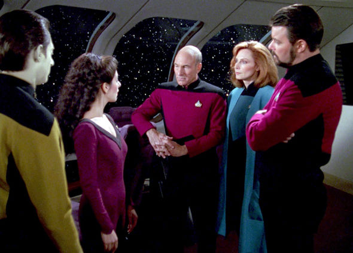
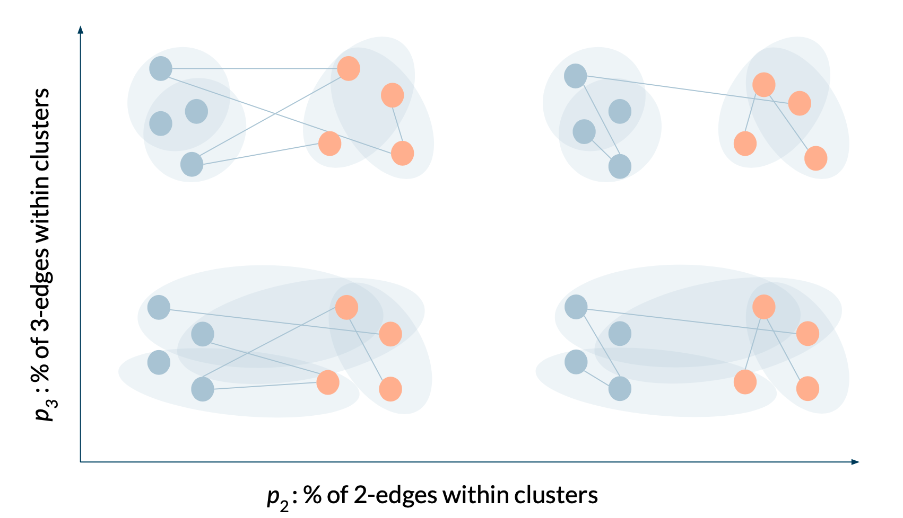
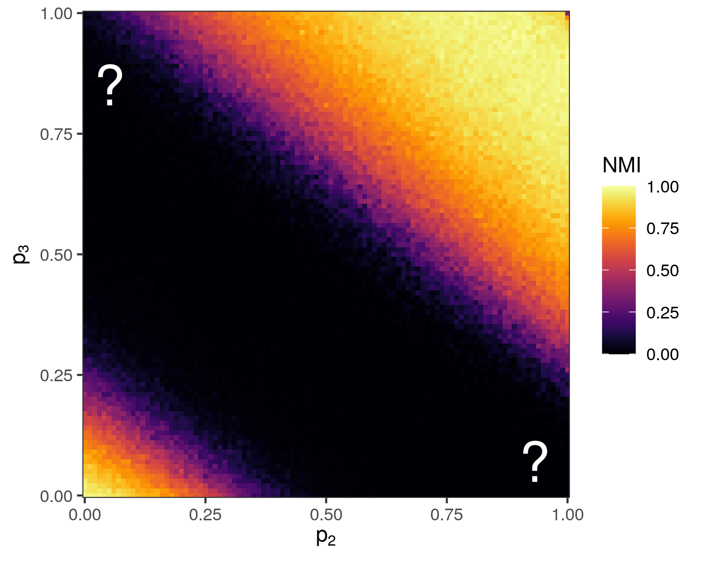
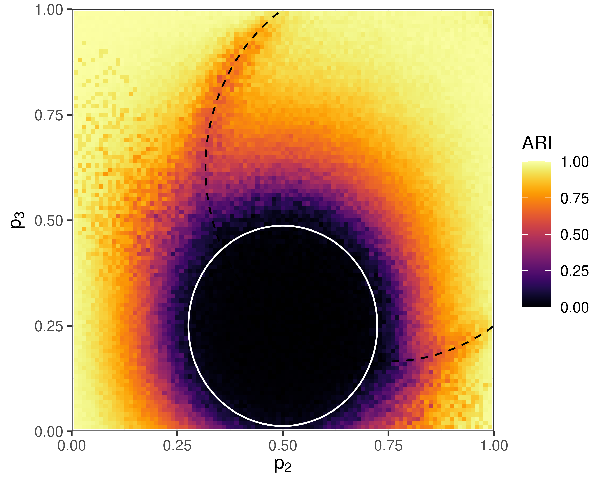

exclude: true   
<style type="text/css">
code.r{ 
  font-size: 16px; 
}
pre {
  font-size: 16px !important;  
}
</style>
```{r setup, include=FALSE}
options(htmltools.dir.version = FALSE)
```

---

class: split-two
layout: false

.column.bg-main1[
.content[ 
  ## Graphs and Hypergraphs 
 
  <br> 
  A .alert[graph] consists of a set of nodes $\mathcal{N}$ and a set of edges $\mathcal{E}$. Each edge in $\mathcal{E}$ is a set of two nodes. 

<br> <br> <br> <br> <br>
  In .alert[hypergraphs], edges in $\mathcal{E}$ can contain *any number* of nodes.     
]

]

.column[
  .vmiddle[
  </img>
  ] 
]

---

class: split-two
layout: false

.column.bg-main1[
  
  ## Hypergraph Data

  

]

.column.bg-main2[.vmiddle[
  <br>
]]


---

class: split-two
layout: false

.column.bg-main1[
  
  ## Hypergraph Data

<br> <br> 

  - .alert[**Interaction**]: nodes are agents, edges are interaction events (socializing in groups, attending events).
  

]

.column.bg-main2[.vmiddle[
  </img> 
]]

---

class: split-two
layout: false

.column.bg-main1[
  
  ## Hypergraph Data

<br> <br> 

  - .alert[**Interaction**]: nodes are agents, edges are interaction events (socializing in groups, attending events).
  - .alert[**Collaboration**]: nodes are collaborators, edges are projects or teams (scholarly papers, legislation, etc). 
  

]

.column.bg-main2[.vmiddle[
  </img> 
]]

---

class: split-two
layout: false

.column.bg-main1[
  
  ## Hypergraph Data

<br> <br> 

  - .alert[**Interaction**]: nodes are agents, edges are interaction events (socializing in groups, attending events).
  - .alert[**Collaboration**]: nodes are collaborators, edges are projects or teams (scholarly papers, legislation, etc). 
  - .alert[**Co-presence**]: nodes are chemical compounds, edges are drugs formed from those compounds.

]

.column.bg-main2[.vmiddle[
  </img> 
]]

---


layout: false
class: split-two

.column.bg-main1[
  ### The Hypergraph Community Detection Problem 

  Given some hypergraph data, assign each node to a .alert[**community**] (or "cluster") of "related" nodes. 
  <br> <br>
  "*Related*": often interpreted as "*densely interconnected.*"
<br> <br>
  Applications in social network analysis, drug discovery, image processing, data visualization...

  
  <div class="footnote">
  .alert2[One review in]: <br> <b>PSC</b>, N. Veldt, A. R. Benson, (2021). Generative hypergraph clustering: from blockmodels to modularity, <i>Science Advances</i>, 7:eabh1303
</div>

  
]
.column[.content.vmiddle[.stretch[
  
]]]

---

layout: true
class: split-two middle 
 
.column[
  .split-three[ 
  .row.bg-main1[.content.vmiddle[.font_medium[  
.alert[**Graph community detection**] with eigenvectors.
  ]]]     
  .row.bg-main2[.content.vmiddle[.font_medium[
.alert[**Hashimoto operators**] and eigenvector methods for hypergraphs.  
  ]]] 
  .row.bg-main3[.content.vmiddle[.font_medium[ 
.alert[**Detectability thresholds**] and open questions. 
  ]]]
]] 

.column[.center[.stretch[
  {{content}} 
]]]
 
---
class: hide-row2-col1 hide-row3-col1 hide-row4-col1 hide-row5-col1


  

  <div class="footnote">
  Image from <a href="http://allthingsgraphed.com/2014/10/09/visualizing-political-polarization/"> All Things Graphed </a> 
  </div>


---
class: hide-row3-col1 hide-row4-col1   hide-row5-col1 
<br> <br> <br> 

<br> 

---
class: hide-row4-col1 hide-row5-col1 
<br> <br> <br> <br>
 

---

class: fade-row2-col1 fade-row3-col1 fade-row4-col1 fade-row5-col1

  

  <div class="footnote">
    Image from <a href="http://allthingsgraphed.com/2014/10/09/visualizing-political-polarization/"> All Things Graphed </a> 
  </div>
---

class: bg-main2
layout: false
background-image: url(img/opportunity.jpeg)
background-size: contain

---

class: split-two
layout: false

.column[
  ## The graph...

.center[
  
]
]
.column[

  ## ...the adjacency matrix
  
  .center[
  <br> 
  
  ]

]

---

class: split-two
layout: false

.column.bg-main1[
  ## Modeling Clustered Graphs

  Take $n$ nodes and divide them into two groups $a$ and $b$. 

  For each pair of nodes $i$ and $j$, draw an edge with probability 

  $$p_{ij} = \begin{cases} p &\quad i,j \text{ are in the same group} \\ q &\quad i,j \text{ are in different groups} \end{cases}$$

  We can represent the result as an adjacency matrix $\mathbf{A}$, where 

  $$a_{ij} = \begin{cases} 1 &\quad (i,j) \in \mathcal{E} \\ 0 &\quad  \text{otherwise} \end{cases}$$
]

.column[.vmiddle[.center[


]]
]

---

class: split-two
layout: false

.column.bg-main1[
  ### Clusters from Eigenvectors

.font_smaller[
  Leading eigenvectors of $\mathbf{P}$:

  $\mathbf{v}_1 = {\underbrace{(1,1,\ldots,1,1)}_{2n \text{ copies}}}^T$ <br> 
  $\lambda_1 = \frac{n}{2}(p + q)$.

<br>
  $\mathbf{v}_2 = (\underbrace{1,1,\ldots,1}_{n \text{ copies } (a)}, \underbrace{-1,-1,\ldots,-1}_{n \text{ copies } (b)})^T$ <br>
  $\lambda_2 = \frac{n}{2}(p - q)$.


  .alert[Results from random matrix theory]: the "interesting" eigenvalues/vectors of $\mathbf{A}$ are close to the "interesting" eigenvalues/vectors of $\mathbf{P}$ with high probability as $n$ grows large.  
]
]

.column[.vmiddle[.center[


]]
]

---

class: split-two
layout: false

.column.bg-main1[
  ## An Algorithm

Suppose we don't know the cluster labels. We can estimate them (under the right conditions) using $\mathbf{v}_2$. 

<br>
.alert[Adjacency Spectral Clustering]

1. Compute the second-largest eigenvector $\mathbf{v}_2$ of $\mathbf{A}$. 
2. If $v_{2i} > 0$, guess that node $i$ is in group $a$, otherwise in group $b$. 

Variations on this work for other graph matrices. 
]

.column[.center[


]]

---

class: split-two middle
layout: false

.column.bg-main1[
  # Summing Up

  <br>

  Graphs represent .alert[pairwise] interactions and can be easily represented by .alert[2D] objects like adjacency matrices.

  In a clustered graph, the 2nd eigenvector of the adjacency matrix can reveal cluster structure. 

  So now we'd like to .alert2[generalize] to hypergraphs...
]
.column[
.center[
  
]
]

---

layout: true
class: split-two middle 
 
.column[
  .split-three[ 
  .row.bg-main1[.content.vmiddle[.font_medium[  
.alert[**Graph community detection**] with eigenvectors. 
  ]]]     
  .row.bg-main2[.content.vmiddle[.font_medium[
.alert[**Hashimoto operators**] and eigenvector methods for hypergraphs.  
  ]]] 
  .row.bg-main3[.content.vmiddle[.font_medium[ 
.alert[**Detectability thresholds**] and open questions. 
  ]]]
]] 

.column[.center[
  {{content}} 
]]

---
class: fade-row1-col1 fade-row3-col1
<br> <br> <br> 

<br> 

---

class: split-two
layout: false

.column.bg-main1[

### Matrices for Hypergraphs? 

We could transform the hypergraph into a graph.
- .alert[Problem]: loses higher-order information.

We could construct a set of adjacency tensors $\mathbf{A}^{(2)}$, $\mathbf{A}^{(3)}$, $\mathbf{A}^{(4)}$...

$$a^{(3)}_{ijk} = \begin{cases} 1 &\quad (i,j,k)\in \mathcal{E} \\ 0 &\quad \text{otherwise...}\end{cases}$$

- .alert[Problem]: we know eigenvectors of tensors, but not .alert2[sets] of tensors.

So, uh, what should we do?....


]

.column[
  <br>
  
]


---
class: split-50 bg-main1 
layout: false 
 
.row[ 
.split-three[
.column[<br><br>
   
  ]
.column[<br><br>
   
]
.column[<br><br>
     
] 

]
]
.row[ 
.split-three[
.column[<br>
  .font_large[.alert-no-bold[<nobr>Jamie Haddock</nobr>]]
  <nobr>Mathematics</nobr> <br> Harvey Mudd College      
  .alert2[@jamie_hadd]
]  
.column[<br>
  .font_large[.alert-no-bold[<nobr>Nicole Eikmeier</nobr>]]
   Computer Science <br> Grinnell College      
   .alert2[@NicoleEikmeier]
]
.column[<br>
  .font_large[.alert-no-bold[<nobr>Phil Chodrow</nobr>]]
  <nobr>Mathematics</nobr> <br> UCLA
  <br> .alert2[@PhilChodrow] <br>
]
]
]

---

class: split-two
layout: false


.column.bg-main1[
## The Hashimoto Operator

The adjacency matrix is $n\times n$ and  operates on nodes. 

The .alert[Hashimoto operator] operates on .alert2[edge-node pairs]: 

Let $(e_1, p_1) \rightarrow (e_2, p_2)$ if: 

- $p_1 \in e_1$ and $p_2 \in e_2$
- $p_1 \in e_2 \setminus p_2$
- $e_1 \neq e_2$

Then, 

.font_smaller[ .font_smaller[
$$\mathbf{B}[(e_1, p_1), (e_2, p_2)] = \begin{cases} 1 &\quad (e_1, p_1) \rightarrow (e_2, p_2) \\ 
0 &\quad \text{otherwise.}\end{cases}$$
]]]

.column[
<br>


"I can get to $p_2 \in e_2$ from $e_1$ by passing through $p_1$. I can get to $p_3 \in e_3$ from $e_2$ by passing through $p_2$..."

]

---

class: split-two
layout: false


.column.bg-main1[
## The Hashimoto Operator

<br> 
Popularized (for graphs) in Hashimoto K. (1990), *Int. J. Math.* 

First formulated for hypergraphs by Storm, C. K. (2006). *The Electronic Journal of Combinatorics*.

"Rediscovered" for hypergraphs by Angelini, M. C., Caltagirone, F., Krzakala, F., & Zdeborová, L. (2015), *Allerton Conference*.

*Also often called the "nonbacktracking operator/matrix."*

]

.column[
<br>


"I can get to $p_2 \in e_2$ from $e_1$ by passing through $p_1$. I can get to $p_3 \in e_3$ from $e_2$ by passing through $p_2$..."
]

---

class: split-two
layout: false


.column.bg-main1[
## The Hashimoto Operator

<br> 

Connected to prime cycles and zeta functions on graphs. 

Can represent hyperedges of all sizes in the same matrix!


.alert[Second eigenvector] is correlated with communities, if corresponding eigenvalue is real.  
  - Needs to be aggregated to node level
 
]

.column[.content.vmiddle[.stretch[
   
]]]

---

class: split-two
layout: false


.column.bg-main1[
## Issue \# 1: Computation

<br>
$\mathbf{B}$ is indexed by edge-node pairs. 

So, $\mathbf{B}$ is of size $m\langle k\rangle \times m\langle k\rangle$, where $m$ is the number of edges and $\langle k \rangle$ is the average edge size. 

A .alert[*small*] data set might have $n = 300$ nodes, $m = 8,000$ edges, and average edge size $2.5$. 

So, $m\langle k \rangle = 8,000 \times 2.5 = 20,000$, which is already a pretty big matrix. 

So...

]

.column[.content.vmiddle[.stretch[
   
]]]

---

class: bg-main2
background-image: url("img/large-matrix.jpeg")
background-size: contain


---

class: bg-main2
layout: false

## Linear Algebra to the Rescue

**Theorem (PSC, JH, NE '21)**: Under mild conditions, if $\lambda$ is an eigenvalue of $\mathbf{B},$ then either: 

1. $\lambda \in \{1, -1, -2, \ldots, 1-\bar{k}\}$ and carries no structural information about the hypergraph, or
2. $\lambda$ is an eigenvalue of the matrix 

$$
\mathbf{B}' = \left[\begin{matrix}
  <!-- \mathbf{0} & \mathbb{D} - \mathbf{I}_{\bar{k}n} \\ -->
  <!--   (\mathbf{I}_{\bar{k}}- \mathbf{K}) \otimes \mathbf{I}_n &  \mathbb{A} + (2\mathbf{I}_{\bar{k}} - \mathbf{K})\otimes \mathbf{I}_n -->
\end{matrix}\right] \in \mathbb{R}^{2\bar{k}n\times 2\bar{k}n}\;.
$$

.font_smaller[.font_smaller[
- $\bar{k}$ is the number of distinct edge sizes, $n$ is the number of nodes. 
- $\mathbb{A} \in \mathbb{R}^{\bar{k}n\times \bar{k}n}$ collects adjacency information for each hyperedge size.
- $\mathbb{D} \in \mathbb{R}^{\bar{k}n\times \bar{k}n}$ collects node degrees for each hyperedge size. 
- $\mathbf{K} \in \mathbb{R}^{\bar{k}\times \bar{k}}$ lists possible edge sizes. 
- $\mathbf{I}_{\ell} \in \mathbb{R}^{\ell\times \ell}$ is the matrix identity of size $\ell$. 
- $\otimes$ is the Kronecker product. 
]]

---

class: bg-main2
  

## Proof Sketch

1. $\mathbf{B}$ can be written as $\mathbf{S}\mathbf{T} - \mathbf{R}$ for suitable operators $\mathbf{S}$, $\mathbf{T}$ and $\mathbf{R}$, which also satisfy handy relations like $\mathbf{T}\mathbf{S} = \mathbb{A}$.  
2. Consider $\det(\lambda\mathbf{I} - \mathbf{B})$, substitute $\mathbf{B} = \mathbf{S}\mathbf{T} - \mathbf{R}$, and use the *push-through identity*:
$$
\det(\mathbf{X + \mathbf{Y}\mathbf{Z}}) = \det(\mathbf{X}) \det(\mathbf{I} + \mathbf{Z}\mathbf{X}^{-1}\mathbf{Y})
$$
(*provided all inverses, sums, and products are defined*). 
3. Battle through a .alert1[**LOT**] of algebraic simplifications, obtaining 
$$
\det(\lambda \mathbf{I} - \mathbf{B}) = \det(\text{boring part})\det(\lambda\mathbf{I} - \mathbf{B}')\,.
$$ 


.footnote[Approach based on a proof of the the graph Ihara-Bass formula in: <br> M. C. Kempton (2016). Non-backtracking random walks and a weighted Ihara’s theorem. *Open Journal of Discrete Mathematics* 6, 207-226
]


---

class: split-two
layout: false


.column.bg-main1[
## Issue \# 1: Computation

<br> <br> 
A .alert[*small*] data set might have $n = 300$ nodes, $m = 8,000$ edges, and average edge size $2.5$. 

<br> 
If $\bar{k} = 3$, then can compute eigenvectors in 

$$2n\bar{k} = 1,800 \color{#FFD046}{\ll} 20,000 = m\langle k\rangle$$ 

dimensions instead.

We can do that 100-1,000x faster! 
]

.column[.content.vmiddle[.stretch[
   
]]]

---

class: split-two
layout: true

.column.bg-main1[

  ## First Algorithm

  
  2. Compute the second eigenpair $(\lambda_2, \mathbf{v}_2)$ of $\mathbf{B}'$. 
  3. If $\lambda_2$ is .alert[real], separate $\mathbf{v}_2 = (\alpha, \beta)$, with $\alpha, \beta \in \mathbb{R}^{n\bar{k}}$. 
  4. If
     $$u_i = \sum_{k = 1}^{\bar{k}}\alpha_{ik} < 0\;,$$
    assign $i$ to cluster $A$, else assign $i$ to cluster $B$. 

]

.column[.content.vmiddle[.stretch[
{{ content }}
]]]

---

class: split-two


   

---

class: split-two


   

---

class: split-two


   

---

class: split-two
layout: false


.column.bg-main1[
## Issue \# 2: Edge Sizes

As we've just seen, our first spectral algorithm only works well when edges of different sizes carry .alert[similar types of information] about the clusters. 

<br> 

What if edges of different sizes mean different things? 

<br> 

.alert2[Example]: small interactions might be very likely to be within a cluster, but larger interactions might be more likely to be *between* clusters. 

]

.column[.content.vmiddle[.stretch[
   
]]]

---

class: split-two
layout: false

.column.bg-main1[
  ## Belief Propagation...

  <br>

  
]

---

class: split-two
layout: false

.column.bg-main1[
  ## Belief Propagation...

  <br>

  ...is the "cavity method" of statistical physics. 

  
]

---

class: split-two
layout: false

.column.bg-main1[
  ## Belief Propagation...

  <br>

  ...is the "cavity method" of statistical physics. 
 
  ...is an approximate method for ~~statistical inference~~ Machine Learning.®

  
]

---

class: split-two
layout: false

.column.bg-main1[
  ## Belief Propagation...

  <br>

  ...is the "cavity method" of statistical physics. 

  ...is an approximate method for ~~statistical inference~~ Machine Learning.®

  ...is a discrete-time dynamical system.  
]

---

class: split-two
layout: false

.column.bg-main1[
  ## Belief Propagation...

  <br>

  ...is the "cavity method" of statistical physics. 

  ...is an approximate method for ~~statistical inference~~ Machine Learning.®

  ...is a discrete-time dynamical system.  
]

.column[

<br> 
Formally, iterate these updates to convergence: 
<br> 
\begin{align}
\mu_{iR}^{(s)} &\gets \frac{1}{Z_{iR}}\prod_{Q \in \binom{[n]}{|R|}\setminus R} \nu_{Qi}^{(s)} \\ 
\nu_{Ri}^{(s)} &\gets \frac{1}{Z_{Ri}}\sum_{\mathbf{z}:z_i = s}\mathbb{P}(a_R| \mathbb{z}_R)\prod_{j \in R\setminus i} \mu_{jR}^{(z_j)}
\end{align}

.font_smaller[  
$\mu_{iR}^{(s)}$ is "node $i$'s confidence that it belongs to cluster $s$ based on other nodes in tuple $R$."

$Z_{iR}$ is a normalization constant. 

$\mathbb{P}(a_R|\mathbb{z}_R)$ is a statistical model of how likely there are to be $a_R$ edges on tuple $R$ given the cluster labels $\mathbf{z}_R$. 
]
]

---

class: split-two

.column.bg-main1[

### The Uninformative Fixed Point

It is "easy to verify" that if all clusters have the same average degree (number of edges per node), BP has a fixed point that contains no info about the clusters. 

.alert[Key question]: is this fixed point stable?

.alert2[Standard method]: compute Jacobian matrix $\mathbf{J}$ of the dynamics at this fixed point and ask whether $\lambda \geq 1$ for any eigenvalue $\lambda$ of $\mathbf{J}$. 

Corresponding eigenvectors give first-order perturbations away from the uninformative fixed point. 

]

--

.column[
  

  ### "It turns out that"

<br>
  $$\mathbf{J} = \sum_{k = 1}^{\bar{k}} \mathbf{C}_k \otimes \mathbf{B}_k + O(n^{-1})\;,$$

  where: 

  - $\mathbf{C}_k$ is a matrix of parameters that depends on the statistical model $\mathbb{P}$. 
  - $\mathbf{B}_k$ is our friend the Hashimoto operator, restricted to edges of size $k$. 
  - $\otimes$ is the Kronecker product. 


<div class="footnote">
  .alert2[Shown for graphs by]: <br> Krzakala et al. (2013)  Spectral redemption in clustering sparse networks, <i>PNAS</i> 110 (52) 20935-20940
</div>

]

---

class: split-two

.column.bg-main1[

### Second Algorithm

1. Start with a guess about $\mathbf{C}_k$ and form 
$$\mathbf{J} = \sum_{k = 1}^{\bar{k}} \mathbf{C}_k \otimes \mathbf{B}_k\;.$$
2. Compute the .alert[leading] $\color{#FFD046}{\ell}$ .alert[eigenvectors] of $\mathbf{J}$, provided they have real eigenvalues. 
3. For each eigenvector $\mathbf{v} = (\alpha, \beta)$, compute $u_{i\ell} = \mathbb{1}\left(\sum_{k = 1}^{\bar{k}} \alpha_{ik}^{(\ell)} > 0\right)$. 
4. Use a .alert2[Euclidean clustering algorithm] (like $k$-means) in the space spanned by the vectors $\{\mathbf{u}\}$. 
5. Re-estimate $\mathbf{C}_k$ and repeat...
]

.column[.vmiddle[.center[

 

]]]

---

class: split-two

# A Cheat

$\mathbf{J}$ is a *really* big matrix. 

As before, we can use a smaller one: 

**Theorem (PSC, JH, NE '21)**: Under mild conditions, if $\lambda$ is an "interesting" eigenvalue of $\mathbf{J},$ then $\lambda$ is also an eigenvalue of the $2n\ell\bar{k}$ matrix

$$\mathbf{J}' = (\mathbf{G}\otimes \mathbf{I}_n) \left[\begin{matrix} 
\mathbf{0} & \mathbf{I}_\ell \otimes \mathbb{D} \\ 
\mathbf{0} & \mathbf{I}_\ell \otimes \mathbb{A}
\end{matrix}\right] - \bar{\mathbf{G}} \left[\begin{matrix} 
\mathbf{0} & \mathbf{I}_\ell \otimes \mathbf{I}_{\bar{k}} \\ 
\mathbf{I}_\ell \otimes (\mathbf{K} - \mathbf{I}_{\bar{k}-1}) & \mathbf{I}_\ell \otimes (\mathbf{K} - 2\mathbf{I}_{\bar{k}-1})
\end{matrix}\right] \otimes \mathbf{I}_n$$

where $\ell$ is the number of groups and $\mathbf{G}$, $\bar{\mathbf{G}}$ hold statistical parameters. 

<!-- ---

class: split-two
background-image: url("img/scream.jpeg")
background-size: contain -->


---

class: split-two
layout: false

.column.bg-main1[
  ## Ok, but does it work? 

  Recall that we were having issues with situations in which edges of different sizes carried different kinds of information. 
]

.column[.vmiddle[.stretch[
     
]]]

---

class: split-two
layout: false

.column.bg-main1[
  ## Ok, but does it work? 

  Recall that we were having issues with situations in which edges of different sizes carried different kinds of information. 

<br> 

  Working with the more complicated matrix $\mathbf{J}$ increases computation time, but also allows us to detect communities in more situations. 
]

.column[.vmiddle[.stretch[
     
]]]

---

class: vmiddle bg-main2

<br> <br> <br> <br> <br> 
## What about .alert[real data]?

---

## High School Social Contacts

<br> 

  $n = 327$ students (nodes) in a French high school. 

  $m = 7,818$ social contact events (edges) measured by wearable 
  sensors.   

  Average number of participants in interaction $\langle k \rangle = 2.3$ 

  Clusters are the classes to which students are assigned. 


  <div class="footnote">
    Data originally from: <br>
    R. Mastrandrea et al. (2015), Contact patterns in a high school: A comparison between data collected using wearable sensors, contact diaries, and friendship surveys. <i>PLoS One</i> 10:9, e0136497
    <br> <br> 
    Prepared by 
    A. R. Benson et al. (2018), Simplicial closure and higher-order link prediction. <i>Proceedings of the National Academy of Sciences</i> 10.1073/pnas.1800683115  
  </div>

---
background-image: url(img/contact-high-school-classes.png)
background-size: contain

## High School Social Contacts 

---

  ## On the Other Hand...Senate Bills

<br> 

  $n = 293$ U.S. senators (nodes) cosponsoring bills.

  $m = 20,006$ bills (edges) in period 1973-2016.

  Average number of cosponsors $\langle k \rangle = 7.3$.

  Clusters are Democrat/Republican. 


<div class="footnote">
  Data originally from: <br>
  J. Fowler (2006), Legislative cosponsorship networks in the U.S. House and Senate. <i>Social Networks</i> 28:4, 454--465
  <br> <br> 
  Prepared by 
  A. R. Benson et al. (2018), Simplicial closure and higher-order link prediction. <i>Proceedings of the National Academy of Sciences</i> 10.1073/pnas.1800683115  
</div>


---
background-image: url(img/SN-congress-bills.png)
background-size: contain

## Senate Bills

---
class: bg-main2

<br> <br> <br> <br> 
### .alert[Big Picture]: you want hypergraph methods when edges of different sizes give you different information about the cluster structure. 

---

background-image: url(img/clustering-math.png)
background-size: contain


#### Just for Fun: Mapping Math with StackExchange Tags


---

layout: true
class: split-two middle 
 
.column[
  .split-three[ 
  .row.bg-main1[.content.vmiddle[.font_medium[  
.alert[**Graph community detection**] with eigenvectors. 
  ]]]     
  .row.bg-main2[.content.vmiddle[.font_medium[
.alert[**Hashimoto operators**] and eigenvector methods for hypergraphs.  
  ]]] 
  .row.bg-main3[.content.vmiddle[.font_medium[ 
.alert[**Detectability thresholds**] and open questions. 
  ]]]
]] 

.column[.center[.stretch[
  {{content}} 
]]]

---
class: fade-row1-col1 fade-row2-col1
<br> <br> <br> <br>
 
<br> 


---

class: split-two
layout: false

.column.bg-main1[
  ## Detectability

  Recall the .alert[*suspiciously round*] region where our algorithm totally failed to learn any cluster information. 

]

.column[.stretch[
  <br> <br> <br> <br>
     
]]


---

class: split-two
layout: false

.column.bg-main1[
  ## Detectability

  Recall the .alert[*suspiciously round*] region where our algorithm totally failed to learn any cluster information. 

  This region can actually be estimated!   

  $$
  (2p_2-1)^2c_2 + 2\left(\frac{4p_3-1}{3} \right)^2c_3 \leq 1
  $$

  Strategy: ask when $\mathbf{J}$ has an eigenvalue $> 1$, using approximations analogous to known results for graphs. 

  .alert2[Future work]: justify the approximations. 

]

.column[.stretch[
  <br> <br> <br> <br>
     
]]

---

class: split-two
layout: false

.column.bg-main1[
  ## Detectability

In graphs, failure of Hashimoto spectral clustering coincides with an .alert[information-theoretic bound] on the clustering problem. 
  
- .alert2[No algorithm] can reliably detect communities. 

We conjecture the same thing for hypergraphs: inside that ellipse, the clustering problem is not just difficult but *theoretically* impossible. 

Proving this is likely to be a loooooong project...

]

.column[.stretch[
  <br> <br> <br> <br>
     
]]


---


class: split-two
layout: false

.column.bg-main1[

# Summing Up

The .alert[Hashimoto operator] enables eigenvector techniques for community detection in hypergraphs. 

Determinant identities help us speed up computation. 

Some hypergraph data sets "need" hypergraph methods, while others don't. 

There are open questions around the .alert2[fundamental limits] of hypergraph community detection. 


]

.column[

]

---

class: split-two
layout: false

.column.bg-main1[

# Summing Up


The .alert[Hashimoto operator] enables eigenvector techniques for community detection in hypergraphs. 

Determinant identities help us speed up computation. 

Some hypergraph data sets "need" hypergraph methods, while others don't. 

There are open questions around the .alert2[fundamental limits] of hypergraph community detection. 


]

.column.bg-main2[
# **Thanks!**

.row[ 
.split-two[
.column[.lil-stretch[<br><br><br><br> 
   
  ]]
.column[.lil-stretch[<br><br><br><br>
   
]]]]
.row[ 
.split-two[
.column[.lil-stretch[<br><br><br><br><br><br><br><br><br><br>
  .alert[Jamie Haddock] <br> Harvey Mudd @jamie_hadd
  ]]
.column[.lil-stretch[<br><br><br><br><br><br><br><br><br><br>
  .alert[Nicole Eikmeier] <br> Grinnell @NicoleEikmeier
]]]]

<br><br><br><br><br><br><br><br><br>


- Heather Zinn Brooks 
- Maryann Hohn
- Everyone here and online

]


