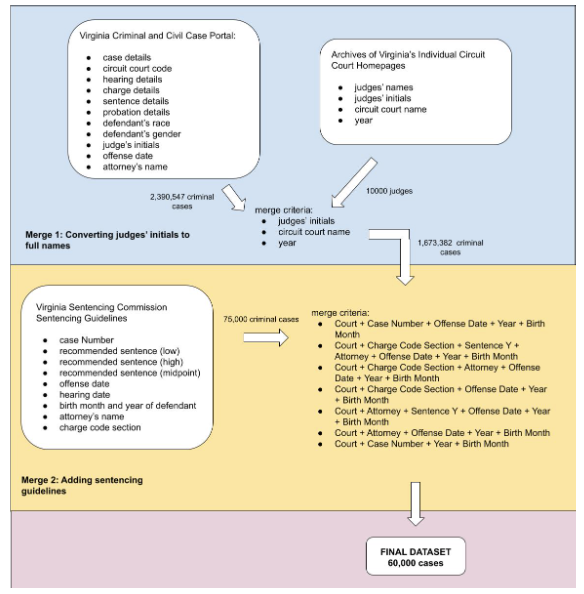

---

background-image: url("../img-shared/karate-graph-fade.png")
class:  

    
# My Research 

### Data Science, Computation, and Modeling for Complex, Connected Systems

---

class: split-three
layout: 

.row[
  .split-40[.column.bg-main1[
      ### Foundations of Network Data Science
    ].column[
       
       
      <!--   -->
       
    ]
  ]  
]
.row[
  .split-40[.column.bg-main2[.content[
    ### Models of Biosocial Systems
  ]].column[.content[
    
     
     
    <!--   -->
  ]]
]
]
.row[
  .split-40[.column.bg-main3[.content[
    ### Data Science and Social Responsibility
  ]].column[.content[
     
    <!--   -->
     
     
  ]]
]
]

---

class: split-three fade-row2-col1 fade-row2-col2 fade-row3-col1 fade-row3-col2
layout: 

.row[
  .split-40[.column.bg-main1[
      ### Foundations of Network Data Science
    ].column[
       
- What .alert[models] accurately reflect features of network data? 
- What .alert[algorithms] can we use to learn these models? 
    ]
  ]  
]
.row[
  .split-40[.column.bg-main2[.content[
    ### Models of Biosocial Systems
  ]].column[.content[
    
     
     
    <!--   -->
  ]]
]
]
.row[
  .split-40[.column.bg-main3[.content[
    ### Data Science and Social Responsibility
  ]].column[.content[
     
    <!--   -->
     
     
  ]]
]
]

---

class: split-three fade-row1-col1 fade-row1-col2 fade-row3-col1 fade-row3-col2
layout: 

.row[
  .split-40[.column.bg-main1[.content[
      ### Foundations of Network Data Science
    ]].column[.content[
       
       
      <!--   -->
       
    ]]
  ]  
]
.row[
  .split-40[.column.bg-main2[.content[
    ### Models of Biosocial Systems
  ]].column[.content[
     
- How do .alert[hierarchies] and .alert[echo chambers] form and sustain themselves?
- What machinery do we need in order to connect these models to .alert[actual data]?
  ]]
]
]
.row[
  .split-40[.column.bg-main3[.content[
    ### Data Science and Social Responsibility
  ]].column[.content[
     
    <!--   -->
     
     
  ]]
]
]

---

class: split-three fade-row1-col1 fade-row1-col2 fade-row2-col1 fade-row2-col2
layout: 

.row[
  .split-40[.column.bg-main1[.content[
      ### Foundations of Network Data Science
    ]].column[.content[
       
       
      <!--   -->
       
    ]]
  ]  
]
.row[
  .split-40[.column.bg-main2[.content[
    ### Models of Biosocial Systems
  ]].column[.content[
    
     
     
    <!--   -->
  ]]
]
]
.row[
  .split-40[.column.bg-main3[.content[
    ### Data Science and Social Responsibility
  ]].column[.content[ 
- How can data science serve the study of .alert[inequality], .alert[segregation], and .alert[injustice]? 
- How can we actively use our quantitative powers for .alert[social change]? 
  ]]
]
]

???

That said, I want to focus on a specific story on the foundations of network data science. This story has some nice mathematical features; I feel that it represents my style well; and it highlights the interplay between data science, computation, and dynamics that animates a lot of my work. 
