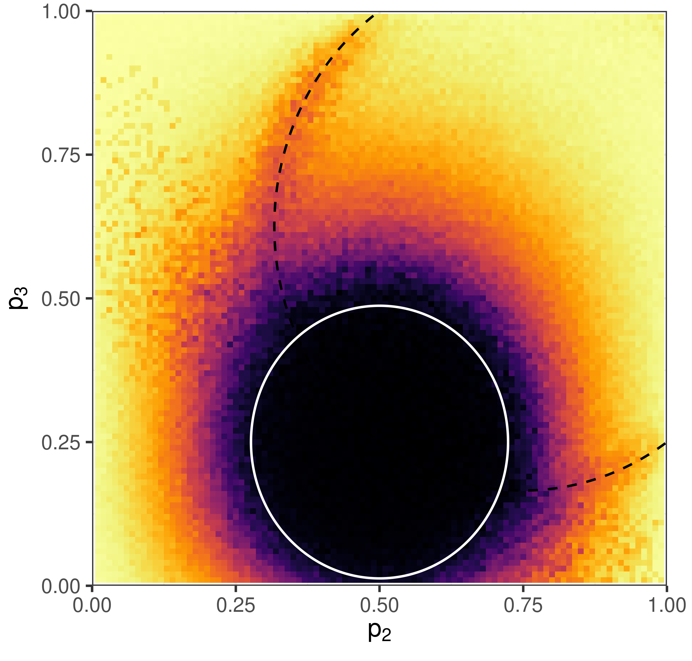
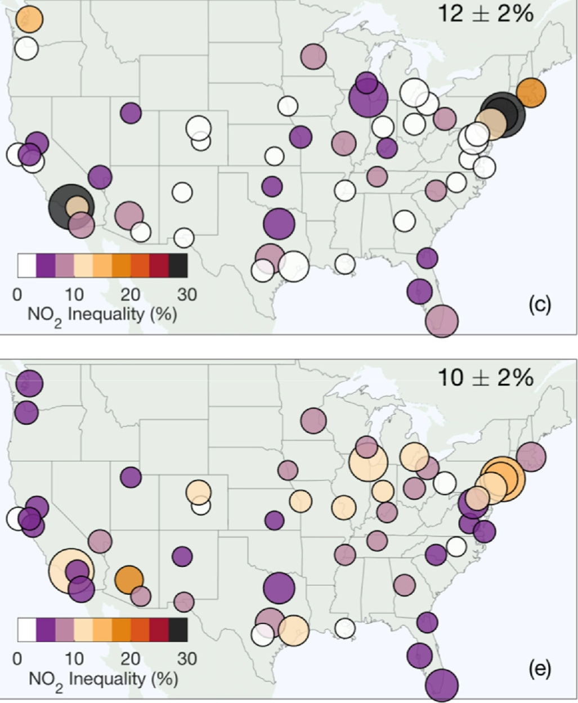
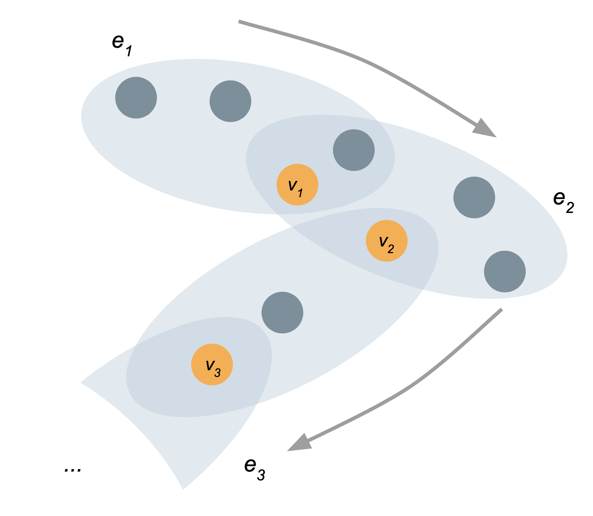

exclude: true   
<style type="text/css">
code.r{ 
  font-size: 16px; 
}
pre {
  font-size: 16px !important;  
}
</style>
```{r setup, include=FALSE}
options(htmltools.dir.version = FALSE)
```

```{r run, eval=FALSE, include=FALSE}
# xaringan::inf_mr("swat-2021/index.rmd")
```


---

class: bg-main1 
background-image: url("../img-shared/geo-intro.png")
background-size: contain
 
# My Journey
 
---

background-image: url("img/ninjagram.jpeg")
background-size: cover 
class: split-two

.column[
  <br>
]

.column[
# <font color="white"> &nbsp;&nbsp;&nbsp;&nbsp;&nbsp;&nbsp;&nbsp; Uh...sorry? 😬 </font>
] 

---

background-image: url("img/karate-graph-fade.png")
class:  

<br><br><br><br>
# My Research 

### Math and Computation for Complex, Connected Systems


---

class: split-three
layout: true

.row[
  .split-40[.column.bg-main1[
      ### Foundations of Network Data Science
    ].column[
       
       
      <!--   -->
       
    ]
  ]  
]
.row[
  .split-40[.column.bg-main2[.content[
    ### Models of Biosocial Systems
  ]].column[.content[
    
     
     
    <!--   -->
  ]]
]
]
.row[
  .split-40[.column.bg-main3[.content[
    ### Data Science and Social Responsibility
  ]].column[.content[
     
    <!--   -->
     
     
  ]]
]
]

---

class:

---

class: split-40
layout: true

.column.bg-main1[
### Foundations of Network Data Science

<br>

What .alert[models] accurately reflect features of network data? 

What .alert[algorithms] can we use to learn these models? 

What can we .alert[prove] about these models and algorithms?

]

.column[.split-four[
  .row[.content[.split-20[.column[ 
  <div class="thumbnail"> 
   
  </div>
  ].column[
  <div class="compress">
  <br>
  <a href="https://link.springer.com/article/10.1007/s41109-020-0252-y">Nonbacktracking specral clustering of nonuniform hypergraphs </a> <br>
  <b>PSC</b>, Nicole Eikmeier, and Jamie Haddock<br>
  <i>In preparation</i> (2022)
  </div>       
  ]]] 
]
  .row[.content[.split-20[.column[
    <div class="thumbnail"> 
     
    </div>
    ].column[
    <div class="compress">
    <br>
    <a href="https://advances.sciencemag.org/content/7/28/eabh1303">Generative hypergraph clustering: from blockmodels to modularity </a> <br>
    <b>PSC</b>, Nate Veldt, and Austin Benson <br>
    <i>Science Advances</i> (2021)
    </div>       
    ]]
  ]]
.row[.content[.split-20[.column[
  <div class="thumbnail"> 
     
    </div>
    ].column[
    <div class="compress">
    <br>
    <a href="https://epubs.siam.org/doi/abs/10.1137/19M1288772">Moments of uniformly random multigraphs with fixed degree sequences </a> <br>
    <b>PSC</b><br>
    <i>SIAM J. Mathematics of Data Science</i> (2020)
    </div>       
    ]]]
  ]
.row[.content[.split-20[.column[.content[
  <div class="thumbnail"> 
   
  </div>
  ]].column[.content[
  <div class="compress">
  <br>
  <a href="https://academic.oup.com/comnet/article-abstract/8/3/cnaa018/5879929">Configuration models of random hypergraphs </a> <br>
  <b>PSC</b> <br>
  <i>J. Complex Networks</i> (2020)
  </div>       
  ]]]]
]
]
]

---

---

class: fade-row2-col2 fade-row3-col2 fade-row4-col2

---

class: split-two
layout: false

.column.bg-main1[
.content[ 
  ## Graphs and Hypergraphs 
 
  <br> 
  A .alert[graph] consists of a set of nodes $\mathcal{N}$ and a set of edges $\mathcal{E}$. Each edge in $\mathcal{E}$ is a set of two nodes. 

<br> <br> <br> <br> <br>
  In .alert[hypergraphs], edges in $\mathcal{E}$ can contain *any number* of nodes.     
]

]

.column[
  .vmiddle[
  </img>
  ] 
]

---

class: split-two
layout: false

.column.bg-main1[
  
  ## Hypergraph Data

  

]

.column.bg-main4[.vmiddle[
  <br>
]]


---

class: split-two
layout: false

.column.bg-main1[
  
  ## Hypergraph Data

<br> <br> 

  - .alert[**Interaction**]: nodes are agents, edges are interaction events (socializing in groups, attending events).
  

]

.column.bg-main4[.vmiddle[
  </img> 
]]

---

class: split-two
layout: false

.column.bg-main1[
  
  ## Hypergraph Data

<br> <br> 

  - .alert[**Interaction**]: nodes are agents, edges are interaction events (socializing in groups, attending events).
  - .alert[**Collaboration**]: nodes are collaborators, edges are projects or teams (scholarly papers, legislation, etc). 
  

]

.column.bg-main4[.vmiddle[
  </img> 
]]

---

class: split-two
layout: false

.column.bg-main1[
  
  ## Hypergraph Data

<br> <br> 

  - .alert[**Interaction**]: nodes are agents, edges are interaction events (socializing in groups, attending events).
  - .alert[**Collaboration**]: nodes are collaborators, edges are projects or teams (scholarly papers, legislation, etc). 
  - .alert[**Co-presence**]: nodes are chemical compounds, edges are drugs formed from those compounds.

]

.column.bg-main4[.vmiddle[
  </img>  
]]

---


layout: false
class: split-two

.column.bg-main1[
  ### The Hypergraph Community Detection Problem 

  Given some hypergraph data, assign each node to a .alert[*community*] (or *cluster*) of "related" nodes. 
  <br> <br>
  "*Related*": often interpreted as "*densely interconnected.*"
<br> <br>
  Applications in social network analysis, drug discovery, image processing, data visualization...

  
  .footnote[
  One review in: <br> <b>PSC</b>, N. Veldt, A. R. Benson (2021). Generative hypergraph clustering: from blockmodels to modularity, <i>Science Advances</i>, 7:eabh1303
]

  
]
.column[.content.vmiddle[.stretch[
  
]]]

---

class: split-two

.column[
### Motivation: **Weird Gaps** in a Computational Experiment

.stretch[

]

High ARI means approximate success in a synthetic trial (details later). 


]
.column[.stretch[ 
     
]]


---

layout: true
class: split-two middle 
 
.column[
  .split-three[ 
  .row.bg-main1[.content.vmiddle[.font_medium[  
Eigenvectors and .alert[graph community detection].
  ]]]     
  .row.bg-main2[.content.vmiddle[.font_medium[
The .alert[**Hashimoto operator**] and eigenvector methods for hypergraphs.  
  ]]] 
  .row.bg-main3[.content.vmiddle[.font_medium[ 
.alert[**Detectability thresholds**] and open questions. 
  ]]]
]] 

.column[.center[.stretch[
  {{content}} 
]]]
 
---
class: hide-row2-col1 hide-row3-col1 hide-row4-col1 hide-row5-col1


  

  <div class="footnote">
  Image from <a href="http://allthingsgraphed.com/2014/10/09/visualizing-political-polarization/"> All Things Graphed </a> 
  </div>


---
class: hide-row3-col1 hide-row4-col1   hide-row5-col1 
<br> <br> <br> 

<br> 

---
class: hide-row4-col1 hide-row5-col1 
<br> <br> <br> <br>
 

---

class: fade-row2-col1 fade-row3-col1 fade-row4-col1 fade-row5-col1

  

  <div class="footnote">
    Image from <a href="http://allthingsgraphed.com/2014/10/09/visualizing-political-polarization/"> All Things Graphed </a> 
  </div>
---

class: bg-main1
layout: false
# Reminder 

<br> <br> 
.font_larger[
Vector $\mathbf{v} \in \mathbb{R}^n$ is an .alert[eigenvector] of matrix $\mathbf{A} \in \mathbb{R}^n$ with .alert[eigenvalue] $\lambda \in \mathbb{R}$ iff 

.font_larger[.font_larger[
$$ \mathbf{A}\mathbf{v} = \lambda \mathbf{v}\;. $$ 
]]]


---

class: split-two bg-main4
layout: false

.column[
  ## The graph... 

<br> 
.center[
  
]

]
.column[

  ## ...the adjacency matrix
  
  <br> <br> 
  $$\mathbf{A} = \left[\begin{matrix}
    <!-- 0 & \mathbf{1} & 0 & 0 & 0  \\  -->
    <!-- \mathbf{1}     & 0 & \mathbf{1} & 0 & \mathbf{1}  \\ -->
    <!-- 0 & \mathbf{1} & 0 & \mathbf{1} & \mathbf{1}  \\ -->
    <!-- 0 & 0 & \mathbf{1} & 0 & 0  \\ -->
    <!-- 0 & \mathbf{1} & \mathbf{1} & 0 & 0  \\  -->
    \end{matrix}\right] 
    $$

  We have 
  $$a_{ij} = \begin{cases}
  <!-- 1 &\quad (i,j) \in \mathcal{E} \\  -->
  0 &\quad \text{otherwise.}
  \end{cases}$$
  

]

---

class: split-two
layout: false

.column.bg-main1[
  ### Modeling Graphs with Communities

  Take $n$ nodes and divide them into two groups $a$ and $b$. 

  For each pair of nodes $i$ and $j$, draw an edge with probability 

  $$p_{ij} = \begin{cases} p &\quad i,j \text{ are in the same group} \\ q &\quad i,j \text{ are in different groups} \end{cases}$$

  This gives us an adjacency matrix $\mathbf{A}$ with .alert[noisy block structure].

  This is called a .alert[stochastic blockmodel (SBM)]. 
]

.column[.vmiddle[.center[


]]
]

---

class: split-two
layout: false

.column.bg-main1[
### Communities and Eigenvectors

<br> 

.font_smaller[
Leading eigenpairs of $\mathbf{P}$. 

.font_smaller[
$$\begin{align}
  \lambda_1 = \frac{n}{2}(p + q) \;, &\quad \mathbf{v}_1 = {\underbrace{(1,\ldots,1,1)}_{n \text{ copies}}}^T  \\ 
  \lambda_2 = \frac{n}{2}(p - q) \;, &\quad \mathbf{v}_2 = (\underbrace{1,\ldots,1}_{n/2 \text{ copies }}, \underbrace{-1,\ldots,-1}_{n/2 \text{ copies }})^T
\end{align}$$
]
]

.font_smaller[
<br> 
.alert[**Fact**] (from random matrix theory): Eigenpairs of $\mathbf{A}$ are close to these with high probability as $n$ grows large.  
]

.footnote[
Nadakuditi and Newman (2012). Graph spectra and the detectability of community structure in networks, <i>Physical Review Letters</i>
]

]


.column[.vmiddle[.center[


]]
]

---

class: split-two
layout: false

.column.bg-main1[
### A Graph Community Detection Algorithm


.font_smaller[

<br>

1. Compute the second-largest eigenvector $\mathbf{v}_2$ of $\mathbf{A}$. 
2. If $v_{2i} > 0$, guess that node $i$ is in group $a$, otherwise in group $b$. 

Works well if $p-q$ is sufficiently large, variations work for other graph matrices. 
]

.footnote[
- Decelle et al. (2011) Inference and phase transitions in the detection of modules in sparse networks, *Phys. Rev. Let.* 107.6: 065701
- Krzakala et al. (2013)  Spectral redemption in clustering sparse networks, <i>PNAS</i> 110 (52) 20935-20940]

]

.column[.center[


]]

<!-- ---

class: split-two middle
layout: false

.column.bg-main1[
  # Summing Up

  <br>

  Graphs represent .alert[pairwise] interactions and can be easily represented by .alert[2D] objects like adjacency matrices.

  The 2nd eigenvector of the adjacency matrix can reveal community structure. 

  So now we'd like to .alert[generalize] to hypergraphs...
]
.column[
.center[
  
  .footnote[
  Image from <a href="http://allthingsgraphed.com/2014/10/09/visualizing-political-polarization/"> All Things Graphed </a> 
  ]
]
] -->

---

layout: true
class: split-two middle 
 
.column[
  .split-three[ 
  .row.bg-main1[.content.vmiddle[.font_medium[  
Eigenvectors and .alert[graph community detection]. 
  ]]]     
  .row.bg-main2[.content.vmiddle[.font_medium[
The .alert[**Hashimoto operator**] and eigenvector methods for hypergraphs.  
  ]]] 
  .row.bg-main3[.content.vmiddle[.font_medium[ 
.alert[**Detectability thresholds**] and open questions. 
  ]]]
]] 

.column[.center[
  {{content}} 
]]

---
class: fade-row1-col1 fade-row3-col1
<br> <br> <br> 

<br> 

---

class: split-two
layout: false

.column.bg-main2[

### Matrices for Hypergraphs? 

We could transform the hypergraph into a graph.
- .alert[Problem]: loses multi-way information.

We could construct a set of adjacency tensors $\mathbf{A}^{(2)}$, $\mathbf{A}^{(3)}$, $\mathbf{A}^{(4)}$...

$$a^{(3)}_{ijk} = \begin{cases} 1 &\quad (i,j,k)\in \mathcal{E} \\ 0 &\quad \text{otherwise...}\end{cases}$$

- .alert[Problem]: we know eigenvectors of tensors, but not .alert[*sets*] of tensors.

So, what should we do?....


]

.column[
  <br> <br>
  
]


<!-- ---
class: split-50 bg-main2 
layout: false 
 
.row[ 
.split-three[
.column[<br><br>
   
  ]
.column[<br><br>
   
]
.column[<br><br>
     
] 

]
]
.row[ 
.split-three[
.column[<br>
  .font_large[.alert-no-bold[<nobr>Jamie Haddock</nobr>]]
  <nobr>Mathematics</nobr> <br> Harvey Mudd College      
  .alert2[@jamie_hadd]
]  
.column[<br>
  .font_large[.alert-no-bold[<nobr>Nicole Eikmeier</nobr>]]
   Computer Science <br> Grinnell College      
   .alert2[@NicoleEikmeier]
]
.column[<br>
  .font_large[.alert-no-bold[<nobr>Phil Chodrow</nobr>]]
  <nobr>Mathematics</nobr> <br> UCLA
  <br> .alert2[@PhilChodrow] <br>
]
]
] -->

---

class: split-two
layout: false


.column.bg-main2[
## The Hashimoto Operator

The adjacency matrix is $n\times n$ and  operates on nodes. 

The .alert[Hashimoto operator] $\mathbf{B}$ is a matrix that operates on *edge-node pairs*. 

Define relation $(e_1, v_1) \rightarrow (e_2, v_2)$: 

- $v_1 \in e_1$ and $v_2 \in e_2$
- $v_1 \in e_2 \setminus v_2$
- $e_1 \neq e_2$

Then, 

.font_smaller[ .font_smaller[
$$\mathbf{B}[(e_1, v_1), (e_2, v_2)] = \begin{cases} 1 &\quad (e_1, v_1) \rightarrow (e_2, v_2) \\ 
0 &\quad \text{otherwise.}\end{cases}$$
]]]

.column[
<br>


"I can get to $v_2 \in e_2$ from $e_1$ by passing through $v_1$. I can get to $v_3 \in e_3$ from $e_2$ by passing through $v_2$..."

]

---

class: split-two
layout: false


.column.bg-main2[
## The Hashimoto Operator

<br> 
Popularized (for graphs) by Hashimoto, K. (1990), *Int. J. Math.* 

Important theorem for computation by Bass, H. (1992), *Int. J. Math.* 

Formulated for hypergraphs by Storm, C. K. (2006). *The Electronic Journal of Combinatorics*.

"Rediscovered" for hypergraphs by Angelini, M. C. et al. (2015), *Allerton Conference*.

]

.column[
<br>


"I can get to $v_2 \in e_2$ from $e_1$ by passing through $v_1$. I can get to $v_3 \in e_3$ from $e_2$ by passing through $v_2$..."
]

---

class: split-two
layout: false


.column.bg-main2[
## The Hashimoto Operator

<br> 

Cool topological connections: prime cycles and zeta functions. 

Can represent hyperedges of all sizes in the same matrix!

In our stochastic blockmodel from before, eigenvector $\mathbf{v}_2$ is correlated with communities if $\lambda_2$ is real. 

.footnote[
  Precise control over community-correlated eigenvalues in the graph case: 

  Bordenave et al. (2018): Non-backtracking spectrum of random graphs: community detection and non-regular Ramanujan graphs. *Annals of Probability*.
]


]

.column[.content.vmiddle[.stretch[
   
]]]

---

class: split-two
layout: false


.column.bg-main2[
## Issue \# 1: Computation

<br>
$\mathbf{B}$ is indexed by edge-node pairs. 

So, $\mathbf{B}$ is of size $m\langle k\rangle \times m\langle k\rangle$, where $m$ is the number of edges and $\langle k \rangle$ is the average edge size. 

A .alert[*small*] data set might have $n = 300$ nodes, $m = 8,000$ edges, and average edge size $2.5$. 

$m\langle k \rangle = 8,000 \times 2.5 = 20,000$, which is already a pretty big matrix. 

Eigenpair computations get expensive fast...

]

.column[.content.vmiddle[.stretch[
   
]]]

---

class: bg-main4
layout: false

## A Generalized Ihara-Bass Theorem

**Theorem (PSC, JH, NE '22)**: Under mild conditions, if $\lambda$ is an eigenvalue of $\mathbf{B},$ then either: 

1. $\lambda \in \{1, -1, -2, \ldots, 1-\bar{k}\}$ and carries no structural information about the hypergraph, or
2. $\lambda$ is an eigenvalue of the matrix 

$$
\mathbf{B}' = \left[\begin{matrix}
  <!-- \mathbf{0} & \mathbb{D} - \mathbf{I}_{\bar{k}n} \\ -->
  <!--   (\mathbf{I}_{\bar{k}}- \mathbf{K}) \otimes \mathbf{I}_n &  \mathbb{A} + (2\mathbf{I}_{\bar{k}} - \mathbf{K})\otimes \mathbf{I}_n -->
\end{matrix}\right] \in \mathbb{R}^{2\bar{k}n\times 2\bar{k}n}\;.
$$

.font_smaller[.font_smaller[
- $\bar{k}$ is the number of distinct edge sizes, $n$ is the number of nodes. 
- $\mathbb{A} \in \mathbb{R}^{\bar{k}n\times \bar{k}n}$ collects adjacency information for each hyperedge size.
- $\mathbb{D} \in \mathbb{R}^{\bar{k}n\times \bar{k}n}$ collects node degrees for each hyperedge size. 
- $\mathbf{K} \in \mathbb{R}^{\bar{k}\times \bar{k}}$ lists possible edge sizes. 
- $\mathbf{I}_{\ell} \in \mathbb{R}^{\ell\times \ell}$ is the matrix identity of size $\ell$. 
- $\otimes$ is the Kronecker product. 
]]

---

class: bg-main4
  

## Proof Sketch

1. $\mathbf{B}$ can be written as $\mathbf{S}\mathbf{T} - \mathbf{R}$ for suitable operators $\mathbf{S}$, $\mathbf{T}$ and $\mathbf{R}$, which also satisfy handy relations like $\mathbf{T}\mathbf{S} = \mathbb{A}$.  
2. Consider $\det(\lambda\mathbf{I} - \mathbf{B})$, substitute $\mathbf{B} = \mathbf{S}\mathbf{T} - \mathbf{R}$, and use the *push-through identity*:
$$
\det(\mathbf{X + \mathbf{Y}\mathbf{Z}}) = \det(\mathbf{X}) \det(\mathbf{I} + \mathbf{Z}\mathbf{X}^{-1}\mathbf{Y})
$$
(*provided all inverses, sums, and products are defined*). 
3. Simplify, obtaining
$$
\det(\lambda \mathbf{I} - \mathbf{B}) = \det(\lambda\mathbf{I} - \mathbf{B}')\det(\text{uninformative part})\,.
$$ 


.footnote[Approach based on a proof of the the graph Ihara-Bass formula in: <br> M. C. Kempton (2016). Non-backtracking random walks and a weighted Ihara’s theorem. *Open Journal of Discrete Mathematics* 6, 207-226
]


---

class: split-two
layout: false


.column.bg-main2[
## Issue \# 1: Computation

<br> <br> 
A .alert[*small*] data set might have $n = 300$ nodes, $m = 8,000$ edges, and average edge size $2.5$. 

<br> 
If $\bar{k} = 3$, then we can compute eigenvectors in 

$$2n\bar{k} = 1,800 \ll 20,000 = m\langle k\rangle$$ 

dimensions instead.

We can do that 100x-1,000x faster! 
]

.column[.content.vmiddle[.stretch[
   
]]]

---

class: split-two
layout: true

.column.bg-main2[

  ## First Algorithm

  
<br>

  2. Compute the second eigenpair $(\lambda_2, \mathbf{v}_2)$ of $\mathbf{B}'$. 
  3. If $\lambda_2$ is real, separate $\mathbf{v}_2 = (\alpha, \beta)$, with $\alpha, \beta \in \mathbb{R}^{n\bar{k}}$. 
  4. If
     $$u_i = \sum_{k = 1}^{\bar{k}}\alpha_{ik} < 0\;,$$
    assign $i$ to cluster $A$, else assign $i$ to cluster $B$. 

]

.column[.content.vmiddle[.stretch[
{{ content }}
]]]

---

class: split-two


   

---

class: split-two
layout: true

.column[

## Synthetic Testbed

<br> <br>
   
]
.column[


  {{content}}

  Adjusted Rand Index (ARI): 

- $\mathrm{ARI} = 1$: perfect cluster recovery. 
- $\mathrm{ARI} = 0$: random noise. 


]

---

## From the Prequel

<br>
   

---

## Eigenvector Algorithm

<br>
   

<!-- ---

class: split-two
layout: false


.column.bg-main2[
## Issue \# 2: Edge Sizes

Our first eigenvector algorithm only works well when edges of different sizes carry .alert[similar types of information] about the clusters. 

<br> 

What if edges of different sizes mean different things? 

<br> 

.alert2[Example]: small interactions might be very likely to be within a cluster, but larger interactions might be more likely to be *between* clusters. 

]

.column[.content.vmiddle[.stretch[
   
]]] -->

---

class: split-two
layout: false

.column.bg-main2[
  ## Belief Propagation...

  <br>

  
]

---

class: split-two
layout: false

.column.bg-main2[
  ## Belief Propagation...

  <br>

  ...is the "cavity method" of statistical physics. 

  
]

---

class: split-two
layout: false

.column.bg-main2[
  ## Belief Propagation...

  <br>

  ...is the "cavity method" of statistical physics. 
 
  ...is an approximate method for ~~statistical inference~~ Machine Learning.®

  
]

---

class: split-two
layout: false

.column.bg-main2[
  ## Belief Propagation...

  <br>

  ...is the "cavity method" of statistical physics. 

  ...is an approximate method for ~~statistical inference~~ Machine Learning.®

  ...is a discrete-time dynamical system.  
]

---

class: split-two
layout: false

.column.bg-main2[
  ## Belief Propagation...

  <br>

  ...is the "cavity method" of statistical physics. 

  ...is an approximate method for ~~statistical inference~~ Machine Learning.®

  ...is a discrete-time dynamical system.  
]

.column[

<br> 
Formally, iterate these updates to convergence: 
<br> 
\begin{align}
\mu_{iR}^{(s)} &\gets \frac{1}{Z_{iR}}\prod_{Q \in \binom{[n]}{|R|}\setminus R} \nu_{Qi}^{(s)} \\ 
\nu_{Ri}^{(s)} &\gets \frac{1}{Z_{Ri}}\sum_{\mathbf{z}:z_i = s}\mathbb{P}(a_R| \mathbb{z}_R)\prod_{j \in R\setminus i} \mu_{jR}^{(z_j)}
\end{align}

.font_smaller[  
$\mu_{iR}^{(s)}$ is "node $i$'s confidence that it belongs to community $s$ based on other nodes in tuple $R$."

$Z_{iR}$ and $Z_{Ri}$ are normalization constants. 

$\mathbb{P}(a_R|\mathbb{z}_R)$ is our stochastic blockmodel: specifies how likely there are to be $a_R$ edges on tuple $R$ given some community labels $\mathbf{z}_R$. 
]
]

---

class: split-two

.column.bg-main2[

### A Linear Approximation

.font_smaller[
**Theorem (PSC, NE, JH '22):** Consider a stochastic blockmodel in which: 

- Every node has the same expected number of attached edges. 
- The expected number of attached edges does not depend on the number of nodes $n$. 

Then: 

- BP has an approximate fixed point $\bar{\mathbf{x}}$ that contains no cluster information. 
- The Jacobian derivative $\mathcal{J}(\bar{\mathbf{x}})$ of the BP dynamics around $\bar{\mathbf{x}}$ has $O(n^{-1})$ entries, except for a block of the form 

$$\mathbf{J} = \sum_{k = 1}^{\bar{k}} \mathbf{C}_k \otimes \mathbf{B}_k + O(n^{-1})\;.$$
]
]

--

.column[
  

  

<br> <br> <br> <br> 

- $\mathbf{C}_k$ is a matrix of parameters that depends on the stochastic blockmodel $\mathbb{P}$. 
- $\mathbf{B}_k$ is our friend the Hashimoto operator, restricted to edges of size $k$. 
- $\otimes$ is the Kronecker product. 


.footnote[
  Result argued heuristically for graphs in: <br>
  <br> Krzakala et al. (2013)  Spectral redemption in clustering sparse networks, <i>PNAS</i> 110 (52) 20935-20940
]
] 

<!-- ---

background-image: url(img/algorithm-demo.png)
background-size: contain

### Belief-Propagation Spectral Clustering

<br> <br> <br> <br> <br> <br> <br> <br> <br> <br> <br> <br> <br>  Real leading eigenvectors of $\mathbf{J}$ contain cluster information!  -->


---

class: split-two bg-main4

# A Cheat

$\mathbf{J}$ can be a *very* large matrix. 

As before, we can use a smaller one: 

**Theorem (PSC, JH, NE '22)**: Under mild conditions, if $\lambda$ is an "interesting" eigenvalue of $\mathbf{J},$ then $\lambda$ is also an eigenvalue of the $2n\ell\bar{k}$ matrix

$$\mathbf{J}' = (\mathbf{G}\otimes \mathbf{I}_n) \left[\begin{matrix} 
\mathbf{0} & \mathbf{I}_\ell \otimes \mathbb{D} \\ 
\mathbf{0} & \mathbf{I}_\ell \otimes \mathbb{A}
\end{matrix}\right] - \bar{\mathbf{G}} \left[\begin{matrix} 
\mathbf{0} & \mathbf{I}_\ell \otimes \mathbf{I}_{\bar{k}} \\ 
\mathbf{I}_\ell \otimes (\mathbf{K} - \mathbf{I}_{\bar{k}-1}) & \mathbf{I}_\ell \otimes (\mathbf{K} - 2\mathbf{I}_{\bar{k}-1})
\end{matrix}\right] \otimes \mathbf{I}_n$$

where $\ell$ is the number of communities and $\mathbf{G}$, $\bar{\mathbf{G}}$ hold statistical parameters. 

*Proof is a little messier this time.*

<!-- ---

class: split-two
background-image: url("img/scream.jpeg")
background-size: contain -->


---

class: split-two
layout: false

.column.bg-main2[
  ## Ok, but does it work? 

 <br> 

  Recall that we were having issues with parameter combinations in which edges of different sizes carried different kinds of information. 
]

.column[.vmiddle[.stretch[
     
]]]

---

class: split-two
layout: false

.column.bg-main2[
  ## Ok, but does it work? 

<br>

  Recall that we were having issues with parameter combinations in which edges of different sizes carried different kinds of information. 

<br> 

  Working with the more complicated matrix $\mathbf{J}$ increases computation time, but also allows us to detect communities for more parameter combinations. 
]

.column[.vmiddle[.stretch[
     
]]]


---

background-image: url(img/clustering-math.png)
background-size: contain


#### Example Data: Mapping Math with StackExchange Tags

---

layout: true
class: split-two middle 
 
.column[
  .split-three[ 
  .row.bg-main1[.content.vmiddle[.font_medium[  
Eigenvectors and .alert[graph community detection]. 
  ]]]     
  .row.bg-main2[.content.vmiddle[.font_medium[
The .alert[**Hashimoto operator**] and eigenvector methods for hypergraphs.  
  ]]] 
  .row.bg-main3[.content.vmiddle[.font_medium[ 
.alert[**Detectability thresholds**] and open questions. 
  ]]]
]] 

.column[.center[.stretch[
  {{content}} 
]]]

---
class: fade-row1-col1 fade-row2-col1
<br> <br> <br> <br>
 
<br> 


---

class: split-two
layout: false

.column.bg-main3[
  ## Algorithmic Thresholds

<br> 
  Recall the .alert[*suspiciously round*] region where our algorithm totally failed to learn any cluster information. 

]

.column[.stretch[
  <br> <br> <br> <br>
     
]]


---

class: split-two
layout: false

.column.bg-main3[
  ## Algorithmic Thresholds

<br> 
  Recall the .alert[*suspiciously round*] region where our algorithm totally failed to learn any cluster information. 

  This region can be estimated!     

  Strategy: ask when $\mathbf{J}$ has an eigenvalue $> 1$, using approximations analogous to known results for graphs. 


]

.column[.stretch[
  <br> <br> <br> <br>
     
]]

---

class: split-two
layout: false

.column.bg-main3[
  ## Algorithmic Thresholds

.alert[**Conjecture**]: In a 2-group testbed with edge sizes $k_1,k_2,\ldots$ and $c_k$ edges of size $k$ per node, detection is possible outside the ellipsoid with centroid $(x_{k_1},x_{k_2},\ldots)$ and radii $(r_{k_1},r_{k_2}\ldots)$, where: 

$$
\begin{align}
x_k &= \frac{1-a_k}{2-a_k} \\ 
r_k &= \frac{\sqrt{(k-1)c_k}}{2-a_k} \\
a_k &= \frac{1-2^{2-k}}{1-2^{1-k}}\;.
\end{align}
$$

*Proof will involve some random matrix theory (future work).* 


]

.column[.stretch[
  <br> <br> <br> <br>
  
]]

---

class: split-two
layout: false

.column.bg-main3[
  ## Detectability Thresholds

<br> 
In graphs, failure of Hashimoto spectral clustering coincides with an .alert[information-theoretic bound] on the clustering problem. 
  
- .alert2[No algorithm] can reliably detect communities. 

We conjecture the same thing for hypergraphs: inside that ellipse, the clustering problem is not just difficult but *theoretically* impossible. 

.footnote[
  Recent proof for graphs: <br> 
  Mossel et al. (2018) A proof of the blockmodel threshold conjecture, *Combinatorica*.  
  ]

]

.column[.stretch[
  <br> <br> <br> <br>
  
]]


---


class: split-two
layout: false

.column.bg-main1[

## Summing Up

<br>
The .alert[Hashimoto operator] enables eigenvector techniques for community detection in hypergraphs. 

Determinant identities help us speed up computation. 

There are open questions around the .alert[fundamental limits] of hypergraph community detection. 


]

.column.bg-main4[


.row[ 
.split-two[
.column[.lil-stretch[<br><br>
   
  ]]
.column[.lil-stretch[<br><br>
   
]]]]
.row[ 
.split-two[
.column[.lil-stretch[<br><br><br><br><br><br><br><br>
  .alert[Jamie Haddock] <br> Harvey Mudd @jamie_hadd
  ]]
.column[.lil-stretch[<br><br><br><br><br><br><br><br>
  .alert[Nicole Eikmeier] <br> Grinnell @NicoleEikmeier
]]]]

<br><br><br><br><br><br><br><br><br><br><br> <br> 

**PSC**, Nicole Eikmeier, and Jamie Haddock (2022). Nonbacktracking spectral clustering of nonuniform hypergraphs. *In preparation*.

]
 
---

class: bg-main2 middle

# Future Directions

---

class: split-three
layout: 

.row[
  .split-40[.column.bg-main1[
      ### Foundations of Network Data Science
    ].column[
       
       
      <!--   -->
       
    ]
  ]  
]
.row[
  .split-40[.column.bg-main2[.content[
    ### Models of Biosocial Systems
  ]].column[.content[
    
     
     
    <!--   -->
  ]]
]
]
.row[
  .split-40[.column.bg-main3[.content[
    ### Data Science and Social Responsibility
  ]].column[.content[
     
    <!--   -->
     
     
  ]]
]
]

---

class: split-three fade-row2-col1 fade-row2-col2 fade-row3-col1 fade-row3-col2
layout: 

.row[
  .split-40[.column.bg-main1[
      ### Foundations of Network Data Science
    ].column[
- "With high probability as the number of nodes grows large, the .alert[eigenvalues] of $\mathbf{B}$ are..."  
- .alert[Dynamics and algorithms]: random walks, stability functions, ranking, clustering. 
    ]
  ]  
]
.row[
  .split-40[.column.bg-main2[.content[
    ### Models of Biosocial Systems
  ]].column[.content[
    
     
     
    <!--   -->
  ]]
]
]
.row[
  .split-40[.column.bg-main3[.content[
    ### Data Science and Social Responsibility
  ]].column[.content[
     
    <!--   -->
     
     
  ]]
]
]

---

class: split-three fade-row1-col1 fade-row1-col2 fade-row3-col1 fade-row3-col2
layout: 

.row[
  .split-40[.column.bg-main1[.content[
      ### Foundations of Network Data Science
    ]].column[.content[
       
       
      <!--   -->
       
    ]]
  ]  
]
.row[
  .split-40[.column.bg-main2[.content[
    ### Models of Biosocial Systems
  ]].column[.content[
- Comparing network ranking functions with actual, .alert[human-attributed ranks] 
  - Ongoing collaboration with social anthropologists.
- Statistical problems with .alert[inference of biosocial hierarchies] (focal sampling, behavior categories).
  ]]
]
]
.row[
  .split-40[.column.bg-main3[.content[
    ### Data Science and Social Responsibility
  ]].column[.content[
     
    <!--   -->
     
     
  ]]
]
]


---

class: split-three fade-row1-col1 fade-row1-col2 fade-row2-col1 fade-row2-col2
layout: 

.row[
  .split-40[.column.bg-main1[.content[
      ### Foundations of Network Data Science
    ]].column[.content[
       
       
      <!--   -->
       
    ]]
  ]  
]
.row[
  .split-40[.column.bg-main2[.content[
    ### Models of Biosocial Systems
  ]].column[.content[
    
     
     
    <!--   -->
  ]]
]
]
.row[
  .split-40[.column.bg-main3[.content[
    ### Data Science and Social Responsibility
  ]].column[.content[
- Dynamical models of .alert[migration] and racial segregation. 
- .alert[Racial disparities] in U.S. criminal sentencing: further data acquisition + analysis.  
  ]]
]
]

---
class: middle bg-main1 
layout: false
# Thanks everyone! 

## Questions?


---

class: middle bg-main4  

# Extra slides


---

## High School Social Contacts

<br> 

  $n = 327$ students (nodes) in a French high school. 

  $m = 7,818$ social contact events (edges) measured by wearable 
  sensors.   

  Average number of participants in interaction $\langle k \rangle = 2.3$ 

  Cluster labels are the classes to which students are assigned. 


  <div class="footnote">
    Data originally from: <br>
    R. Mastrandrea et al. (2015), Contact patterns in a high school: A comparison between data collected using wearable sensors, contact diaries, and friendship surveys. <i>PLoS One</i> 10:9, e0136497
    <br> <br> 
    Prepared by 
    A. R. Benson et al. (2018), Simplicial closure and higher-order link prediction. <i>Proceedings of the National Academy of Sciences</i> 10.1073/pnas.1800683115  
  </div>

---
background-image: url(img/contact-high-school-classes.png)
background-size: contain

## High School Social Contacts 

---

  ## On the Other Hand...Senate Bills

<br> 

  $n = 293$ U.S. senators (nodes) cosponsoring bills.

  $m = 20,006$ bills (edges) in period 1973-2016.

  Average number of cosponsors $\langle k \rangle = 7.3$.

  Community labels are Democrat/Republican. 


<div class="footnote">
  Data originally from: <br>
  J. Fowler (2006), Legislative cosponsorship networks in the U.S. House and Senate. <i>Social Networks</i> 28:4, 454--465
  <br> <br> 
  Prepared by 
  A. R. Benson et al. (2018), Simplicial closure and higher-order link prediction. <i>Proceedings of the National Academy of Sciences</i> 10.1073/pnas.1800683115  
</div>


---
background-image: url(img/SN-congress-bills.png)
background-size: contain

## Senate Bills

---
class: bg-main2

<br> <br> <br> <br>  
### .alert[Big Picture]: you want hypergraph methods when edges of different sizes give you different information about the community structure. 

---

class: middle 

# My Papers

---

class: split-40

.column.bg-main1[
### Foundations of Network Data Science

<br>

What .alert[models] accurately reflect features of network data? 

What .alert[algorithms] can we use to learn these models? 

What .alert[mathematical challenges] arise from these questions? 

]

.column[.split-four[
  .row[.split-20[.column[ 
  <div class="thumbnail"> 
   
  </div>
  ].column[
  <div class="compress">
  <br>
  <a href="https://link.springer.com/article/10.1007/s41109-020-0252-y">Nonbacktracking specral clustering of nonuniform hypergraphs </a> <br>
  <b>PSC</b>, Nicole Eikmeier, and Jamie Haddock<br>
  <i>In preparation</i> (2022)
  </div>       
  ]] 
]
  .row[.split-20[.column[
    <div class="thumbnail"> 
     
    </div>
    ].column[
    <div class="compress">
    <br>
    <a href="https://advances.sciencemag.org/content/7/28/eabh1303">Generative hypergraph clustering: from blockmodels to modularity </a> <br>
    <b>PSC</b>, Nate Veldt, and Austin Benson <br>
    <i>Science Advances</i> (2021)
    </div>       
    ]]
  ]
.row[.split-20[.column[
  <div class="thumbnail"> 
     
    </div>
    ].column[
    <div class="compress">
    <br>
    <a href="https://epubs.siam.org/doi/abs/10.1137/19M1288772">Moments of uniformly random multigraphs with fixed degree sequences </a> <br>
    <b>PSC</b><br>
    <i>SIAM J. Mathematics of Data Science</i> (2020)
    </div>       
    ]] 
  ]
.row[.split-20[.column[
  <div class="thumbnail"> 
   
  </div>
  ].column[
  <div class="compress">
  <br>
  <a href="https://academic.oup.com/comnet/article-abstract/8/3/cnaa018/5879929">Configuration models of random hypergraphs </a> <br>
  <b>PSC</b> <br>
  <i>J. Complex Networks</i> (2020)
  </div>       
  ]]
]
]
]


---

class: split-40

.column.bg-main2[ 
### Models of Biosocial Systems

<br>

How can .alert[individual decisions] lead to large-scale 
social division or hierarchy? 

What .alert[mechanisms] do math models need to capture these phenomena? 

What can we .alert[prove] or .alert[approximate] about the behavior of these models?

]

.column[.split-four[
  .row[.split-20[.column[
  <div class="thumbnail"> 
   
  </div>
  ].column[
  <div class="compress">
  <br>
  <a>Smoothly nonlinear opinion dynamics </a> <br>
  Heather Zinn Brooks, <b>PSC</b>, and Mason A. Porter <br>
  <i>In preparation</i> (2022)
  </div>       
  ]]
]
.row[.split-20[.column[
  <div class="thumbnail"> 
   
  </div>
  ].column[
  <div class="compress">
  <br>
  <a>Model-based approaches to layer aggregation in animal dominance networks </a> <br>
  <b>PSC</b>, Kelly Finn, and and Mason A. Porter <br>
  <i>In preparation</i> (2022)
  </div>       
  ]]
]
  .row[.split-20[.column[
    <div class="thumbnail"> 
     
    </div>
    ].column[
    <div class="compress">
    <br>
    <a href="https://advances.sciencemag.org/content/7/28/eabh1303">Emergence of hierarchy in networked endorsement dynamics </a> <br>
    Mari Kawakatsu, <b>PSC</b>, Nicole Eikmeier, and Dan Larremore <br>
    <i>Proc. National Academy of Sciences</i> (2021) 
    </div>       
    ]]
  ]  
.row[.split-20[.column[
  <div class="thumbnail"> 
     
    </div>
    ].column[
    <div class="compress">
    <br>
    <a href="https://epubs.siam.org/doi/pdf/10.1137/18M1232346?casa_token=st1ib1C3dRUAAAAA:u69ZSyBJVU-keaUQ6eO6wVKcM42DNeUReNMDWhVVT5pUDozAHYx8NnGz7iKZ4gX1gtMxGYMCucA">Local symmetry and global structure in adaptive voter models </a> <br>
    <b>PSC</b> and Peter Mucha<br>
    <i>SIAM J. Applied Math</i> (2020)
    </div>       
    ]] 
  ]
]
] 

---

class: split-40

.column.bg-main3[ 
### Data Science and Social Responsibility

<br>

How can mathematics .alert[unify and support] methods in quantitative sociology? 

How can we acquire and analyze data sets on .alert[equity] and .alert[justice]? 

How can we model the history (and future?) of .alert[representation] in our discipline? 
]

.column[.split-four[
  .row[.split-20[.column[
    <div class="thumbnail"> 
     
    </div>
    ].column[
    <div class="compress">
    <br>
    <a> Impact of race on sentencing in a state court</a> <br>
    Hinal Jajal (undergraduate mentee), <b>PSC</b><br>
    <i>Ongoing work</i> (2022) 
    </div>       
    ]]
]  
.row[.split-20[.column[
  <div class="thumbnail"> 
     
    </div>
    ].column[
    <div class="compress">
    <br>
    <a>Dynamics of gender representation in mathematical subfields </a> <br>
    Ben Brill (undergraduate mentee) et al. <br>
    <i>Ongoing work</i> (2022)
    </div>       
    ]] 
  ]
  .row[.split-20[.column[
  <div class="thumbnail"> 
   
  </div>
  ].column[
  <div class="compress">
  <br>
  <a href="https://agupubs.onlinelibrary.wiley.com/doi/10.1029/2021GL094333">Space-based observational constraints on NO₂ air pollution inequality from diesel traffic in major U.S. cities </a> <br>
  Demetillo et al. 
  <i>Geophysics Review Letters</i> (2021)
  </div>       
  ]]
]
  .row[.split-20[.column[
  <div class="thumbnail"> 
   
  </div>
  ].column[
  <div class="compress">
  <br>
  <a href="https://www.pnas.org/content/pnas/114/44/11591.full.pdf">Structure and information in spatial segregation </a> <br>
  <b>PSC</b><br>
  <i>Proc. National Academy of Sciences</i> (2017)
  </div>       
  ]]
]
]
] 
