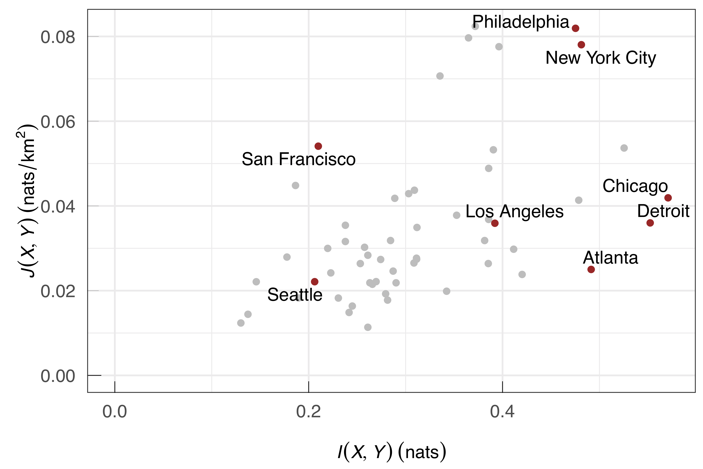
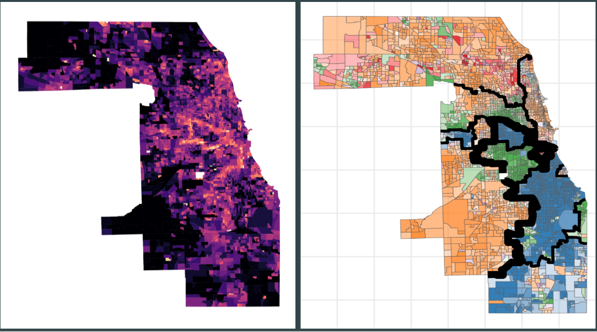
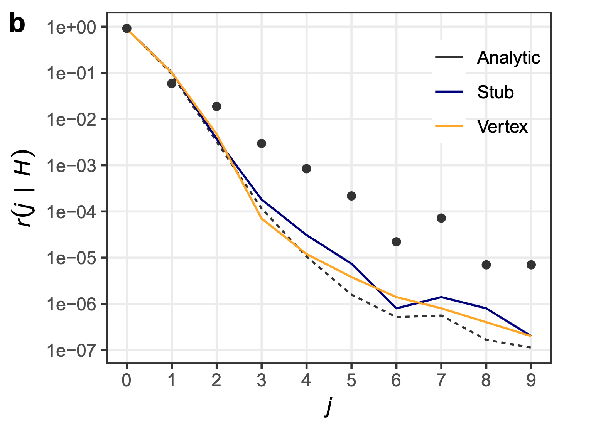

```{r child = "style/rmd/DJN_setup.Rmd"}
```

---

background-image: url(img/picard_thanks.jpg)
background-size: contain


---

# ...and you, and you, and...

### Advisors

- Marta González (UC Berkeley)
- Patrick Jaillet (MIT)

### Committee

- David Gamarnik (MIT)
- Peter Mucha (UNC Chapel Hill)

### NSF (funding)

\+ Family, friends, collaborators, supporters, mentors...

---

# Research Streams

.embolden[Random graph theory for data science]

Structure and dynamics of spatial networks

Nonlinear and adaptive network models

Inference in generative models of complex systems

---

# Chapters

1. .embolden[Structure and information in spatial segregation] (2017), *Proceedings of the National Academy of Sciences.*
2. .embolden[Local symmetry and global structure in adaptive voter models] (2020). *SIAM Journal on Applied Mathematics.* *.embolden[(With Peter Mucha)]*
3.  .embolden[Configuration models of random hypergraphs] (2020). *Forthcoming: Journal of Complex Networks.*
4. .embolden[Moments of uniformly random multigraphs with fixed degree sequences] (2020). *R&R, SIAM Journal on Mathematics of Data Science*

---

# Chapters

1. .fade[Structure and information in spatial segregation (2017), *Proceedings of the National Academy of Sciences.*]
2. .fade[Local symmetry and global structure in adaptive voter models (2020). *SIAM Journal on Applied Mathematics.* *(With Peter Mucha)*]
3.  .embolden[Configuration models of random hypergraphs] (2020). *Forthcoming: Journal of Complex Networks.*
4. .embolden[Moments of uniformly random multigraphs with fixed degree sequences] (2020). *R&R, SIAM Journal on Mathematics of Data Science*

---

# Other Papers

.midi[
- .embolden[Annotated hypergraphs: Models and applications]. PSC and Andy Mellor, (2020). *Applied Network Science*.
- .embolden[Demand and congestion in multiplex networks]. PSC, Zeyad al-Awwad, Shan Jiang, Marta González,  (2016). *PLoS ONE*
- .embolden[Heterogeneous spatial evolution of large metropolitan areas]. Emanuele Strano, PSC et al., (2020). *R&R, Physical Review E*
- .embolden[Emergence of hierarchy in networked endorsement dynamics]. Nicole Eikmeier, Mari Kawakatsu, PSC, and Dan Larremore,  *In preparation.*
- .embolden[Log-minor distributions and an application to estimating mean subsystem entropy]. Alice Schwarze, PSC, and Mason Porter,  (2018). *arXiv:1901.09456*
]
---

class: section, middle

# Structure and Information in Spatial Segregation 

### .right[.pink[PSC, *PNAS* 2017]]

---

# Core Contributions

Spatial segregation costs lives and treasure. There are many, competing methodologies for measuring and visualizing segregation. 

We offer: 

- A unification of many extant measures under the calculus of Bregman divergences. 
- An accompanying suite of methods for the analysis of spatial segregation and difference, using elementary information geometry and machine learning. 

---

# Core Results


.midi[
$$j(\mathbf{x}_0) \triangleq \lim_{r\rightarrow 0}j_r(\mathbf{x}_0) = \frac{1}{4\pi} \text{Tr} (\nabla \alpha (\mathbf{x}_0)^T \mathcal{H}f_{\alpha(\mathbf{x}_0)} \nabla \alpha(\mathbf{x}_0))$$
]

A *resolution-independent* measurement of local segregation, computable via linear regression.  

---

# Core Results



Measurements of *extent* and *characteristic scale* of segregation in US cities. 


---

# Core Results



Information-maximization heuristics for computing natural partitions in observed data. 

---

class: section, middle

# Local Symmetry and Global Structure in Adaptive Voter Models 

### .right[.pink[PSC + Peter J. Mucha, *SIAP* 2020]]

---

class: section, middle

# Configuration Models of Random Hypergraphs

### .right[.pink[PSC, *Forthcoming @ JCN* 2020]]

---

# Null Modeling in Networks

Suppose I measure degree-assortativity in some network data -- the tendency of nodes with many neighbors to themselves be connected. I find a correlation coefficient of 0.3. 

Is that high? Low? Interesting? Boring? 

.embolden[Null hypothesis testing]: compare the measurement to its distribution under a **null model.** 

--

...which model?

---

# Classical Network Nulls

.embolden[Erdős–Rényi]: place an edge with probability $p \in [0,1]$ between every pair of nodes. 

.embolden[Chung-Lu]: place an edge between nodes $i$ and $j$ w. p. $\propto \theta_i\theta_j$. Allows flexible specification of expected degrees. 

.embolden[Configuration model]: sample uniformly from the space $\mathcal{G}_\mathbf{d}$ of graphs with fixed degree sequence $\mathbf{d}$. 

^^ Agenda for this chapter: extend configuration model to ***hypergraphs***. 

---

# Polyadic Networks

Lots of systems we care about contain interactions between embolden[groups] of agents: 

- **Collaboration / coauthorship**: Congressional cosponsorship, the network of scholars studying the network of...
- **Co-presence**: drug combinations, patent classifications,
- **Communication**: emails, tweets, etc.

---

background-image: url(img/projection.png)
background-size: contain

# The Dyadic Projection

*"Polyadic structures are hard, but I know about graphs..."*

---

# Dyadic Configuration Models (Graphs)

Observe a graph with degree sequence $\mathbf{d} \in \mathbb{Z}^n$. 

The (vertex-labeled<sup>1</sup>) *configuration model* is the uniform probability distribution $\eta_\mathbf{d}$ over the space 
$$\mathcal{G}_\mathbf{d} = \{G:\mathrm{deg}(G) = \mathbf{d}\}\;.$$

.embolden[Common pattern]: project, use $\mathbf{d}$ from projected graph, randomize with configuration model. 

.footnote[<sup>1</sup>Fosdick et al., "Configuring Random Graph Models with Fixed Degree Sequences", *SIAM Review* (2018)]

---

# .midi[Problems with the Dyadic Projection]


Projection distorts meaningful quantities: number of edges, degree.

**Irrelevant as a null**: never generates multiway interactions. (A world of only 2-author papers)

---

# Hypergraphs

.pull-left[
- $H = (V,E)$
- Edges can have *any number* of nodes. 
- Parallel edges are ok $(\{a,b,c\}, \{a,b,c\})$
- Degenerate edges are not $(\{a,a,b,\ldots\})$
]

.pull-right[<br>]

.footnote[Image from Wikipedia]

---

# .midi[Configuration Models (Hypergraphs)]

Observe a hypergraph with degree sequence $\mathbf{d} \in \mathbb{Z}^n$ and **dimension sequence** $\mathbf{k} \in \mathbb{Z}^m$. 

The (vertex-labeled) *configuration model* is the uniform probability distribution $\eta_{\mathbf{d}, \mathbf{k}}$ over the space 
$$\mathcal{H}_{\mathbf{d}, \mathbf{k}} = \{H:\mathrm{deg}(H) = \mathbf{d}\;,\;\color{#0F4C81}{\mathrm{dim}(H) = \mathbf{k}}\}\;.$$


---

# .midi[Representing Polyadic Networks]

- .embolden[Bipartite graphs]
  - .midi[Flexible.]
  - .midi[Some probability distributions are hard to formulate.]
- .embolden[Simplicial complexes]
  - .midi[Good data compression and topological properties.]  
  - .midi[Face inclusion is appropriate for some (not all) data generating processes.]  
- .embolden[Hypergraphs]
  - .midi[Flexible and intuitive.]
  - .midi[Few existing null models...]

.footnote[Survey in PSC, "Configuration Models of Random Hypergraphs", `arXiv:1902.09302` (2020)]

---

# MCMC Sampling

**Idea**: sample from $\eta_{\mathbf{d}, \mathbf{k}}$ by crawling through $\mathcal{H}_{\mathbf{d}, \mathbf{k}}$. 

1. .highlight[Sample]: Pick two edges $\Delta$ and $\Gamma$ u.a.r.
2. .highlight[Proposal]: Randomly resample nodes between $\Delta$ and $\Gamma$ while avoiding degeneracy
3. .highlight[Transition]: With probability $m_{\Delta}^{-1}m_{\Gamma}^{-1}$, accept swap, otherwise start over. 

**Theorem**: This Markov chain is ergodic and its invariant measure is the configuration model $\eta_{\mathbf{d}, \mathbf{k}}$.  To sample, run this chain a "for long time." 

.footnote[PSC, `arXiv:1902.09302` (2020)]

---

class: standout, middle

.large[**Let's look at some data.**]

---

# Triadic Closure

$$\bar{C} = \frac{1}{n}\sum_{v \in \mathcal{V}} \frac{T_v}{W_v}$$

- $T_v$: number of triangles incident to $v$. 
- $W_v$: number of wedges at $v$. 

Conventional wisdom since Watts-Strogatz (1998): many empirical networks are more clustered than can be explained by (dyadic) configuration models. 
 
What about hypergraph configuration models?

---

# Triadic Closure 

|                                |   $C$    | $<C>_h$ | $<C>_{2}$ |
| ------------------------------ | :------: | :-----: | :-------: |
| **congress-bills**             |   0.61   |  0.60   |   0.45    | 
| **coauth-Geology**             |   0.82   |  0.82   |   0.00    | 
| .highlight[email-Enron]        |   0.66   |  0.84   |   0.64    | 
| .highlight[email-Eu]           |   0.54   |  0.57   |   0.40    | 
| .highlight[tags-ask-ubuntu]    |   0.57   |  0.61   |   0.18    | 
| .highlight[threads-math-sx]    |   0.29   |  0.44   |   0.09    | 

.footnote[Data from Benson et al. "Simplicial Closure and Higher-Order Link Prediction," *PNAS* (2018)]


---

## Triadic Closure

.midi[
|                                |   $C$    | $<C>_h$ | $<C>_{2}$ |
| ------------------------------ | :------: | :-----: | :-------: |
| **congress-bills**             |   0.61   |  0.60   |   0.45    | 
| **coauth-Geology**             |   0.82   |  0.82   |   0.00    | 
| .highlight[email-Enron]        |   0.66   |  0.84   |   0.64    | 
| .highlight[email-Eu]           |   0.54   |  0.57   |   0.40    | 
| .highlight[tags-ask-ubuntu]    |   0.57   |  0.61   |   0.18    | 
| .highlight[threads-math-sx]    |   0.29   |  0.44   |   0.09    | 
]

Hypergraph configuration model distinguishes **collaboration** networks from .highlight[communication] networks.  


---

# The Intersection Profile

How "similar" are two interactions?

Intersection profile: 

$$r(j) = \langle \mathbb{I}(\Delta \cap \Gamma) = j\rangle$$

"Among all pairs of edges, what proportion have intersection of size $j$?"

Measures repeated interactions:  productive **teams** of researchers, chatty **groups** on email, etc.   

.footnote[PSC,  `arXiv:1902.09302` (2020)]

---


# Enron Intersection Profile 



---

# Approximate Intersection Profiles

Computing null intersection profiles can be very difficult for large data sets. 
Fortunately, we can approximate: 

**Theorem:**<sup>*</sup> With high probability as $n$ grows large, 

.midi[$$r_\eta(j) = (1 + O(n^{-1}))j!\left \langle
\binom{\vert \Delta\vert}{j}\right\rangle^2 \left(\frac{1}{n} \frac{\mathbb{E}[D^2] - \mathbb{E}[D]}{\mathbb{E}[D]^2}\right)^j$$]

*Terms and conditions apply. 

.footnote[PSC,  `arXiv:1902.09302` (2020)]

---

background-image: url(img/large_intersections.png)
background-size: contain

# Profiles for Big Data™

.footnote[PSC,  `arXiv:1902.09302` (2020)]

---

# Summing Up

.embolden[Polyadic data should be benchmarked using polyadic nulls.] 

When the data generating process generates hypergraph-like data, hypergraph configuration models can be a good choice. 

Using these models, we can 

1. Ask old questions in new ways (triadic closure).
2. As new questions (intersection profiles). 

.footnote[PSC,`arXiv:1902.09302` (2020)]


---

class: section, middle

# Moments of Uniformly Random Multigraphs with Fixed Degree Sequences 

## .right[.pink[PSC, R&R @ *SIMODS*, 2020]]

---

class: standout, middle

### **Goal**: estimate the expected adjacency matrix $\Omega$ of a uniformly random multigraph with specified degree sequence $\mathbf{d}$. 

---

class: top

# .midi[Modularity]

An objective function for finding .embolden[communities] in networks (terms and conditions apply). 


Usually **defined** as: 

$$Q(\mathbf{G}) = \frac{1}{2m}\sum_{ij}\left[W_{ij} - \color{#C49377}{\mathbb{E}_\eta[W_{ij}]}\right]\delta(g_i, g_j)$$

- $\mathbf{G}$: a partition of nodes into ordinal groups. 
- $\mathbf{W}$: a weighted adjacency matrix. 
- $\color{#C49377}{\eta}$: "a random graph with degree sequence $\mathbf{d}$." 


.footnote[Newman + Girvan, "Finding and Evaluating Community Structure in Networks." *PRE*, (2003)]

---

# .midi[Modularity]

An objective function for finding .embolden[communities] in networks (terms and conditions apply). 

Usually **computed** as: 

$$Q(\mathbf{G}) = \frac{1}{2m}\sum_{ij}\left[W_{ij} - \color{#C49377}{\frac{d_id_j}{2m}}\right]\delta(g_i, g_j)$$

- $\mathbf{G}$: a partition of nodes into ordinal groups. 
- $\mathbf{W}$: a weighted adjacency matrix. 
- $\color{#C49377}{\eta}$: "a random graph with degree sequence $\mathbf{d}$." 

.footnote[Newman + Girvan, "Finding and Evaluating Community Structure in Networks." *PRE*, (2003)]

---

# A Folk Theorem

.alert[
*The expected number of edges $w_{ij}$ between two nodes in **"random"** graph **"with degree sequence $\mathbf{d}$"** is *

$$ \omega_{ij} = \frac{d_id_j}{2m} + \text{small terms}\;.$$
]

--

This is right if you choose your random graph model .highlight[conveniently].

- Chung-Lu model (**d** fixed in expectation)
- Stub-matching (biased, not entropy-maximizing)

---

class: top

# Which random graph?... 

We .highlight[say]: "(entropy-maximizing) random graph." 

We .highlight[mean]: "random graph that makes calculations convenient."

--

.footnote[Fosdick et al., "Configuring Random Graph Models with Fixed Degree Sequences", *SIAM Review* (2018)]

What if we *actually* used an entropy-maximizing random graph for calculations?

---
class: middle

# .large[The Uniform Model]

---

# Which Random Graph?


Let $\mathcal{G}_\mathbf{d}$ be the set of all .embolden[multigraphs] with fixed degree sequence $\mathbf{d}$. 

The **uniform random graph model** $\eta_\mathbf{d}$ is a probability distribution that assigns equal weight to each element of $\mathcal{G}_\mathbf{d}$. 

$\eta_\mathbf{d}$ is the entropy-maximizing random graph with fixed degree sequence $\mathbf{d}$. 

---

# Edge-Swap Monte Carlo


We can sample from $\eta_\mathbf{d}$ by crawling through $\mathcal{G}_\mathbf{d}$.

(This is just the dyadic version of the Markov chain we saw for hypergraphs)


.footnote[Image from Fosdick et al., "Configuring Random Graph Models with Fixed Degree Sequences", *SIAM Review* (2018)]

---

# Edge-Swap Monte Carlo


1. .embolden[Sample edges] $(i,j)$ and $(k,\ell)$ with random orientations. 
2. .embolden[Propose swap] $(i,j), (k,\ell) \mapsto (i,\ell), (k,j)$.  
3. .embolden[Accept swap] with probability $w_{ij}^{-1}w_{k\ell}^{-1}$. 


**Theorem:** This works.<sup>1</sup> 


.footnote[<sup>1</sup>Fosdick et al., "Configuring Random Graph Models with Fixed Degree Sequences", *SIAM Review* (2018)]

---

class: middle, standout

Estimating $\omega_{ij} = \mathbb{E}[W_{ij}]$ via Edge-Swap Monte Carlo is **expensive** (~3 days on my laptop). 

How can we estimate efficiently expectations under $\eta$? 

---

class: top

# Approach


Edge-Swap Monte Carlo is a stochastic process with known equilibrium distribution $\eta_\mathbf{d}$. 

At equilibrium, all **expectations** are fixed. 

$$\mathbb{E}_\eta[f(G_{t+1}) - f(G_t)] = 0\;.$$ 

If we choose $f(G) = w_{ij}^p$ for $p = 1,\ldots$ and handle .embolden[a lot] of algebra, we can get analytical approximations. 


.footnote[PSC, "Moments of Uniformly Random Multigraphs with Fixed Degree Sequences, `arxiv:1909.09037` (2020)]
---

# Expected Number of Neighbors

Let $\beta_i = \mathbb{E}_\eta[\text{# of distinct neighbors of } i]$.

.alert[
**Theorem**: $$\chi_{ij}\triangleq \mathbb{E}_\eta[\mathbb{I}(W_{ij} > 0)] = \frac{\beta_i\beta_j}{\sum_\ell \beta_\ell} + \text{small terms}$$
]

.footnote[PSC,  `arxiv:1909.09037` (2020)]

---

# A Parallel

.funding[.embolden[Folk Theorem]
$$\omega_{ij} \triangleq \mathbb{E}_\eta[W_{ij}] \stackrel{?}{=} \frac{d_id_j}{\sum_\ell d_\ell} + \text{small terms}$$
]

.alert[
**Actual Theorem**: $$\chi_{ij}\triangleq \mathbb{E}_\eta[\mathbb{I}(W_{ij} > 0)] = \frac{\beta_i\beta_j}{\sum_\ell \beta_\ell} + \text{small terms}$$
]


---

# Expected Edge Densities


.alert[
**Theorem**: $$\omega_{ij}\triangleq \mathbb{E}_\eta[W_{ij}] = \frac{\chi_{ij}}{1 - \chi_{ij}} + \text{small terms}$$ 
]

Can also get higher-order moments: variances, etc. 

.footnote[PSC,  `arxiv:1909.09037` (2020)]

---

# Determining $\beta$
.midi[
The vector $\beta$ approximately solves

$$\sum_{j}\frac{\beta_i\beta_j}{\sum_\ell\beta_\ell - \beta_i\beta_j} = d_i \quad \forall i\;.$$

.alert[
**Theorem**: Solution (if it exists) is unique on the set 
$$\mathcal{B} = \left\{\beta: \beta \geq \mathbf{0},\; \beta_i^2 < \sum_\ell \beta_\ell \quad \forall i\right\}\;.$$
] 
]


.footnote[PSC,  `arxiv:1909.09037` (2020)]
---

# Proof Sketch
.midi[
Let $h(\beta)_i = \sum_{j}\frac{\beta_i\beta_j}{\sum_\ell\beta_\ell - \beta_i\beta_j}$. We want to solve $\mathbf{h}(\beta) = \mathbf{d}$. 
Equivalently, $$\mathcal{L}(\beta) \triangleq \lVert \mathbf{h}(\beta) - \mathbf{d} \rVert^2 = \mathbf{0}$$

1. The Jacobian $\mathbf{J}$ of $\mathbf{h}$ has strictly positive eigenvalues on $\mathcal{B}$ (linear algebra tricks).
2. The Hessian $\mathcal{H}$ of $\mathcal{L}$ is positive-definite at all critical points of $\mathcal{L}$ $\implies$ all critical points are isolated local minima (more linear algebra tricks). 
3. .embolden[Mountain Pass Theorem]:<sup>1</sup> If two or more, $\exists$ a third which is not a local minimum. 
4. So, $\exists$ at most one local minimizer of $\mathcal{L}$ on $\mathcal{B}$. 
]

.footnote[<sup>1</sup>For a review, see Bisgard, "Mountain Passes and Saddle Points," *SIREV* (2015)]
---

class: middle, standout

# .large[Experiments]

---

# High School Contact Data

Collected by the SocioPatterns project. 

.centered-image[]

.footnote[Mastrandrea et al. (2015), Benson et al. (2018)]

---

background-image: url(img/eval_figs.png)
background-size: contain

## Evaluating Approximations

.footnote[PSC, `arxiv:1909.09037` (2020)]

---


background-image: url(img/error_matrices.png)
background-size: contain

## Estimating $\mathbb{E}[W]$

.footnote[PSC, `arxiv:1909.09037` (2020)]

---

background-image: url(img/modularity_high_school.png)
background-size: contain

## Downstream Consequences: Modularity Maximization

.footnote[PSC, `arxiv:1909.09037` (2020)]

---

# Summing Up


**Rigor** means 
- Carefully articulating our models 
- Checking that our heuristics work. 

Entropy-maximizing random graphs with fixed degree sequences break our standard heuristics. 

Using a dynamical approach, we can get **rigorous approximations** with **excellent performance** on real data. 

---

# Thanks again! 

### Advisors

- Marta González (UC Berkeley)
- Patrick Jaillet (MIT)

### Committee

- David Gamarnik (MIT)
- Peter Mucha (UNC Chapel Hill)

### NSF (funding)

\+ Family, friends, collaborators, supporters, mentors...

---


class: standout, middle

# Supplementary Slides


---


# A Note on Stub-Matching

.pull-left[.midi[

Sometimes, "the configuration model" is defined via a stub-matching process. 

This is related to the uniform model for .embolden[simple] graphs and hypergraphs.

**Very few data sets are natively simple.**

]] 

.pull-right[


]

.footnote[<sup>1</sup>Fosdick et al., "Configuring Random Graph Models with Fixed Degree Sequences", *SIAM Review* (2018)]


